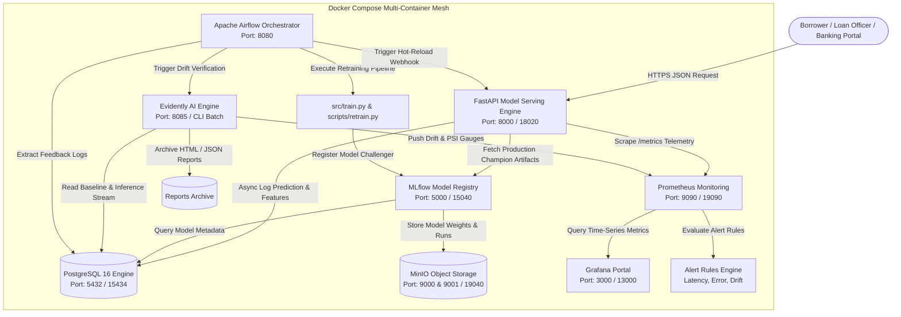
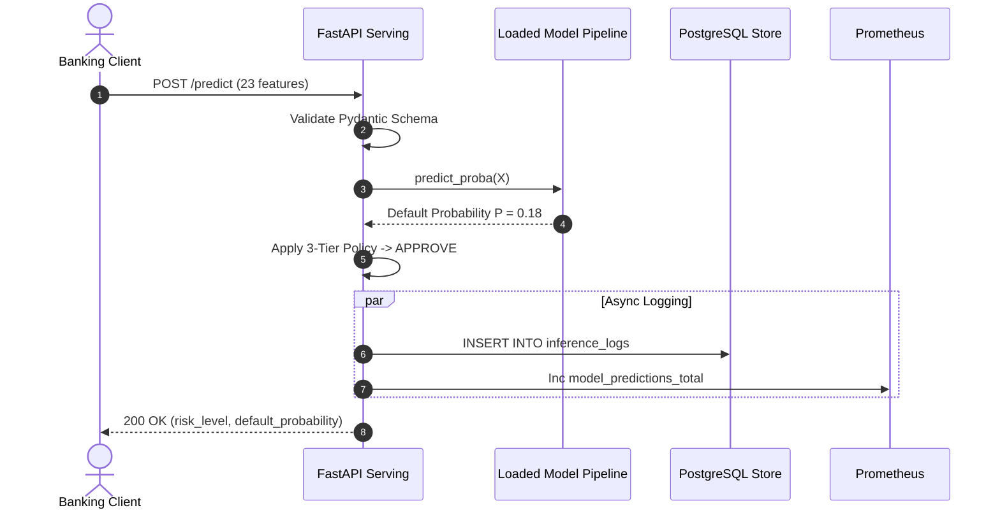

# 🏛️ Architecture & System Design Specification
## FinTech Real-Time Credit Default Risk Scoring Platform (Closed-Loop MLOps)
> **Course:** DDM501 — AI in DevOps, DataOps, MLOps · FSB, FPT University  
> **Team:** Group 5 · Final Project Capstone  
> **Version:** 2.0.0 (Production Architecture)

---

## 📑 Table of Contents
1. [Executive Overview & Business Objectives](#1-executive-overview--business-objectives)
2. [C4 Container Architecture](#2-c4-container-architecture)
3. [Component Responsibilities & Topology](#3-component-responsibilities--topology)
4. [Data Flow & Lifecycle Pathways](#4-data-flow--lifecycle-pathways)
5. [Technology Stack Justification & Trade-off Analysis](#5-technology-stack-justification--trade-off-analysis)
6. [Closed-Loop Retraining & Self-Healing Loop](#6-closed-loop-retraining--self-healing-loop)
7. [Observability, Alerting & Telemetry Architecture](#7-observability-alerting--telemetry-architecture)
8. [Responsible AI, Governance & Regulatory Compliance](#8-responsible-ai-governance--regulatory-compliance)
9. [Security, Privacy & Disaster Recovery](#9-security-privacy--disaster-recovery)

---

## 1. Executive Overview & Business Objectives

Credit risk assessment is a mission-critical financial workload where inaccurate predictions produce asymmetric costs: approving a borrower who defaults ($Y=1, \hat{Y}=0$) costs the institution 5 to 10 times more in unrecoverable principal than declining a creditworthy borrower ($Y=0, \hat{Y}=1$).

This platform implements an enterprise-grade, closed-loop Machine Learning Operations (MLOps) architecture combining:
- **Low-latency RESTful inference** (< 25ms p95 latency) with real-time risk tiering (`APPROVE`, `REVIEW`, `DECLINE`).
- **Telemetry instrumentation** with custom Prometheus metrics and Grafana dashboards.
- **Continuous statistical drift detection** via Evidently AI (monitoring Population Stability Index - PSI, Wasserstein distance, and Kolmogorov-Smirnov test).
- **Automated orchestration** via Apache Airflow to ingest production feedback, validate schema gates, retrain challenger models, and stage them to MLflow Model Registry.
- **Canary delivery & zero-downtime hot-reload** mechanisms.

---

## 2. C4 Container Architecture



---

## 3. Component Responsibilities & Topology

| Container Service | Base Technology | Host Port | Internal Port | Core Architectural Responsibilities |
|---|---|---|---|---|
| `api` | FastAPI, Uvicorn, Python 3.11 | `18020` | `8000` | High-throughput model inference, schema validation, decision boundary mapping, and Prometheus telemetry. |
| `postgres` | PostgreSQL 16 Alpine | `15434` | `5432` | Persistence store for inference payloads, latency logs, user feedback labels, and MLflow backend metadata. |
| `minio` | MinIO High-Performance S3 | `19040`, `19041` | `9000`, `9001` | S3-compatible blob storage hosting serialized scikit-learn models, preprocessors, and confusion matrix artifacts. |
| `mlflow` | MLflow 2.19, Gunicorn | `15040` | `5000` | Centralized experiment tracking, hyperparameter logging, model versioning, and `@champion` / `@challenger` aliases. |
| `prometheus` | Prometheus v2.54 | `19090` | `9090` | Time-series scraper collecting API latencies, prediction counts, classification values, and drift indicators. |
| `grafana` | Grafana Enterprise | `13000` | `3000` | Pre-provisioned telemetry dashboards for loan approval rates, p95 latency, and drift warning visualizers. |
| `airflow` | Apache Airflow 2.10 | `18080` | `8080` | Workflow DAG scheduler executing automated retraining, quality validation gates, and canary transitions. |

---

## 4. Data Flow & Lifecycle Pathways

### Pathway A: Real-Time Inference (Online Path)
1. **Client Request:** Banking client sends JSON payload with 23 financial and demographic features to `POST /predict`.
2. **Schema & Domain Gate:** Pydantic `CreditRiskInput` validates data types and logical bounds (e.g., $AGE \ge 18$, $LIMIT\_BAL > 0$).
3. **Pipeline Transformation:** `StandardScaler` scales continuous numerical variables while pass-through keeps categorical features intact.
4. **Model Scoring:** Serialized Random Forest / Ensemble model predicts default probability $P(Y=1)$.
5. **Decision Tiering:**
   - $P < 0.30 \implies$ `APPROVE` (Low Risk)
   - $0.30 \le P < 0.60 \implies$ `REVIEW` (Manual Underwriting)
   - $P \ge 0.60 \implies$ `DECLINE` (High Risk)
6. **Telemetry & Audit Logging:** Prometheus metrics incremented; request, features, probability, decision, and latency persisted to PostgreSQL asynchronously.



### Pathway B: Closed-Loop Continuous Retraining (Offline Path)
1. **Scheduled or Event Trigger:** Airflow DAG executes daily or upon receiving an alert webhook from Prometheus/Evidently.
2. **Data Extraction & Joining:** Extraction of recent inference samples joined with updated ground-truth loan repayment statuses.
3. **Data Quality Gate:** Schema integrity check, missing value threshold check (< 1%), and range violation check.
4. **Drift Evaluation:** Calculation of Population Stability Index (PSI). If $\text{PSI} \ge 0.25$, pipeline proceeds to retraining.
5. **Challenger Training:** Train model candidate on sliding window of historical + augmented fresh feedback.
6. **Model Validation Gate:**
   - Candidate $AUC_{\text{challenger}} \ge AUC_{\text{champion}}$
   - Candidate Disparate Impact Ratio $0.80 \le \text{DIR} \le 1.25$
7. **Promotion & Notification:** Promote model in MLflow Model Registry and invoke API `POST /reload-model` hot-reload endpoint.

---

## 5. Technology Stack Justification & Trade-off Analysis

| Component | Selected Technology | Alternative Evaluated | Selection Justification | Trade-offs & Mitigations |
|---|---|---|---|---|
| **API Serving** | FastAPI + Uvicorn | Flask / Django | Asynchronous ASGI throughput, native Pydantic typing, auto-generated OpenAPI documentation, sub-25ms response time. | *Trade-off:* Async database drivers needed. *Mitigation:* Background tasks and pooled SQLAlchemy connections. |
| **Experiment Tracking** | MLflow | Weights & Biases / Neptune | Self-hostable, open-source, no external SaaS vendor lock-in, zero cloud subscription cost, robust Model Registry with aliases. | *Trade-off:* Requires dedicated Postgres & MinIO. *Mitigation:* Bundled in Docker Compose. |
| **Drift Monitoring** | Evidently AI | Great Expectations / Alibi Detect | Native HTML report generation, standard statistical tests (KS, Wasserstein, PSI), direct integration with tabular pandas DataFrames. | *Trade-off:* In-memory processing. *Mitigation:* Window-based batch sampling (5,000 recent records). |
| **Metrics Store** | Prometheus | InfluxDB / Datadog | Industry-standard cloud-native time-series format, pull-based architecture, lightweight memory footprint (< 100MB RAM). | *Trade-off:* No long-term storage out of the box. *Mitigation:* Configured 15-day retention policy. |
| **Dashboards** | Grafana | Superset / Metabase | Instant native Prometheus datasource support, JSON-as-code dashboard provisioning, flexible alerting rules. | *Trade-off:* Read-only visualization. *Mitigation:* Complement with FastAPI admin endpoints. |

---

## 6. Closed-Loop Retraining & Self-Healing Loop

The architecture incorporates the **3-Tier Traffic Light Drift Policy**:

```
[Production Traffic Stream]
           │
           ▼
[Evidently Drift Engine] ──► Calculate PSI & KS p-values
           │
     ┌─────┴─────────────────────┐
     ▼                           ▼
[PSI < 0.10: GREEN]     [0.10 <= PSI < 0.25: YELLOW]     [PSI >= 0.25: RED]
- Normal operations     - Slack/Grafana Warning alert     - CRITICAL ALERT
- Keep current model    - Increase sampling rate (4h)     - Trigger Airflow Retrain DAG
                                                          - Automated Challenger Training
                                                          - Gate Promotion & Zero-Downtime Reload
```

---

## 7. Observability, Alerting & Telemetry Architecture

The platform exports rich multi-dimensional metrics via `/metrics`:
- `credit_predictions_total`: Counter partitioned by `risk_level` (`APPROVE`, `REVIEW`, `DECLINE`) and `model_version`.
- `credit_prediction_latency_seconds`: Histogram measuring inference execution time with fine-grained buckets ($5\text{ms}$ to $500\text{ms}$).
- `credit_prediction_probability`: Summary tracking the distribution of default probabilities over sliding time windows.
- `credit_data_drift_status`: Gauge reflecting current drift level ($0 = \text{Green}$, $1 = \text{Yellow}$, $2 = \text{Red}$).
- `credit_psi_score`: Real-time gauge of Population Stability Index.

Prometheus alert rules (`monitoring/alert_rules.yml`) continuously evaluate latency spikes (> 200ms), 5xx error surges (> 5%), and critical drift conditions ($\text{PSI} \ge 0.25$).

---

## 8. Responsible AI, Governance & Regulatory Compliance

In lending and banking, automated decision systems must adhere to strict regulatory standards:
1. **Equal Credit Opportunity Act (ECOA) & Fair Lending:**
   - Automated fairness audit evaluates Disparate Impact Ratio (DIR) across protected groups (`SEX`, `EDUCATION`, `AGE_GROUP`).
   - The platform enforces the **80% Rule (Four-Fifths Rule)**: $\text{DIR} \ge 0.80$.
2. **Model Explainability (FCRA / Adverse Action):**
   - Whenever an applicant is declined, the institution must provide actionable reasons.
   - The platform integrates SHAP-based feature attribution to identify the top 3 drivers of high default risk (e.g. `PAY_0` payment delays, credit utilization > 90%).
3. **Model Risk Management (SR 11-7):**
   - Every model version is versioned, logged with training data digests, confusion matrices, and validation scores before deployment.

---

## 9. Security, Privacy & Disaster Recovery

- **Data Minimization:** No Personally Identifiable Information (PII) like Citizen IDs, names, or addresses are stored in the training set or inference logs.
- **Principle of Least Privilege:** PostgreSQL credentials, S3 secret keys, and Grafana admin passwords managed through environment variables (`.env`).
- **Container Isolation:** All internal microservices communicate within an isolated Docker bridge network (`credit-mlops-network`); only API and UI ports are exposed.
- **Disaster Recovery:** Automated volume mounts for PostgreSQL (`pgdata`) and MinIO (`miniodata`) ensure persistent state across container restarts and host migrations.
