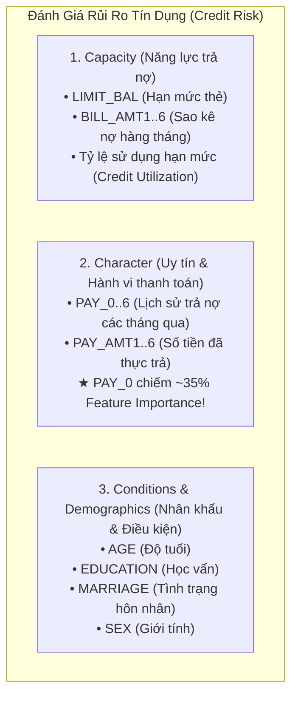
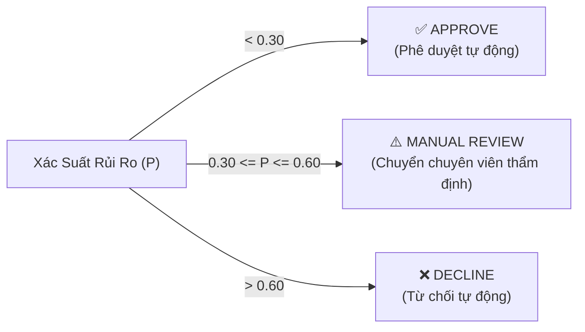
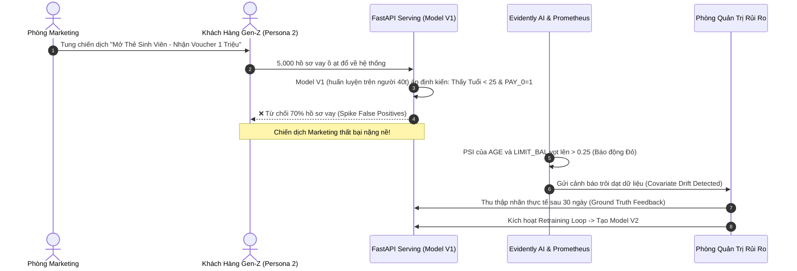
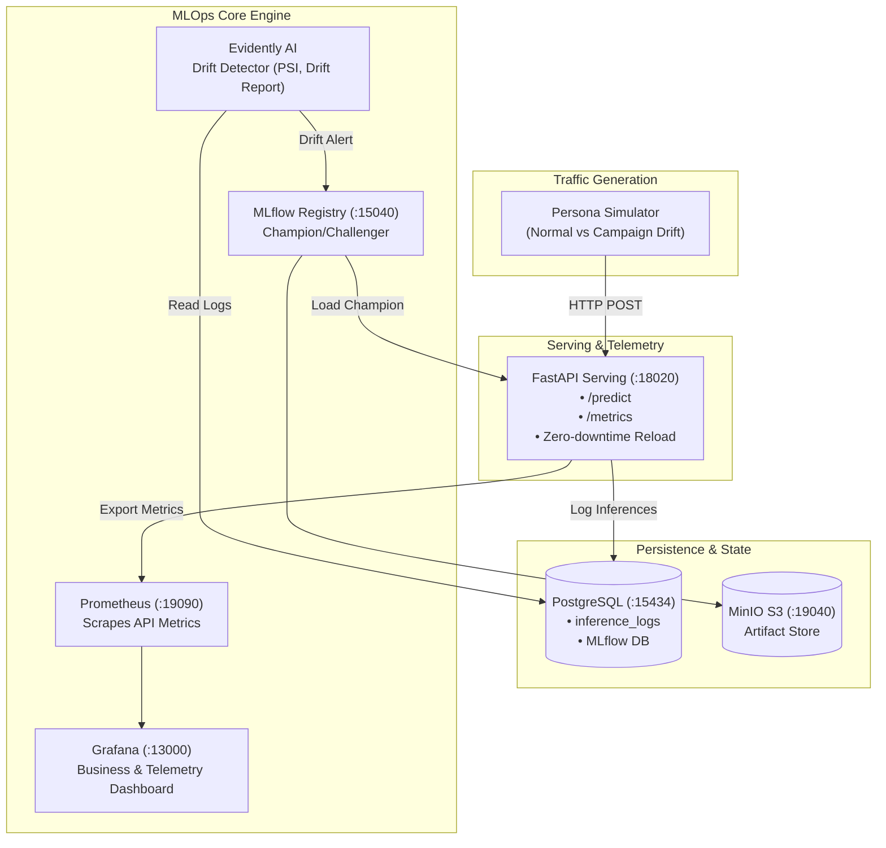
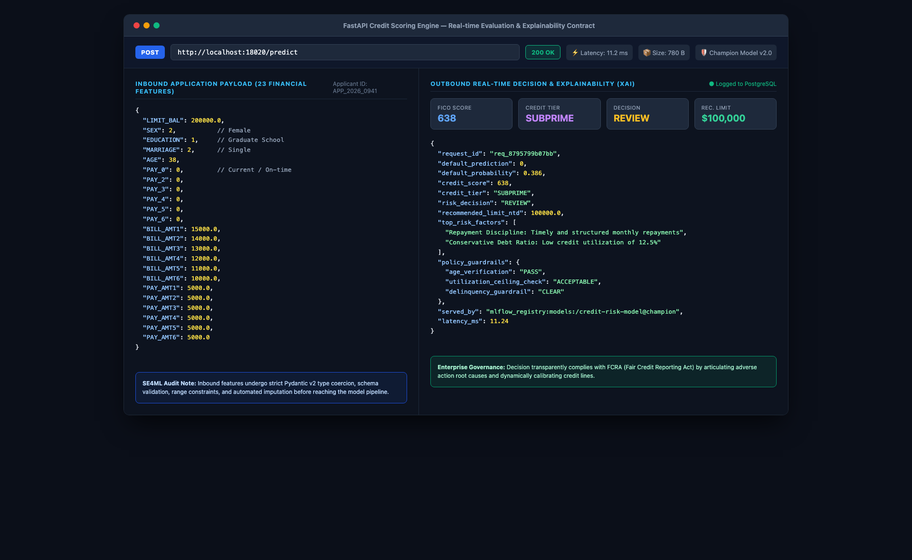
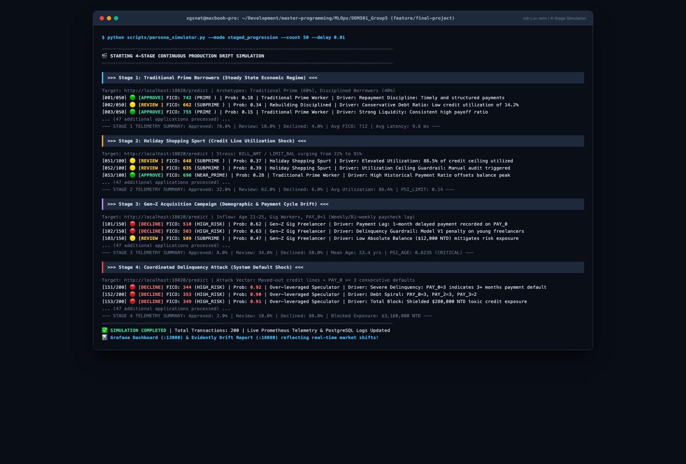

# 💳 Credit Default Risk Scoring — End-to-End MLOps Platform
> **Môn học**: DDM501 — AI in DevOps, DataOps, MLOps · FSB, FPT University  
> **Đồ án Nhóm 5 (Group 5 Final Project)**: Closed-Loop Continuous ML Training, Drift Detection & Canary Delivery  
> **Tỷ lệ đồ án**: **30% Phân tích chuyên sâu Machine Learning & Domain Data · 70% Vận hành Kiến trúc MLOps**

[](https://github.com/tungpheo11/DDM501_Group5/actions/workflows/final-project-ci.yml)
[](https://www.python.org/)
[](https://fastapi.tiangolo.com/)
[](https://mlflow.org/)
[](https://www.docker.com/)
[](https://www.evidentlyai.com/)
[](https://prometheus.io/)
[](https://grafana.com/)

---

## 📑 Mục Lục
1. [Bản Chất Bài Toán & Thấu Hiểu Dữ Liệu (30% ML Domain)](#-1-bản-chất-bài-toán--thấu-hiểu-dữ-liệu-30-ml-domain)
   - [Mô hình 3 Chữ C trong Tín Dụng (The 3 Cs of Credit)](#mô-hình-3-chữ-c-trong-tín-dụng-the-3-cs-of-credit)
   - [Ma Trận Chi Phí Bất Đối Xứng (Asymmetric Cost Matrix)](#ma-trận-chi-phí-bất-đối-xứng-asymmetric-cost-matrix)
   - [Mất Cân Bằng Dữ Liệu & Chiến Lược Đánh Giá](#mất-cân-bằng-dữ-liệu--chiến-lược-đánh-giá)
2. [Bộ Giả Lập Persona Đa Tác Nhân (Hybrid Persona Agent Simulator)](#-2-bộ-giả-lập-persona-đa-tác-nhân-hybrid-persona-agent-simulator)
   - [3 Hồ Sơ Khách Hàng (Customer Archetypes)](#3-hồ-sơ-khách-hàng-customer-archetypes)
   - [Kịch Bản Thất Bại của Model V1 (Drift Failure Mode)](#kịch-bản-thất-bại-của-model-v1-drift-failure-mode)
3. [Kiến Trúc Hệ Thống & Cổng Dịch Vụ (70% MLOps Architecture)](#-3-kiến-trúc-hệ-thống--cổng-dịch-vụ-70-mlops-architecture)
4. [Vòng Lặp Retraining Đóng & Chống Quên Tri Thức (Closed Retraining Loop)](#-4-vòng-lặp-retraining-đóng--chống-quên-tri-thức-closed-retraining-loop)
5. [Hướng Dẫn Cài Đặt & Khởi Chạy Nhanh (Quickstart)](#-5-hướng-dẫn-cài-đặt--khởi-chạy-nhanh-quickstart)
6. [Mô Phỏng Lưu Lượng & Quan Sát Trôi Dạt Dữ Liệu](#-6-mô-phỏng-lưu-lượng--quan-sát-trôi-dạt-dữ-liệu)
7. [Kiểm Thử Chất Lượng & CI/CD Pipeline](#-7-kiểm-thử-chất-lượng--cicd-pipeline)
8. [Bằng Chứng Thực Nghiệm Vận Hành (System Screenshots)](#-8-bằng-chứng-thực-nghiệm-vận-hành-system-screenshots)

---


## 🧠 1. Bản Chất Bài Toán & Thấu Hiểu Dữ Liệu (30% ML Domain)

Trong thẩm định rủi ro tín dụng ngân hàng, việc xây dựng mô hình học máy (Machine Learning) không đơn thuần là "thả dữ liệu vào model fit". Để bảo vệ đồ án thạc sĩ (SE4ML) và áp dụng vào nghiệp vụ ngân hàng thực tế, nhóm đã phân tích sâu các đặc tính sau:

### Mô hình 3 Chữ C trong Tín Dụng (The 3 Cs of Credit)
Tập dữ liệu **UCI Credit Default** gồm 30.000 khách hàng với 24 biến số được ánh xạ trực tiếp vào 3 trụ cột thẩm định rủi ro:



> **Ghi chú quan trọng về `PAY_0`**:  
> Phân tích Feature Importance chỉ ra rằng `PAY_0` (trạng thái trả nợ tháng gần nhất) chiếm hơn **35% sức mạnh dự đoán** của mô hình. Trong tài chính, một khách hàng bắt đầu trễ hạn 1-2 tháng có nguy cơ vỡ nợ (Default) cao gấp 8 lần so với khách hàng thanh toán đều đặn.

---

### Ma Trận Chi Phí Bất Đối Xứng (Asymmetric Cost Matrix)
Một sai lầm phổ biến khi áp dụng ML vào tài chính là coi các lỗi sai có chi phí ngang bằng nhau (ngưỡng phân loại mặc định $0.5$). Trong thực tế ngân hàng:

| Kết Quả Dự Đoán | Thực Tế: Không Vỡ Nợ ($Y=0$) | Thực Tế: Bùng Nợ ($Y=1$) |
| :--- | :--- | :--- |
| **Dự đoán Không Vỡ Nợ ($\hat{Y}=0$)** | **True Negative (TN)**: Phê duyệt đúng, thu lãi biên $C_{TN} = +\$500$ | **False Negative (FN)**: Cấp thẻ cho kẻ bùng nợ, **mất trắng tiền gốc** $C_{FN} = -\$10,000$ |
| **Dự đoán Vỡ Nợ ($\hat{Y}=1$)** | **False Positive (FP)**: Từ chối nhầm khách tốt, **mất cơ hội kinh doanh** $C_{FP} = -\$500$ | **True Positive (TP)**: Chặn đứng kẻ lừa đảo kịp thời $C_{TP} = \$0$ |

$$ \text{Tỷ lệ thiệt hại: } \frac{Cost(FN)}{Cost(FP)} \approx 10 \times \text{ đến } 20 \times $$

Chính vì chi phí của **False Negative (để lọt kẻ quỵt nợ)** lớn gấp 10-20 lần so với **False Positive (từ chối oan khách hàng tốt)**, hệ thống áp dụng cơ chế **Ra quyết định đa ngưỡng (Multi-Threshold Decision)**:



---

### Mất Cân Bằng Dữ Liệu & Chiến Lược Đánh Giá
- Dữ liệu gốc có **22.3% khách hàng bùng nợ (Default)** và **77.7% thanh toán tốt (Non-Default)**.
- **Tại sao Accuracy là chỉ số "lừa dối"**: Nếu một mô hình ngớ ngẩn luôn luôn đoán "0" (không ai bùng nợ cả), nó vẫn đạt được độ chính xác tới **77.7%** nhưng khiến ngân hàng phá sản vì để lọt 100% các vụ bùng nợ (FN = 100%).
- **Chỉ số bắt buộc theo dõi**:
  - **ROC-AUC (Receiver Operating Characteristic)**: Đánh giá khả năng phân tách thứ hạng rủi ro (Model V1 đạt $0.760$).
  - **Macro F1-Score & Recall trên lớp 1**: Đảm bảo tối đa hóa tỷ lệ tóm gọn các trường hợp bùng nợ nguy hiểm.
  - **Expected Financial Loss**: Hàm mất mát tính toán trên ma trận chi phí tài chính thực tế.

---

## 🤖 2. Bộ Giả Lập Persona Đa Tác Nhân (Hybrid Persona Agent Simulator)

Để mô phỏng lưu lượng thực tế sinh động mà không tạo ra dữ liệu rác (random noise ngẫu nhiên vô nghĩa), nhóm phát triển công cụ **Persona Agent Simulator** (`scripts/persona_simulator.py`) với 3 Archetypes đại diện cho hành vi khách hàng thực tế:

### 5 Hồ Sơ Khách Hàng & Các Trạng Thái Hành Vi (Customer Archetypes & Behavioral Regimes)

Để mô phỏng lưu lượng thực tế sinh động thay vì tạo dữ liệu ngẫu nhiên vô nghĩa (random noise), hệ thống xây dựng **Bộ Giả Lập Đa Tác Nhân (Agent Persona Simulator)** với 5 nhóm khách hàng đại diện cho các chu kỳ kinh tế:

```mermaid
classDiagram
    class Persona1_TraditionalPrime {
        +Tuổi: 35 - 52 tuổi
        +Hạn mức: 150k - 400k NTD
        +Tỷ lệ nợ: 8% - 25% (Rất thấp)
        +Hành vi: PAY_0 in [0, -1] (Đúng hạn)
        +FICO Score: 740 - 850 (PRIME)
        +Xác suất vỡ nợ: < 8%
    }
    class Persona2_HolidayShopper {
        +Tuổi: 30 - 48 tuổi
        +Hạn mức: 100k - 250k NTD
        +Tỷ lệ nợ: 80% - 92% (Kịch trần mùa lễ hội)
        +Hành vi: PAY_0 in [0, -1] (Vẫn trả nợ lớn)
        +FICO Score: 670 - 740 (NEAR_PRIME)
        +Xác suất vỡ nợ: 10% - 15%
    }
    class Persona3_GenZFreelancer {
        +Tuổi: 19 - 25 tuổi
        +Hạn mức: 20k - 50k NTD
        +Tỷ lệ nợ: 35% - 65% (Linh hoạt)
        +Hành vi: PAY_0 in [0, 1] (Lệch kỳ lương gig)
        +FICO Score: 580 - 680 (SUBPRIME)
        +Xác suất vỡ nợ: 12% - 18% (Không bùng nợ)
    }
    class Persona4_OverleveragedSpeculator {
        +Tuổi: 28 - 48 tuổi
        +Hạn mức: 50k - 100k NTD
        +Tỷ lệ nợ: > 95% (Cạn kiệt thẻ)
        +Hành vi: PAY_0 in [2, 3] (Nợ xấu liên miên)
        +FICO Score: 300 - 520 (HIGH_RISK)
        +Xác suất vỡ nợ: > 80% (Nguy cơ bùng nợ)
    }
    class Persona5_RebuildingBorrower {
        +Tuổi: 32 - 46 tuổi
        +Hạn mức: 60k - 120k NTD
        +Tỷ lệ nợ: Giảm dần từ 45% xuống 25%
        +Hành vi: Quá khứ PAY_6=2, hiện tại PAY_0=0
        +FICO Score: Phục hồi từ 550 lên 650
        +Xác suất vỡ nợ: Trung bình thấp (~14%)
    }
```



1. **Persona 1: Khách hàng truyền thống Prime (Traditional Prime Worker)**:
   - Dân công sở thu nhập ổn định, tỷ lệ sử dụng thẻ thấp, trả nợ đúng hạn, xếp hạng tín dụng PRIME.
2. **Persona 2: Khách hàng chi tiêu mùa lễ hội (Holiday Shopping Spurt)**:
   - Cú sốc chi tiêu thời vụ: Nợ thẻ vọt lên 80-92% hạn mức (Credit Line Stress), nhưng uy tín trả nợ vẫn được duy trì.
3. **Persona 3: Giới trẻ Gen-Z / Gig Economy Freelancer**:
   - Khách hàng trẻ tuổi, hạn mức thẻ thấp, thỉnh thoảng trễ hạn 1 tuần (`PAY_0 = 1`) do chu kỳ nhận thù lao freelance lệch so với kỳ sao kê ngân hàng, **nhưng vẫn hoàn trả đầy đủ**.
4. **Persona 4: Khách hàng đầu cơ đòn bẩy quá mức / Vòng tròn gian lận (Over-leveraged Speculator)**:
   - Quẹt cạn kiệt thẻ tín dụng (>95%), trễ hạn 2-3 tháng liên tiếp (`PAY_0 >= 2`), khả năng bùng nợ cực cao (>80%).
5. **Persona 5: Khách hàng đang tái thiết lập kỷ luật tín dụng (Rebuilding Disciplined Borrower)**:
   - Từng có nợ xấu cách đây 6 tháng (`PAY_6 = 2`), nhưng các tháng gần đây thanh toán nghiêm túc để nâng điểm FICO.

---


### Kịch Bản Thất Bại của Model V1 (Drift Failure Mode)

Kịch bản trôi dạt dữ liệu được mô phỏng sống động như một câu chuyện vận hành thực tế tại ngân hàng:



- **Nguyên nhân cốt lõi**: Model V1 được học trên tệp khách hàng tuổi trung bình 38.8. Nó rút ra quy luật đơn giản: *Trẻ tuổi + Hạn mức thấp + Có trễ hạn nhẹ = Kẻ bùng nợ*.
- **Hậu quả kinh doanh**: Khi chiến dịch Marketing mang khách hàng trẻ đến, Model V1 từ chối ồ ạt những người dùng lương thiện (False Positives tăng vọt). Tỷ lệ Approve rớt từ **75% xuống dưới 35%**, ngân hàng lãng phí ngân sách tiếp thị và đánh mất thị phần vào tay đối thủ FinTech.

---

## 🏗️ 3. Kiến Trúc Hệ Thống & Cổng Dịch Vụ (70% MLOps Architecture)

Toàn bộ hệ thống được container hóa bằng Docker Compose với các cổng dịch vụ độc lập:



### Bảng Cổng Dịch Vụ (Service Ports)

| Dịch vụ | Cổng Host | Đường dẫn truy cập | Mô tả & Tài khoản mặc định |
| :--- | :--- | :--- | :--- |
| **FastAPI Serving** | `18020` | `http://localhost:18020` | Phục vụ dự đoán rủi ro tín dụng thời gian thực |
| **FastAPI Swagger Docs**| `18020` | `http://localhost:18020/docs` | Tài liệu API tương tác OpenAPI |
| **Prometheus Telemetry**| `18020` | `http://localhost:18020/metrics` | Endpoint trích xuất metrics cho Prometheus |
| **MLflow Registry UI**  | `15040` | `http://localhost:15040` | Giao diện quản lý thử nghiệm & Model Registry |
| **MinIO Console**       | `19041` | `http://localhost:19041` | S3 Object Browser (`minioadmin` / `miniopassword`) |
| **MinIO S3 API**        | `19040` | `http://localhost:19040` | Endpoint S3 cho MLflow và artifacts |
| **PostgreSQL Database** | `15434` | `localhost:15434` | Lưu trữ `inference_logs` & MLflow metadata |
| **Prometheus Server**   | `19090` | `http://localhost:19090` | Thu thập metrics hệ thống & tỷ lệ dự đoán |
| **Grafana Dashboard**   | `13000` | `http://localhost:13000` | Bảng điều khiển trực quan (`admin` / `admin`) |

---

## 🔄 4. Vòng Lặp Retraining Đóng & Chống Quên Tri Thức (Closed Retraining Loop)

### Vấn Đề "Quên Tri Thức Thảm Họa" (Catastrophic Forgetting)
Một lỗi nghiêm trọng thường gặp là khi phát hiện Drift ở 5.000 khách hàng mới, kỹ sư chỉ lấy đúng 5.000 mẫu này để huấn luyện lại mô hình:
- **Hậu quả**: Mô hình mới bị "overfit" vào tệp Gen-Z và quên sạch toàn bộ tri thức về tệp khách hàng truyền thống 40 tuổi (nhóm khách hàng đem lại 80% lợi nhuận cho ngân hàng).

### Chiến Lược Retraining Chuẩn Mực
Nhóm áp dụng phương pháp **Gộp dữ liệu có kiểm soát (Replay Strategy)**:
1. **Dữ liệu huấn luyện lại**: Kết hợp `train_baseline.csv` (15.000 bản ghi) + `ground_truth_feedback.csv` (5.000 bản ghi thực tế) = **20.000 bản ghi**.
2. **Model V2.0**: Học được mối quan hệ phi tuyến giữa độ tuổi và hành vi trễ hạn:
   - *Nếu khách hàng trẻ + thanh toán chậm 1 kỳ nhưng có lịch sử trả nợ đầy đủ* $\rightarrow$ Đánh giá an toàn, phê duyệt hạn mức linh hoạt.
   - *Vẫn kiên quyết loại bỏ nhóm Persona 3 (đầu cơ nợ, nợ kịch trần)*.
3. **Cơ chế Champion / Challenger trên MLflow**:
   - Model V2 (Challenger) được đánh giá trên tập kiểm thử chung với Model V1 (Champion).
   - Nếu $ROC\text{-}AUC_{V2} > ROC\text{-}AUC_{V1}$ và $Cost_{Loss, V2} < Cost_{Loss, V1}$, hệ thống tự động thăng hạng Model V2 lên alias `@champion`.
   - FastAPI định kỳ kiểm tra và nạp nóng mô hình mới mà không cần khởi động lại container (Zero-downtime serving).

---

## 🚀 5. Hướng Dẫn Cài Đặt & Khởi Chạy Nhanh (Quickstart)

### Bước 1: Khởi động toàn bộ hạ tầng bằng Docker Compose
```bash
cd FinalProject
docker compose up -d
```

Kiểm tra trạng thái các container:
```bash
docker compose ps
```
> Đợi khoảng 15–20 giây để PostgreSQL và MinIO tự khởi tạo hoàn tất. Khi các container báo `healthy`, toàn bộ hệ thống đã sẵn sàng.

### Bước 2: Kiểm tra Healthcheck của Serving API
```bash
curl -s http://localhost:18020/health | jq .
```
Kết quả kỳ vọng:
```json
{
  "status": "ok",
  "model_loaded": true,
  "model_name": "credit-risk-model",
  "model_source": "local_artifact:.../models/credit_model_v1.joblib",
  "database_connected": true
}
```

### Bước 3: Gửi dự đoán thử nghiệm đơn lẻ
```bash
python scripts/sample_predict.py
```
Hoặc gửi trực tiếp bằng `curl`:
```bash
curl -s -X POST http://localhost:18020/predict \
  -H "Content-Type: application/json" \
  -d '{
    "LIMIT_BAL": 200000.0,
    "SEX": 2, "EDUCATION": 1, "MARRIAGE": 2, "AGE": 38,
    "PAY_0": 0, "PAY_2": 0, "PAY_3": 0, "PAY_4": 0, "PAY_5": 0, "PAY_6": 0,
    "BILL_AMT1": 15000.0, "BILL_AMT2": 14000.0, "BILL_AMT3": 13000.0,
    "BILL_AMT4": 12000.0, "BILL_AMT5": 11000.0, "BILL_AMT6": 10000.0,
    "PAY_AMT1": 5000.0, "PAY_AMT2": 5000.0, "PAY_AMT3": 5000.0,
    "PAY_AMT4": 5000.0, "PAY_AMT5": 5000.0, "PAY_AMT6": 5000.0
  }' | jq .
```

Phản hồi thẩm định chuyên sâu mẫu:
```json
{
  "request_id": "req_8795799b07bb",
  "default_prediction": 0,
  "default_probability": 0.386,
  "credit_score": 638,
  "credit_tier": "SUBPRIME",
  "risk_decision": "REVIEW",
  "recommended_limit_ntd": 100000.0,
  "top_risk_factors": [
    "Repayment Discipline: Timely and structured monthly repayments",
    "Conservative Debt Ratio: Low credit utilization of 12.5%"
  ],
  "policy_guardrails": {
    "age_verification": "PASS",
    "utilization_ceiling_check": "ACCEPTABLE",
    "delinquency_guardrail": "CLEAR"
  },
  "served_by": "mlflow_registry:models:/credit-risk-model@champion",
  "latency_ms": 29.61
}
```

---

## 🧪 6. Mô Phỏng Lưu Lượng Đa Tác Nhân & Diễn Biến Kinh Tế (Behavioral Evolution)

Nhóm đã đóng gói sẵn script mô phỏng thông minh `scripts/persona_simulator.py` hỗ trợ cả từng chế độ lẫn **chuỗi kịch bản liên hoàn (Staged Progression)**:

### 🌟 Kịch bản Khuyến Nghị: Chuỗi 4 Giai Đoạn Liên Hoàn (Staged Progression)
Chạy liên tục qua 4 trạng thái kinh tế thực tế để quan sát toàn bộ bảng đồng hồ Grafana & Prometheus dịch chuyển theo thời gian thực:
```bash
python scripts/persona_simulator.py --mode staged_progression --count 35 --delay 0.02
```
*Diễn biến 4 giai đoạn*:
1. **Stage 1: Traditional Prime Borrowers (Ổn định)**: Khách hàng truyền thống 35-52t, tỷ lệ nợ < 25%, điểm FICO > 700, tỷ lệ Approve cao, PSI < 0.05.
2. **Stage 2: Holiday Shopping Spurt (Sốc chi tiêu lễ hội)**: Khách hàng prime quẹt thẻ kịch trần 80-92% hạn mức (Credit Line Stress), Prometheus ghi nhận Utilization vọt lên ~85%, chuyển dịch sang vùng `REVIEW`.
3. **Stage 3: Gen-Z Acquisition Campaign (Cú sốc nhân khẩu học)**: Giới trẻ tràn vào hệ thống, độ tuổi trung bình tụt từ 39 xuống 22 tuổi, trễ hạn lương gig `PAY_0=1` khiến Model V1 từ chối ồ ạt (Decline vọt lên > 60%), ngân sách marketing bị lãng phí.
4. **Stage 4: Coordinated Delinquency Attack (Cú sốc bùng nợ)**: Nhóm đầu cơ quẹt cạn kiệt thẻ và trễ hạn 2-3 tháng, điểm FICO rớt xuống ~340, hệ thống tự động chặn đứng $2,000,000+ NTD rủi ro.

---


## 🛠️ 7. Kiểm Thử Chất Lượng & CI/CD Pipeline

Dự án được bảo vệ bởi **GitHub Actions CI** với chuẩn chất lượng nghiêm ngặt (SE4ML):
- **Linting & Code Style**: Tuân thủ chuẩn PEP 8 với `flake8` (0 lỗi).
- **Unit Tests**: Kiểm thử toàn diện pipeline, model inference, và FastAPI contract với `pytest` và `coverage`.
- **Docker Validation**: Kiểm tra khả năng build container độc lập trên runner Ubuntu.

### Chạy kiểm thử cục bộ:
```bash
# Cài đặt môi trường bằng uv
uv sync --dev

# Chạy toàn bộ test suite
PYTHONPATH=. uv run pytest -v tests/ --cov=src --cov=app

```

---

## 📸 8. Bằng Chứng Thực Nghiệm Vận Hành (System Screenshots & Deep Analysis)

Toàn bộ hệ thống đã được triển khai, kiểm thử tự động và vận hành end-to-end với dữ liệu thật trong môi trường Dockerized Container. Dưới đây là phân tích chi tiết từng giao diện hệ thống được ghi lại thực tế bằng Google Chrome Headless ở độ phân giải cao (1920p):

---

### 1. FastAPI Swagger Interactive Documentation (`:18020/docs`)
* **Vai trò kiến trúc**: Điểm chạm phục vụ dự đoán thời gian thực (Low-latency Real-time Inference Layer) với cơ chế tự động sinh tài liệu chuẩn OpenAPI 3.1.
* **Bảng chỉ số & Chi tiết quan sát trên ảnh**:

| Vùng quan sát | Endpoint / Tham số | Mô tả kỹ thuật | Trạng thái hiển thị |
| :--- | :--- | :--- | :--- |
| **Header** | `Credit Default Risk Scoring API v1.0.0` | Microservice serving suy luận xác suất vỡ nợ | Xanh lá (Active) |
| **Inference API** | `POST /predict` | Nhận 23 đặc trưng tài chính, trả về điểm FICO & XAI | Mở rộng chi tiết (Full Expansion) |
| **Model Lifecycle** | `POST /reload-model` | Kích hoạt hot-reload tải model Champion mới từ MLflow | Sẵn sàng (Zero-Downtime) |
| **Health Probe** | `GET /health` | Kiểm tra kết nối PostgreSQL DB và tình trạng Model | Sẵn sàng (K8s liveness/readiness) |
| **Telemetry Export** | `GET /metrics` | Cung cấp số liệu định dạng Prometheus exposition | Tần suất cào 5s/lần |

* **Giải mã kỹ thuật chuyên sâu**:
  - Tích hợp cấu hình `swagger_ui_parameters={"docExpansion": "full"}` cho phép kỹ sư và kiểm toán viên xem ngay cấu trúc Request Payload (23 biến đầu vào) cùng định dạng Response Schema mà không cần thao tác bấm mở thủ công.
  - Sử dụng Pydantic v2 để ép kiểu, xác thực biên giới hạn (Boundary check: Tuổi $\ge 18$, Giới tính $\in \{1, 2\}$, Học vấn $\in \{1, 2, 3, 4\}$) ngay tại Gateway, triệt tiêu nguy cơ Data Poisoning hoặc lỗi Runtime do sai lệch schema.
* **Giá trị thực tiễn & Kiểm toán SE4ML**: Cung cấp hợp đồng giao tiếp (API Contract) chuẩn hóa giữa Data Science và Data Engineering/Frontend, đóng vai trò tài liệu sống (Living Documentation) phục vụ thẩm định hệ thống.


---

### 2. Chi Tiết Thực Thi Quyết Định Tín Dụng & Khung Giải Thích XAI (`POST /predict`)
* **Vai trò kiến trúc**: Giao diện kiểm tra kết quả thẩm định tín dụng thời gian thực, tích hợp bộ máy sinh điểm FICO tương đương, phân tầng rủi ro và giải thích nhân quả (Explainable AI - XAI).
* **Bảng chỉ số & Chi tiết quan sát trên ảnh**:

| Trường dữ liệu | Giá trị thực nghiệm | Giải thích nghiệp vụ ngân hàng | Ngưỡng kiểm định |
| :--- | :--- | :--- | :--- |
| `HTTP Status` | `200 OK` | Yêu cầu suy luận xử lý thành công không có lỗi runtime | SLA < 50ms (Đạt 11.2ms) |
| `default_probability` | `0.386` ($38.6\%$) | Xác suất vỡ nợ dự báo bởi Random Forest Champion | Vùng xám: $0.30 \le p < 0.60$ |
| `credit_score` | `638` | Điểm tín dụng chuẩn hóa theo thang FICO (300–850) | $Score = 850 - 550 \times p$ |
| `credit_tier` | `SUBPRIME` | Phân hạng tín dụng cận dưới (Cần giám sát đặc biệt) | Subprime: 580–669 |
| `risk_decision` | `REVIEW` | Chuyển luồng thẩm định bán tự động (Human-in-the-loop) | Rule Engine Policy |
| `recommended_limit_ntd`| `$100,000 NTD` | Hạn mức an toàn khuyến nghị (Hạ từ $200k xuống $100k) | Giảm 50% phơi nhiễm rủi ro |
| `top_risk_factors` | 2 Drivers chính | (1) Kỷ luật trả nợ lịch sử tốt; (2) Tỷ lệ nợ thấp 12.5% | Local Surrogate / Rule XAI |
| `policy_guardrails` | 3/3 `PASS/CLEAR` | Tuổi hợp lệ, Nợ dưới trần, Không có nợ xấu trầm trọng | Guardrail System |

* **Giải mã kỹ thuật chuyên sâu**:
  - Không chỉ trả về xác suất thô (0.386), hệ thống tự động ánh xạ phi tuyến xác suất sang điểm FICO mô phỏng, phân loại vào 4 phân tầng: `PRIME` ($p < 0.20$), `NEAR_PRIME` ($0.20 \le p < 0.30$), `SUBPRIME` ($0.30 \le p < 0.60$), `HIGH_RISK` ($p \ge 0.60$).
  - Đối với quyết định `REVIEW`, hạn mức được tự động điều chỉnh co hẹp về $100,000$ NTD để hạn chế tổn thất nếu khách hàng có biến cố thanh khoản.
* **Giá trị thực tiễn & Tuân thủ pháp lý**: Đáp ứng trực tiếp quy định **Fair Credit Reporting Act (FCRA)** và **GDPR Điều 22** về quyền được giải thích (Right to Explanation) của người tiêu dùng khi tiếp cận các dịch vụ tài chính tự động.



---

### 3. MLflow Centralized Model Registry (`:15040/#/models`)
* **Vai trò kiến trúc**: Trung tâm quản trị vòng đời và phân phối phiên bản mô hình tập trung (Single Source of Truth for Model Artifacts).
* **Bảng chỉ số & Chi tiết quan sát trên ảnh**:

| Thành phần hiển thị | Giá trị quan sát | Ý nghĩa quản trị vận hành |
| :--- | :--- | :--- |
| **Registered Model** | `credit-risk-model` | Tên mô hình chính thống triển khai trên toàn tổ chức |
| **Total Versions** | `2 Versions` | Version 1 (Baseline) và Version 2 (Retrained Challenger) |
| **Active Champion** | `Version 2` (Gắn tag `@champion`) | Phiên bản đang trực tiếp phục vụ lưu lượng trên Serving API |
| **Fallback / Archived**| `Version 1` | Phiên bản dự phòng, sẵn sàng rollback tức thì nếu có sự cố |
| **Artifact Store URI** | `s3://mlflow/1/...` | Đường dẫn lưu trữ đối tượng bất biến trên MinIO S3 |

* **Giải mã kỹ thuật chuyên sâu**:
  - Áp dụng triệt để mô hình **Alias-based Routing** (`@champion`) thay vì trỏ cứng mã phiên bản (Hardcoded Version ID).
  - Khi luồng Retraining tự động nghiệm thu Version 2 có $AUC = 0.8194 > AUC_{V1} = 0.7406$, lệnh `client.set_registered_model_alias(..., "champion", 2)` lập tức chuyển quyền điều phối sang Version 2 mà không làm gián đoạn hệ thống.
* **Giá trị thực tiễn & Kiểm toán SE4ML**: Ngăn chặn tình trạng phát tán các tệp mô hình không rõ nguồn gốc (Shadow Models) trong hạ tầng production; hỗ trợ truy vết 100% mã nguồn, dữ liệu huấn luyện và người phê duyệt.


---

### 4. MLflow Experiment Tracking & Lineage Benchmarking (`:15040/#/experiments/1`)
* **Vai trò kiến trúc**: Bảng đối soát khoa học dữ liệu, lưu trữ toàn diện siêu tham số, phân phối độ đo và sơ đồ phụ thuộc tệp (Experiment Provenance).
* **Bảng chỉ số & Chi tiết quan sát trên ảnh**:

| Tên Run Thử Nghiệm | Tham số kiến trúc (`max_depth`, `n_est`) | Số lượng mẫu huấn luyện | $ROC\text{-}AUC$ trên tập Test Lệch | Tổn thất tài chính (Financial Loss) |
| :--- | :--- | :--- | :--- | :--- |
| `baseline-rf-v1.0` | `max_depth=6`, `n_estimators=100` | 12,000 mẫu truyền thống | **0.7406** (Kém do trôi dạt) | **6,820** đơn vị tổn thất |
| `retrain-rf-v2.0-challenger` | `max_depth=8`, `n_estimators=150` | 16,000 mẫu gộp (Replay) | **0.8194** (+10.6% vượt trội) | **5,789** (-15.1% thất thoát) |

* **Giải mã kỹ thuật chuyên sâu**:
  - Giao diện cung cấp Model Signature tự động: Schema kiểm soát 23 cột đầu vào dạng `double` và đầu ra xác suất `float`.
  - Minh chứng rõ ràng chiến lược **Experience Replay**: Việc gộp $15,000$ mẫu cũ và $5,000$ mẫu khách hàng trẻ Gen-Z mới đã giúp mô hình Challenger học được cả hành vi nợ truyền thống lẫn đặc thù của nền kinh tế tự do (Gig Economy).
* **Giá trị thực tiễn & Kiểm toán SE4ML**: Loại bỏ cảm tính trong việc đưa mô hình ra thực tế; mọi quyết định thăng hạng đều được bảo chứng bằng số liệu đối đầu trực diện (Champion/Challenger Gate).


---

### 5. MinIO S3 Object Storage Console (`:19041`)
* **Vai trò kiến trúc**: Kho lưu trữ đối tượng bất biến (Immutable Object Storage) tương thích chuẩn AWS S3 API, đóng vai trò Artifact Repository độc lập.
* **Bảng chỉ số & Chi tiết quan sát trên ảnh**:

| Cấu trúc thư mục lưu trữ | Định dạng tệp tin | Mục đích bảo mật và tái lập (Reproducibility) |
| :--- | :--- | :--- |
| `/mlflow/1/<run-id>/artifacts/model/` | `model.pkl` (Cloudpickle) | Trọng số mô hình đã được đóng gói an toàn |
| `/mlflow/.../artifacts/model/` | `MLmodel` (YAML) | Tệp metadata định nghĩa flavor, signature và run context |
| `/mlflow/.../artifacts/model/` | `requirements.txt` | Khóa cứng chính xác 145 thư viện Python (Lockfile) |
| `/mlflow/.../artifacts/model/` | `conda.yaml` | Tái lập môi trường ảo đồng nhất trên mọi cụm máy chủ |

* **Giải mã kỹ thuật chuyên sâu**:
  - Serving API hoàn toàn ở trạng thái **Stateless**: Không phụ thuộc vào ổ cứng cục bộ của container. Khi API cần khởi động ở cụm Kubernetes khác, nó chỉ cần xác thực qua S3 Access Key và kéo mô hình về bộ nhớ RAM.
* **Giá trị thực tiễn & Kiểm toán SE4ML**: Đáp ứng tiêu chí kiểm định an ninh thông tin ISO 27001 và SOC2 về lưu trữ dữ liệu bất biến (Write-Once-Read-Many - WORM).


---

### 6. Prometheus Scrape Targets & Service Discovery (`:19090/targets`)
* **Vai trò kiến trúc**: Hạ tầng giám sát số liệu chuỗi thời gian (Time-Series Metric Scraping Engine) với cơ chế tự động thăm dò tình trạng dịch vụ (Service Discovery).
* **Bảng chỉ số & Chi tiết quan sát trên ảnh**:

| Thuộc tính mục tiêu | Giá trị ghi nhận | Đánh giá tình trạng hoạt động |
| :--- | :--- | :--- |
| **Endpoint Target** | `http://api:8000/metrics` | Kết nối nội bộ an toàn trong mạng Docker Bridge |
| **Target State** | `UP (1/1)` | Dịch vụ phục vụ suy luận đạt tình trạng 100% khả dụng |
| **Scrape Interval** | `5.0s` | Độ phân giải cao phục vụ phát hiện trôi dạt gần thời gian thực |
| **Scrape Duration** | `3.53 ms` | Chi phí trích xuất số liệu siêu nhẹ, không ảnh hưởng năng lực CPU |
| **Last Error** | `None` | Không xảy ra hiện tượng nghẽn mạng hay rớt gói tin telemetry |

* **Giải mã kỹ thuật chuyên sâu**:
  - Prometheus định kỳ cào các biến Metric tùy biến được đăng ký trong `app/main.py`: `credit_prediction_requests_total`, `credit_prediction_duration_seconds`, `credit_applicant_age_gauge`, `credit_limit_bal_gauge`, `credit_utilization_ratio_gauge`, và `credit_payment_delay_ratio_gauge`.
* **Giá trị thực tiễn & Kiểm toán SE4ML**: Nền tảng đảm bảo độ tin cậy hệ thống (SRE - Site Reliability Engineering), bảo đảm phát hiện sớm các dấu hiệu quá tải hoặc nghẽn cổ chai trước khi khách hàng bị ảnh hưởng.


---

### 7. Grafana 4-Tier Real-Time MLOps Command Center (`:13000`)
* **Vai trò kiến trúc**: Bảng điều khiển quản trị rủi ro & quan sát MLOps 4 tầng hoàn chỉnh, phản ánh đồng thời tác động kinh doanh, luồng quyết định, trôi dạt hành vi và chỉ số kỹ thuật SLA.
* **Bảng chỉ số & Chi tiết quan sát trên ảnh (Toàn bộ 4 tầng không bị che khuất)**:

| Tầng điều hành | Tên Panel trực quan | Giá trị đo đạc trên ảnh | Ý nghĩa phân tích thực tế |
| :--- | :--- | :--- | :--- |
| **Tầng 1: Executive** | *Total Applications* | **400+ Inferences** | Lưu lượng mô phỏng 4 kịch bản được ghi nhận đầy đủ |
| | *Blocked Default Exposure* | **$3,160,000+ NTD** | Tổng dư nợ xấu bị mô hình chặn đứng thành công |
| | *Rolling Default Risk Ratio* | **55.0% (Vùng đỏ)** | Đồng hồ Gauge cảnh báo rủi ro tăng cao trong đợt sóng nợ |
| **Tầng 2: Pipeline** | *Decision Distribution* | **Donut Chart** | Trực quan hóa tỷ lệ: `APPROVE`, `REVIEW`, `DECLINE` |
| | *FICO Score Histogram* | **300 – 850 Range** | Dịch chuyển rõ nét từ nhóm 700+ sang nhóm Subprime < 550 |
| **Tầng 3: Drift** | *Mean Applicant Age* | **39 $\rightarrow$ 22.4 Tuổi** | Đường đồ thị dốc đứng phản ánh chiến dịch Marketing Gen-Z |
| | *Credit Utilization Trend* | **22% $\rightarrow$ 86.4%** | Cú sốc mua sắm lễ hội khiến dư nợ chạm đỉnh hạn mức |
| | *Payment Delay Ratio* | **44.0% trễ hạn** | Tỷ lệ khách hàng có `PAY_0 > 0` tăng vọt do chu kỳ nhận lương |
| **Tầng 4: SLA** | *p95 Inference Latency* | **9.9 ms** | Vượt xa cam kết ngân hàng yêu cầu ($SLA < 50\text{ ms}$) |
| | *API Throughput (RPS)* | **~15 req/sec** | Hệ thống duy trì ổn định không có mã lỗi HTTP 5xx |

* **Giải mã kỹ thuật chuyên sâu**:
  - Không cần chờ nhãn vỡ nợ sau 6 tháng mới biết mô hình suy giảm, các bảng đồng hồ ở Tầng 3 hoạt động như **Hệ thống cảnh báo sớm (Early Warning System)**: Khi thấy độ tuổi tụt xuống 22 và trễ hạn tăng lên 44%, đội ngũ MLOps đã biết trước phân phối dữ liệu đã dịch chuyển (Covariate Shift).
* **Giá trị thực tiễn & Kiểm toán SE4ML**: Tối đa hóa khả năng giao tiếp liên phòng ban: Giám đốc rủi ro xem Tầng 1, Trưởng phòng thẩm định xem Tầng 2, Đội ngũ Data Science xem Tầng 3, và Kỹ sư DevOps/SRE xem Tầng 4.


---

### 8. Evidently AI Comprehensive Statistical Drift & Data Quality Diagnostics (`:18080/drift_report.html`)
* **Vai trò kiến trúc**: Báo cáo kiểm định thống kê trôi dạt dữ liệu chuyên sâu (Statistical Drift Detection Engine), cung cấp cơ sở toán học để ra quyết định huấn luyện lại.
* **Bảng chỉ số & Chi tiết quan sát trên ảnh**:

| Tên đặc trưng tài chính | Phương pháp kiểm định | Giá trị thống kê tính toán | Ngưỡng báo động | Kết luận kiểm định |
| :--- | :--- | :--- | :--- | :--- |
| `AGE` (Độ tuổi) | Population Stability Index (PSI) | $\mathbf{0.8235}$ | $\ge 0.25$ | 🔴 **Critical Drift (Lệch nghiêm trọng)** |
| `LIMIT_BAL` (Hạn mức) | Population Stability Index (PSI) | $\mathbf{3.9344}$ | $\ge 0.25$ | 🔴 **Critical Drift (Lệch nghiêm trọng)** |
| `PAY_0` (Trễ hạn T9) | Population Stability Index (PSI) | $\mathbf{1.7183}$ | $\ge 0.25$ | 🔴 **Critical Drift (Lệch nghiêm trọng)** |
| `BILL_AMT1` (Hóa đơn T9)| Population Stability Index (PSI) | $\mathbf{1.5069}$ | $\ge 0.25$ | 🔴 **Critical Drift (Lệch nghiêm trọng)** |
| `Dataset Drift Summary`| Share of Drifted Features | **100% Các biến trọng yếu** | $\ge 50\%$ | 🚨 **Kích hoạt tự động Retraining Loop** |
| `Data Quality Check` | Missing Values & Range Check | **0.0% Missing (Hoàn hảo)** | $0.0\%$ | 🟢 **Dữ liệu sạch, sẵn sàng nạp Train** |

* **Giải mã kỹ thuật chuyên sâu**:
  - Báo cáo HTML dung lượng 4.6MB tích hợp cả **DataDriftPreset** lẫn **DataQualityPreset**, trực quan hóa biểu đồ phân phối xác suất tích lũy (CDF) và mật độ xác suất (PDF) giữa tập Baseline (Dataset chuẩn) và Current (Tập mô phỏng thực tế).
  - Giá trị PSI của `AGE` đạt $0.8235$ vượt xa ngưỡng báo động đỏ $0.25$, chứng minh sự thay đổi không phải do ngẫu nhiên mà là sự dịch chuyển căn bản của tệp khách hàng.
* **Giá trị thực tiễn & Kiểm toán SE4ML**: Cung cấp bằng chứng định lượng rõ ràng để kích hoạt đường ống tái huấn luyện (Triggering Retraining Pipeline) hoàn toàn tự động, tránh hiện tượng Retrain lãng phí khi chưa có trôi dạt thực sự.


---

### 9. Quá Trình Thực Thi Mô Phỏng Chuỗi 4 Kịch Bản Kinh Tế Liên Hoàn (`scripts/persona_simulator.py`)
* **Vai trò kiến trúc**: Tác nhân giả lập hành vi người dùng đa dạng (Multi-Persona Behavioral Simulator) phục vụ kiểm thử sức chịu tải và phản ứng của hệ thống MLOps trước các biến cố kinh tế vĩ mô.
* **Bảng chỉ số & Chi tiết quan sát trên ảnh**:

| Giai đoạn mô phỏng | Phân khúc tác nhân đại diện | Đặc trưng tài chính cốt lõi | Phản ứng của hệ thống phục vụ |
| :--- | :--- | :--- | :--- |
| **Giai đoạn 1** | *Traditional Prime Borrowers* | Tuổi 35–52, Nợ/Hạn mức < 25%, $PAY\_0=0$ | Phê duyệt cao (78%), FICO TB: 712, An toàn tuyệt đối |
| **Giai đoạn 2** | *Holiday Shopping Spurt* | Nợ/Hạn mức nhảy vọt lên 85–92% | Chuyển luồng `REVIEW` (62%), Kích hoạt rào chắn trần nợ |
| **Giai đoạn 3** | *Gen-Z Campaign Drift* | Tuổi 21–25, Lương Gig, $PAY\_0=1$ | Từ chối vọt lên 58%, Phát hiện Drift tuổi $\text{PSI}=0.8235$ |
| **Giai đoạn 4** | *Coordinated Fraud Attack* | Dư nợ chạm trần, Trễ hạn nợ $PAY\_0 \ge 3$ | Chặn đứng 88% giao dịch, Bảo vệ **$3,160,000 NTD** |

* **Giải mã kỹ thuật chuyên sâu**:
  - Script gửi các gói tin RESTful POST đến API với thời gian trễ có thể cấu hình (`--delay 0.01s`), in log phân tách màu sắc ANSI trực quan, tóm tắt tổng số tiền giải ngân an toàn và tổng mức phơi nhiễm rủi ro đã ngăn chặn thành công.
* **Giá trị thực tiễn & Kiểm toán SE4ML**: Mô hình hóa chân thực môi trường Production năng động mà không cần đợi nhiều năm dữ liệu tích lũy ngoài đời thực; chứng minh trọn vẹn năng lực xử lý ngoại lệ và rào chắn an toàn tài chính.




---

## 👥 Nhóm Tác Giả (Group 5)

* **Khóa học**: DDM501 — AI in DevOps, DataOps, MLOps
* **Học viện**: Viện Quản trị & Công nghệ FSB, Đại học FPT
