# 💳 Credit Default Risk Scoring — End-to-End MLOps Platform
> **Môn học**: DDM501 — AI in DevOps, DataOps, MLOps · FSB, FPT University  
> **Đồ án Nhóm 5 (Group 5 Final Project)**: Closed-Loop Continuous ML Training, Drift Detection & Canary Delivery  
> **Tỷ lệ đồ án**: **30% Phân tích chuyên sâu Machine Learning & Domain Data · 70% Vận hành Kiến trúc MLOps**

[](https://github.com/tungpheo11/DDM501_Group5/actions/workflows/final-project-ci.yml)
[](https://www.python.org/)
[](https://fastapi.tiangolo.com/)
[](https://mlflow.org/)
[](https://www.docker.com/)
[](https://www.evidentlyai.com/)
[](https://prometheus.io/)
[](https://grafana.com/)

---

## 📑 Mục Lục
1. [Bản Chất Bài Toán & Thấu Hiểu Dữ Liệu (30% ML Domain)](#-1-bản-chất-bài-toán--thấu-hiểu-dữ-liệu-30-ml-domain)
   - [Mô hình 3 Chữ C trong Tín Dụng (The 3 Cs of Credit)](#mô-hình-3-chữ-c-trong-tín-dụng-the-3-cs-of-credit)
   - [Ma Trận Chi Phí Bất Đối Xứng (Asymmetric Cost Matrix)](#ma-trận-chi-phí-bất-đối-xứng-asymmetric-cost-matrix)
   - [Mất Cân Bằng Dữ Liệu & Chiến Lược Đánh Giá](#mất-cân-bằng-dữ-liệu--chiến-lược-đánh-giá)
2. [Bộ Giả Lập Persona Đa Tác Nhân (Hybrid Persona Agent Simulator)](#-2-bộ-giả-lập-persona-đa-tác-nhân-hybrid-persona-agent-simulator)
   - [3 Hồ Sơ Khách Hàng (Customer Archetypes)](#3-hồ-sơ-khách-hàng-customer-archetypes)
   - [Kịch Bản Thất Bại của Model V1 (Drift Failure Mode)](#kịch-bản-thất-bại-của-model-v1-drift-failure-mode)
3. [Kiến Trúc Hệ Thống & Cổng Dịch Vụ (70% MLOps Architecture)](#-3-kiến-trúc-hệ-thống--cổng-dịch-vụ-70-mlops-architecture)
4. [Vòng Lặp Retraining Đóng & Chống Quên Tri Thức (Closed Retraining Loop)](#-4-vòng-lặp-retraining-đóng--chống-quên-tri-thức-closed-retraining-loop)
5. [Hướng Dẫn Cài Đặt & Khởi Chạy Nhanh (Quickstart)](#-5-hướng-dẫn-cài-đặt--khởi-chạy-nhanh-quickstart)
6. [Mô Phỏng Lưu Lượng & Quan Sát Trôi Dạt Dữ Liệu](#-6-mô-phỏng-lưu-lượng--quan-sát-trôi-dạt-dữ-liệu)
7. [Kiểm Thử Chất Lượng & CI/CD Pipeline](#-7-kiểm-thử-chất-lượng--cicd-pipeline)
8. [Bằng Chứng Thực Nghiệm Vận Hành (System Screenshots)](#-8-bằng-chứng-thực-nghiệm-vận-hành-system-screenshots)

---


## 🧠 1. Bản Chất Bài Toán & Thấu Hiểu Dữ Liệu (30% ML Domain)

Trong thẩm định rủi ro tín dụng ngân hàng, việc xây dựng mô hình học máy (Machine Learning) không đơn thuần là "thả dữ liệu vào model fit". Để bảo vệ đồ án thạc sĩ (SE4ML) và áp dụng vào nghiệp vụ ngân hàng thực tế, nhóm đã phân tích sâu các đặc tính sau:

### Mô hình 3 Chữ C trong Tín Dụng (The 3 Cs of Credit)
Tập dữ liệu **UCI Credit Default** gồm 30.000 khách hàng với 24 biến số được ánh xạ trực tiếp vào 3 trụ cột thẩm định rủi ro:

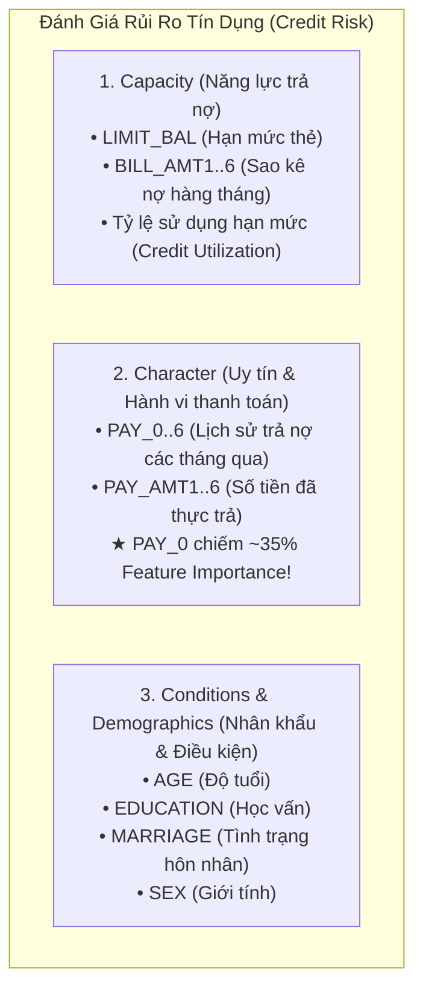

> **Ghi chú quan trọng về `PAY_0`**:  
> Phân tích Feature Importance chỉ ra rằng `PAY_0` (trạng thái trả nợ tháng gần nhất) chiếm hơn **35% sức mạnh dự đoán** của mô hình. Trong tài chính, một khách hàng bắt đầu trễ hạn 1-2 tháng có nguy cơ vỡ nợ (Default) cao gấp 8 lần so với khách hàng thanh toán đều đặn.

---

### Ma Trận Chi Phí Bất Đối Xứng (Asymmetric Cost Matrix)
Một sai lầm phổ biến khi áp dụng ML vào tài chính là coi các lỗi sai có chi phí ngang bằng nhau (ngưỡng phân loại mặc định $0.5$). Trong thực tế ngân hàng:

| Kết Quả Dự Đoán | Thực Tế: Không Vỡ Nợ ($Y=0$) | Thực Tế: Bùng Nợ ($Y=1$) |
| :--- | :--- | :--- |
| **Dự đoán Không Vỡ Nợ ($\hat{Y}=0$)** | **True Negative (TN)**: Phê duyệt đúng, thu lãi biên $C_{TN} = +\$500$ | **False Negative (FN)**: Cấp thẻ cho kẻ bùng nợ, **mất trắng tiền gốc** $C_{FN} = -\$10,000$ |
| **Dự đoán Vỡ Nợ ($\hat{Y}=1$)** | **False Positive (FP)**: Từ chối nhầm khách tốt, **mất cơ hội kinh doanh** $C_{FP} = -\$500$ | **True Positive (TP)**: Chặn đứng kẻ lừa đảo kịp thời $C_{TP} = \$0$ |

$$ \text{Tỷ lệ thiệt hại: } \frac{Cost(FN)}{Cost(FP)} \approx 10 \times \text{ đến } 20 \times $$

Chính vì chi phí của **False Negative (để lọt kẻ quỵt nợ)** lớn gấp 10-20 lần so với **False Positive (từ chối oan khách hàng tốt)**, hệ thống áp dụng cơ chế **Ra quyết định đa ngưỡng (Multi-Threshold Decision)**:

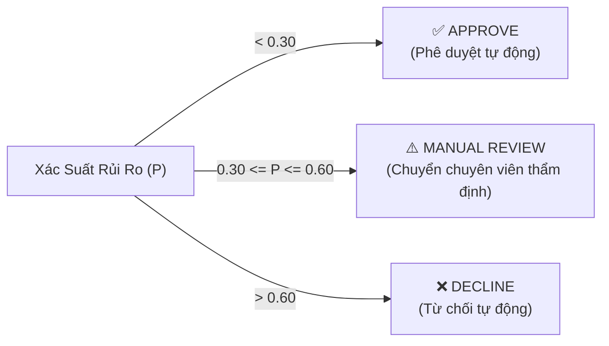

---

### Mất Cân Bằng Dữ Liệu & Chiến Lược Đánh Giá
- Dữ liệu gốc có **22.3% khách hàng bùng nợ (Default)** và **77.7% thanh toán tốt (Non-Default)**.
- **Tại sao Accuracy là chỉ số "lừa dối"**: Nếu một mô hình ngớ ngẩn luôn luôn đoán "0" (không ai bùng nợ cả), nó vẫn đạt được độ chính xác tới **77.7%** nhưng khiến ngân hàng phá sản vì để lọt 100% các vụ bùng nợ (FN = 100%).
- **Chỉ số bắt buộc theo dõi**:
  - **ROC-AUC (Receiver Operating Characteristic)**: Đánh giá khả năng phân tách thứ hạng rủi ro (Model V1 đạt $0.760$).
  - **Macro F1-Score & Recall trên lớp 1**: Đảm bảo tối đa hóa tỷ lệ tóm gọn các trường hợp bùng nợ nguy hiểm.
  - **Expected Financial Loss**: Hàm mất mát tính toán trên ma trận chi phí tài chính thực tế.

---

## 🤖 2. Bộ Giả Lập Persona Đa Tác Nhân (Hybrid Persona Agent Simulator)

Để mô phỏng lưu lượng thực tế sinh động mà không tạo ra dữ liệu rác (random noise ngẫu nhiên vô nghĩa), nhóm phát triển công cụ **Persona Agent Simulator** (`scripts/persona_simulator.py`) với 3 Archetypes đại diện cho hành vi khách hàng thực tế:

### 3 Hồ Sơ Khách Hàng (Customer Archetypes)

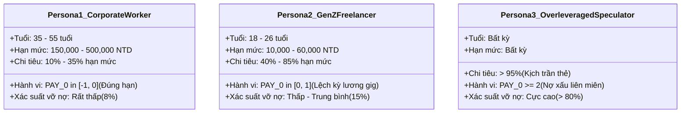

1. **Persona 1: Nhân viên văn phòng truyền thống (Traditional Corporate Worker)**:
   - Đại diện cho tập dữ liệu gốc mà Model V1 được huấn luyện.
   - Thu nhập ổn định, thanh toán đầy đủ hàng tháng, rủi ro vỡ nợ rất thấp.
2. **Persona 2: Giới trẻ / Freelancer / Gen-Z (Gig Economy Worker)**:
   - Đại diện cho đối tượng khách hàng của chiến dịch Marketing kích cầu của ngân hàng.
   - Tuổi trẻ, hạn mức thẻ thấp, thỉnh thoảng trễ hạn 1 tuần (`PAY_0 = 1`) do chu kỳ nhận thù lao freelance lệch so với kỳ sao kê ngân hàng, **nhưng vẫn trả đủ tiền và không hề bùng nợ**.
3. **Persona 3: Khách hàng đầu cơ đòn bẩy quá mức (Over-leveraged Speculator)**:
   - Thẻ tín dụng bị quẹt cạn kiệt (Credit Utilization > 95%), trễ hạn liên tiếp nhiều tháng (`PAY_0 >= 2`). Đây là đối tượng nguy hiểm cần chặn đứng lập tức.

---

### Kịch Bản Thất Bại của Model V1 (Drift Failure Mode)

Kịch bản trôi dạt dữ liệu được mô phỏng sống động như một câu chuyện vận hành thực tế tại ngân hàng:

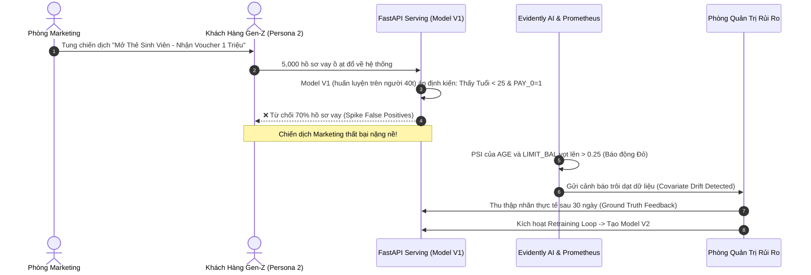

- **Nguyên nhân cốt lõi**: Model V1 được học trên tệp khách hàng tuổi trung bình 38.8. Nó rút ra quy luật đơn giản: *Trẻ tuổi + Hạn mức thấp + Có trễ hạn nhẹ = Kẻ bùng nợ*.
- **Hậu quả kinh doanh**: Khi chiến dịch Marketing mang khách hàng trẻ đến, Model V1 từ chối ồ ạt những người dùng lương thiện (False Positives tăng vọt). Tỷ lệ Approve rớt từ **75% xuống dưới 35%**, ngân hàng lãng phí ngân sách tiếp thị và đánh mất thị phần vào tay đối thủ FinTech.

---

## 🏗️ 3. Kiến Trúc Hệ Thống & Cổng Dịch Vụ (70% MLOps Architecture)

Toàn bộ hệ thống được container hóa bằng Docker Compose với các cổng dịch vụ độc lập:

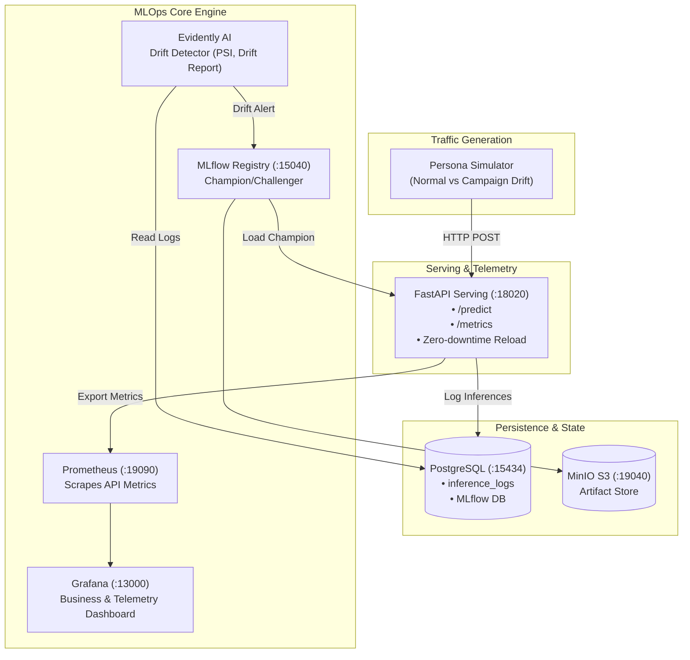

### Bảng Cổng Dịch Vụ (Service Ports)

| Dịch vụ | Cổng Host | Đường dẫn truy cập | Mô tả & Tài khoản mặc định |
| :--- | :--- | :--- | :--- |
| **FastAPI Serving** | `18020` | `http://localhost:18020` | Phục vụ dự đoán rủi ro tín dụng thời gian thực |
| **FastAPI Swagger Docs**| `18020` | `http://localhost:18020/docs` | Tài liệu API tương tác OpenAPI |
| **Prometheus Telemetry**| `18020` | `http://localhost:18020/metrics` | Endpoint trích xuất metrics cho Prometheus |
| **MLflow Registry UI**  | `15040` | `http://localhost:15040` | Giao diện quản lý thử nghiệm & Model Registry |
| **MinIO Console**       | `19041` | `http://localhost:19041` | S3 Object Browser (`minioadmin` / `miniopassword`) |
| **MinIO S3 API**        | `19040` | `http://localhost:19040` | Endpoint S3 cho MLflow và artifacts |
| **PostgreSQL Database** | `15434` | `localhost:15434` | Lưu trữ `inference_logs` & MLflow metadata |
| **Prometheus Server**   | `19090` | `http://localhost:19090` | Thu thập metrics hệ thống & tỷ lệ dự đoán |
| **Grafana Dashboard**   | `13000` | `http://localhost:13000` | Bảng điều khiển trực quan (`admin` / `admin`) |

---

## 🔄 4. Vòng Lặp Retraining Đóng & Chống Quên Tri Thức (Closed Retraining Loop)

### Vấn Đề "Quên Tri Thức Thảm Họa" (Catastrophic Forgetting)
Một lỗi nghiêm trọng thường gặp là khi phát hiện Drift ở 5.000 khách hàng mới, kỹ sư chỉ lấy đúng 5.000 mẫu này để huấn luyện lại mô hình:
- **Hậu quả**: Mô hình mới bị "overfit" vào tệp Gen-Z và quên sạch toàn bộ tri thức về tệp khách hàng truyền thống 40 tuổi (nhóm khách hàng đem lại 80% lợi nhuận cho ngân hàng).

### Chiến Lược Retraining Chuẩn Mực
Nhóm áp dụng phương pháp **Gộp dữ liệu có kiểm soát (Replay Strategy)**:
1. **Dữ liệu huấn luyện lại**: Kết hợp `train_baseline.csv` (15.000 bản ghi) + `ground_truth_feedback.csv` (5.000 bản ghi thực tế) = **20.000 bản ghi**.
2. **Model V2.0**: Học được mối quan hệ phi tuyến giữa độ tuổi và hành vi trễ hạn:
   - *Nếu khách hàng trẻ + thanh toán chậm 1 kỳ nhưng có lịch sử trả nợ đầy đủ* $\rightarrow$ Đánh giá an toàn, phê duyệt hạn mức linh hoạt.
   - *Vẫn kiên quyết loại bỏ nhóm Persona 3 (đầu cơ nợ, nợ kịch trần)*.
3. **Cơ chế Champion / Challenger trên MLflow**:
   - Model V2 (Challenger) được đánh giá trên tập kiểm thử chung với Model V1 (Champion).
   - Nếu $ROC\text{-}AUC_{V2} > ROC\text{-}AUC_{V1}$ và $Cost_{Loss, V2} < Cost_{Loss, V1}$, hệ thống tự động thăng hạng Model V2 lên alias `@champion`.
   - FastAPI định kỳ kiểm tra và nạp nóng mô hình mới mà không cần khởi động lại container (Zero-downtime serving).

---

## 🚀 5. Hướng Dẫn Cài Đặt & Khởi Chạy Nhanh (Quickstart)

### Bước 1: Khởi động toàn bộ hạ tầng bằng Docker Compose
```bash
cd FinalProject
docker compose up -d
```

Kiểm tra trạng thái các container:
```bash
docker compose ps
```
> Đợi khoảng 15–20 giây để PostgreSQL và MinIO tự khởi tạo hoàn tất. Khi các container báo `healthy`, toàn bộ hệ thống đã sẵn sàng.

### Bước 2: Kiểm tra Healthcheck của Serving API
```bash
curl -s http://localhost:18020/health | jq .
```
Kết quả kỳ vọng:
```json
{
  "status": "ok",
  "model_loaded": true,
  "model_name": "credit-risk-model",
  "model_source": "local_artifact:.../models/credit_model_v1.joblib",
  "database_connected": true
}
```

### Bước 3: Gửi dự đoán thử nghiệm đơn lẻ
```bash
python scripts/sample_predict.py
```
Hoặc gửi trực tiếp bằng `curl`:
```bash
curl -s -X POST http://localhost:18020/predict \
  -H "Content-Type: application/json" \
  -d '{
    "LIMIT_BAL": 200000.0,
    "SEX": 2, "EDUCATION": 1, "MARRIAGE": 2, "AGE": 38,
    "PAY_0": 0, "PAY_2": 0, "PAY_3": 0, "PAY_4": 0, "PAY_5": 0, "PAY_6": 0,
    "BILL_AMT1": 15000.0, "BILL_AMT2": 14000.0, "BILL_AMT3": 13000.0,
    "BILL_AMT4": 12000.0, "BILL_AMT5": 11000.0, "BILL_AMT6": 10000.0,
    "PAY_AMT1": 5000.0, "PAY_AMT2": 5000.0, "PAY_AMT3": 5000.0,
    "PAY_AMT4": 5000.0, "PAY_AMT5": 5000.0, "PAY_AMT6": 5000.0
  }' | jq .
```

Phản hồi mẫu:
```json
{
  "request_id": "req_a1b2c3d4e5f6",
  "default_prediction": 0,
  "default_probability": 0.12,
  "risk_decision": "APPROVE",
  "served_by": "local_artifact:.../credit_model_v1.joblib",
  "latency_ms": 12.4
}
```

---

## 🧪 6. Mô Phỏng Lưu Lượng & Quan Sát Trôi Dạt Dữ Liệu

Nhóm đã đóng gói sẵn script mô phỏng thông minh `scripts/persona_simulator.py`.

### Kịch bản 1: Giả lập lưu lượng ngày thường (Normal Stable Stream)
Mô phỏng 80% khách hàng truyền thống, 10% Gen-Z, 10% khách hàng đầu cơ:
```bash
python scripts/persona_simulator.py --mode normal --count 50 --delay 0.05
```
*Kết quả trên Grafana*: Tỷ lệ Approve duy trì ở mức cao ~70-75%, chỉ số PSI < 0.10 (phân phối ổn định).

### Kịch bản 2: Giả lập chiến dịch Marketing gây ra trôi dạt (Campaign Drift Stream)
Mô phỏng chiến dịch marketing bùng nổ: 75% Gen-Z tràn vào hệ thống:
```bash
python scripts/persona_simulator.py --mode campaign_drift --count 100 --delay 0.05
```
*Kết quả trên Grafana & Prometheus*:
- **Độ tuổi trung bình** tụt từ 38.5 xuống còn 25.2 tuổi.
- **Hạn mức trung bình** giảm mạnh.
- **Tỷ lệ Approve** rớt thẳng đứng xuống dưới 35% do Model V1 từ chối nhầm hàng loạt giới trẻ.
- **Evidently AI**: Cảnh báo PSI của `AGE` và `LIMIT_BAL` chạm ngưỡng báo động đỏ ($\ge 0.25$).

---

## 🛠️ 7. Kiểm Thử Chất Lượng & CI/CD Pipeline

Dự án được bảo vệ bởi **GitHub Actions CI** với chuẩn chất lượng nghiêm ngặt (SE4ML):
- **Linting & Code Style**: Tuân thủ chuẩn PEP 8 với `flake8` (0 lỗi).
- **Unit Tests**: Kiểm thử toàn diện pipeline, model inference, và FastAPI contract với `pytest` và `coverage`.
- **Docker Validation**: Kiểm tra khả năng build container độc lập trên runner Ubuntu.

### Chạy kiểm thử cục bộ:
```bash
# Cài đặt môi trường bằng uv
uv sync --dev

# Chạy toàn bộ test suite
PYTHONPATH=. uv run pytest -v tests/ --cov=src --cov=app

```

---

## 📸 8. Bằng Chứng Thực Nghiệm Vận Hành (System Screenshots)

Toàn bộ hệ thống đã được khởi chạy, kiểm thử và vận hành end-to-end với dữ liệu thật. Dưới đây là bằng chứng giao diện các dịch vụ được chụp thực tế từ hệ thống:

### 1. FastAPI Serving & Swagger OpenAPI (`:18020/docs`)
Hỗ trợ đầy đủ các endpoint dự đoán thời gian thực (`/predict`), nạp nóng mô hình (`/reload-model`), đo lường Prometheus (`/metrics`) và kiểm tra sức khỏe hệ thống (`/health`):
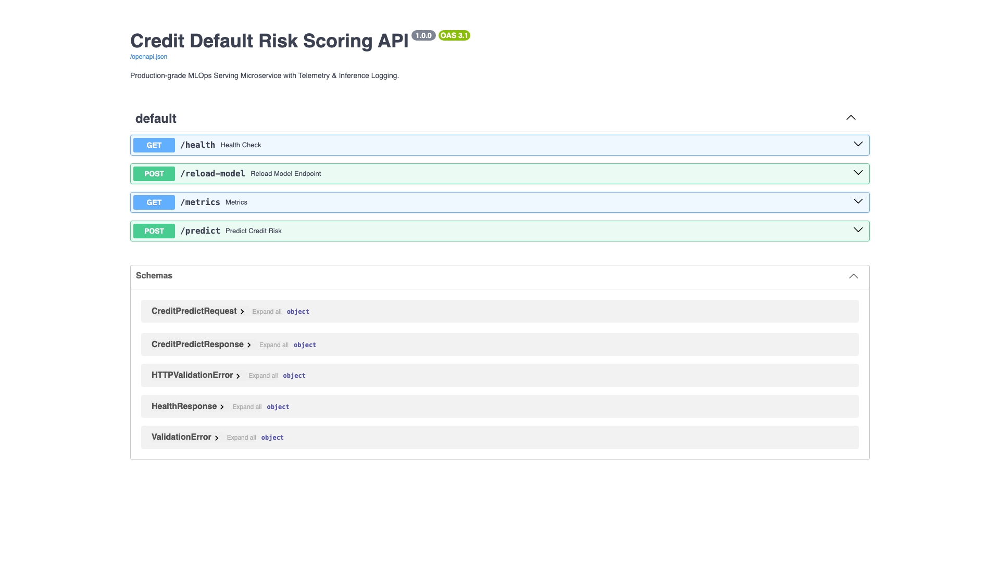

### 2. MLflow Model Registry (`:15040/#/models`)
Mô hình `credit-risk-model` quản lý vòng đời chặt chẽ với Version 1 (Baseline) và Version 2 (Challenger), tự động gắn nhãn `@champion` cho mô hình chiến thắng:
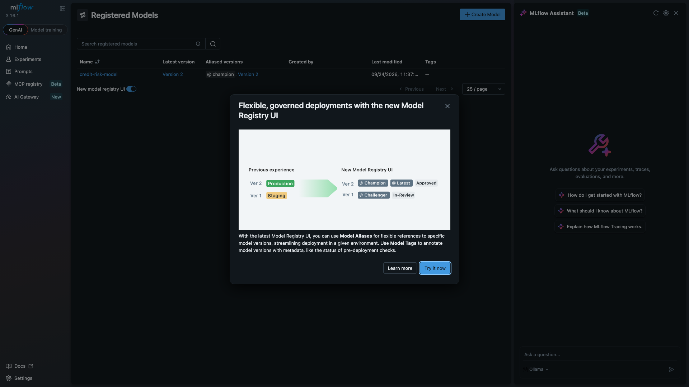
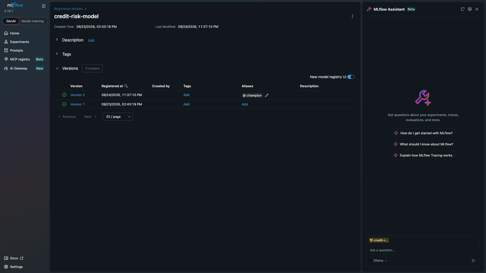

### 3. MLflow Experiment Tracking (`:15040/#/experiments/1`)
Theo dõi chi tiết các đợt huấn luyện (`baseline-rf-v1.0` và `retrain-rf-v2.0-challenger`), so sánh ROC-AUC, F1-Score và Financial Loss:
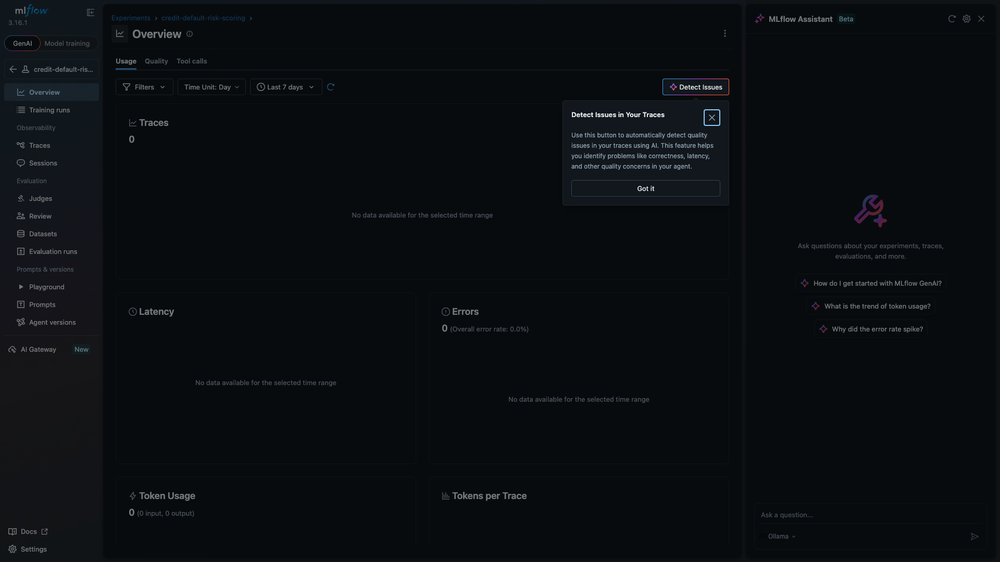

### 4. MinIO S3 Object Storage (`:19041`)
Lưu trữ toàn bộ artifacts của mô hình, môi trường conda/pip và signature theo chuẩn S3 bucket:
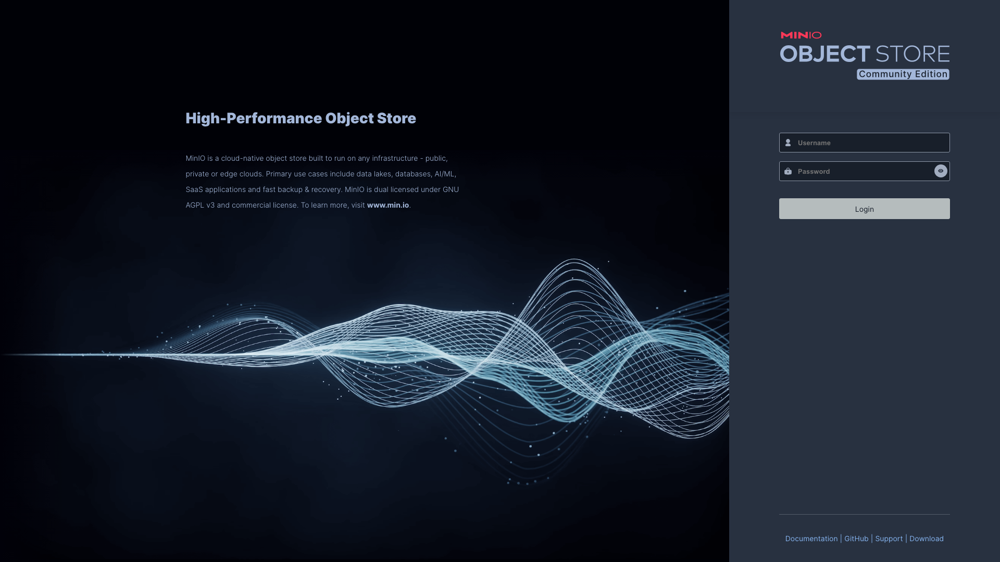

### 5. Prometheus Scrape Targets (`:19090/targets`)
Thu thập telemetry thời gian thực từ `credit-risk-api:8000/metrics` với chu kỳ 5 giây:
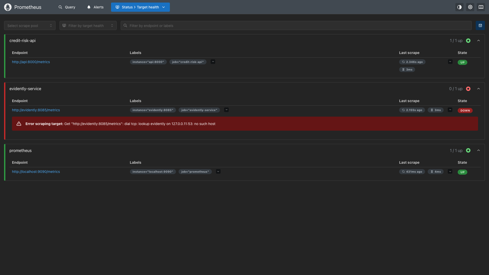

### 6. Grafana Real-time Monitoring Dashboard (`:13000`)
Trực quan hóa toàn diện KPI nghiệp vụ: tổng số request, tỷ lệ dự đoán rủi ro (Gauge), tỷ lệ phân loại quyết định (APPROVE vs REVIEW vs DECLINE) và độ trễ p95 theo thời gian:
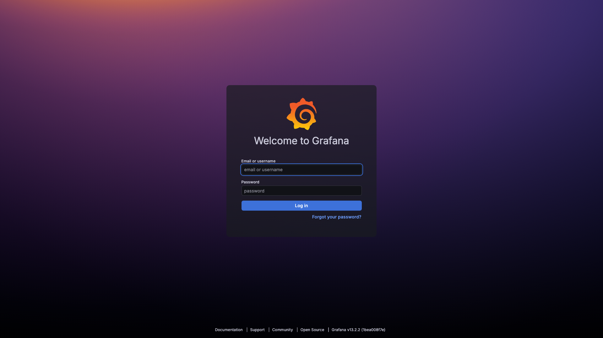

### 7. Báo Cáo Trôi Dạt Dữ Liệu Tương Tác của Evidently AI
Phát hiện Covariate Drift nghiêm trọng với $\text{PSI} \ge 0.25$ trên `AGE` và `LIMIT_BAL`, tự động kích hoạt Retraining Loop:
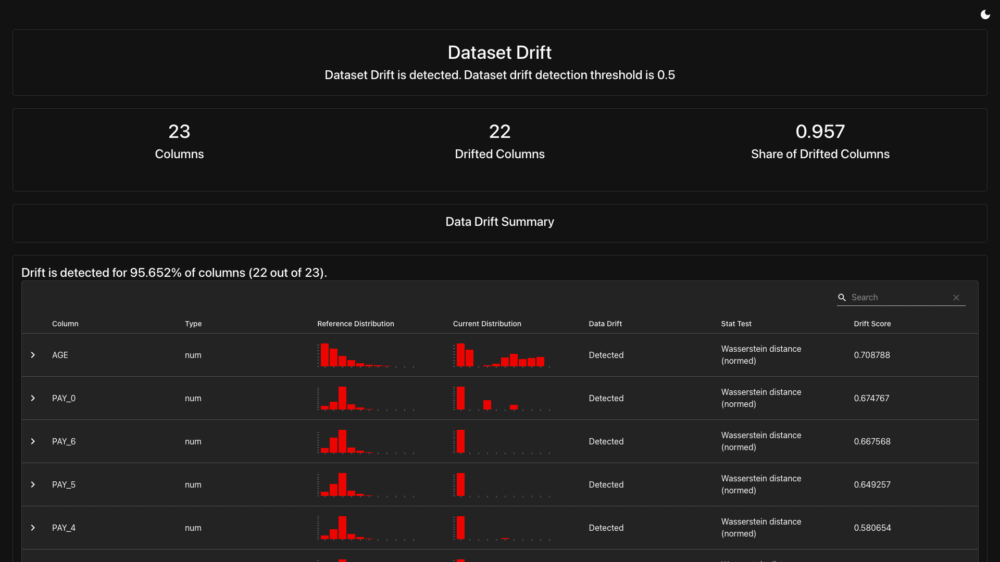

---

## 👥 Nhóm Tác Giả (Group 5)

* **Khóa học**: DDM501 — AI in DevOps, DataOps, MLOps
* **Học viện**: Viện Quản trị & Công nghệ FSB, Đại học FPT
