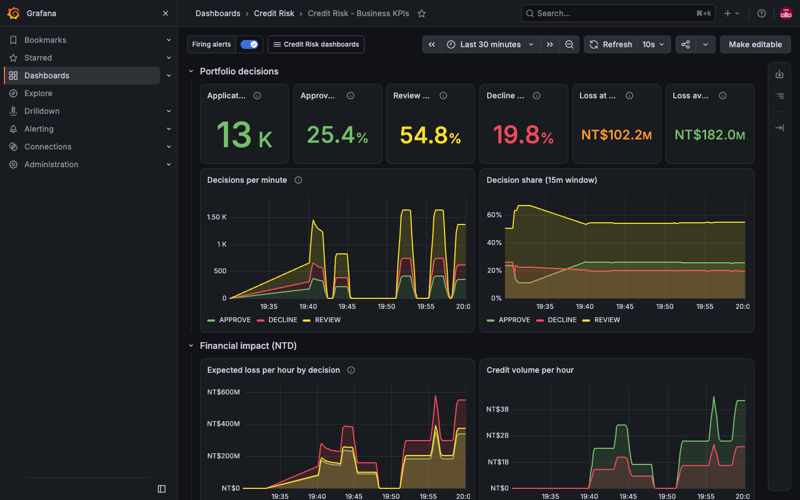
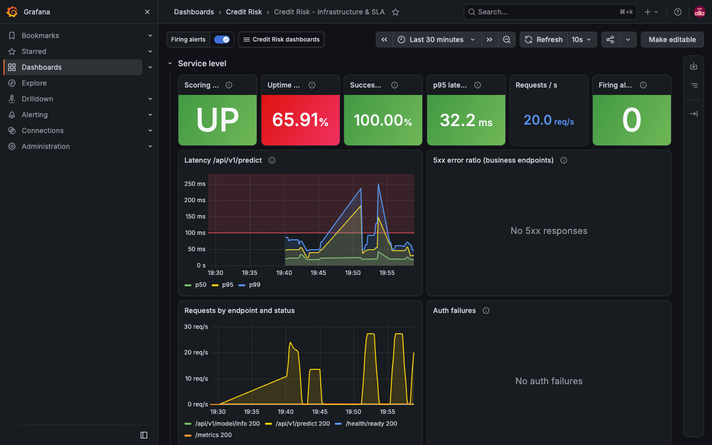

# 05 — Monitoring, alerting & orchestration

> Rubric **C. Implementation — Monitoring (10%)**: metrics (system + ML, custom metrics), dashboards (Grafana),
> alerting (meaningful alerts, proper thresholds). Runbook chi tiết từng alert: [`runbooks/alerts.md`](runbooks/alerts.md).
> Kịch bản kích hoạt từng alert end-to-end: [`guides/scenario-simulation.md`](guides/scenario-simulation.md).

Stack Docker Compose: serving + MLflow + Evidently drift monitor + Prometheus/Alertmanager/Grafana + Airflow. Toàn bộ
chạy bằng một lệnh:

```bash
cp .env.example .env      # `make up` tự tạo nếu chưa có; đổi mật khẩu trước khi deploy thật
make up                   # build + up -d + chờ mọi service healthy (in bảng SERVICE/STATUS/PORTS)
make health               # chạy lại bước kiểm tra
make down                 # dừng (giữ volume) · make down-v: xoá volume, về trạng thái máy sạch
```

## 1. Service, profile, cổng, tài nguyên

Profile điều khiển bằng `COMPOSE_PROFILES` (mặc định `core,monitoring,orchestration`; `make up-core` chỉ chạy `core`).

| Service | Profile | Cổng host → container | Giới hạn RAM | Healthcheck |
|---|---|---|---|---|
| postgres | core | 15434 → 5432 | 512M | `pg_isready` |
| minio (+ console) | core | 19040 → 9000, 19041 → 9001 | 512M | `/minio/health/live` |
| minio-init | core | — (one-shot) | 128M | exit 0 |
| mlflow | core | 15040 → 5000 | 1G | `/health` |
| model-bootstrap | core | — (one-shot) | 1G | exit 0 |
| api | core | 18020 → 8000 | 1.5G (2 worker gunicorn) | `/health/ready` |
| drift-monitor | monitoring | 18085 → 8085 | 1G | `/health` |
| prometheus | monitoring | 19090 → 9090 | 512M | `/-/ready` |
| alertmanager | monitoring | 19093 → 9093 | 128M | `/-/ready` |
| alert-webhook | monitoring | 19095 → 9095 | 64M | `/health` |
| grafana | monitoring | 13000 → 3000 | 768M | `/api/health` |
| statsd-exporter | monitoring, orchestration | 19102 → 9102 (UDP 9125 nội bộ) | 64M | `/metrics` |
| airflow-init | orchestration | — (one-shot) | 1G | exit 0 |
| airflow-webserver | orchestration | 18080 → 8080 | 1.5G | `/health` |
| airflow-scheduler | orchestration | — (health nội bộ 8974) | 2.5G | `:8974/health` |

`docker-compose.prod.yml`: `restart: always`, cổng chỉ bind `127.0.0.1` (đi qua Nginx), bắt buộc đặt mật khẩu
Postgres/MinIO/`PSEUDONYMIZATION_KEY`, không mount source vào container, xoay log 20 MB × 5 (`make up-prod`).

**RAM**

- Đo thực tế (`docker stats`, Docker Desktop 8 GB / 10 CPU): toàn stack idle ≈ **3.0 GB** (3 profile core + monitoring +
  orchestration; `api` 2 worker ≈ 705 MiB lúc vừa khởi động, ≈ 890 MiB sau load 20 user, 1 worker ≈ 370 MiB). Số đo cũ lúc
  chạy load 32 luồng + retrain ≈ 3 GB là với `api` 1 worker; 2 worker cộng thêm ~0.5 GB.
- Tổng giới hạn các service long-running ≈ 10 GB (giới hạn, không phải mức dùng).
- **Tối thiểu:** máy 8 GB RAM, cấp cho Docker ≥ 6 GB. **Khuyến nghị:** 12–16 GB RAM (Docker 8 GB). Đĩa trống ≥ 15 GB cho
  image (layer venv ~3.2 GB dùng chung giữa API / drift monitor / Airflow).
- MLflow 3.x mặc định fork ~7 tiến trình job (`huey`) ~150 MB mỗi cái → bị OOM với giới hạn 1G; compose tắt bằng
  `MLFLOW_SERVER_ENABLE_JOB_EXECUTION=false`.

## 2. Luồng giám sát

```text
api /metrics ───────────────┐
drift-monitor /metrics ─────┤
airflow ─StatsD→ statsd-exporter ─┤──► Prometheus ──rules──► Alertmanager ──► alert-webhook (luôn có)
minio, grafana, alertmanager ─────┘        │                                  └─► Telegram (khi có token)
                                           └──► Grafana (4 dashboard)
```

| Thành phần | Cấu hình | Ghi chú |
|---|---|---|
| Prometheus | [`monitoring/prometheus/prometheus.yml`](../monitoring/prometheus/prometheus.yml) | Scrape 10 s (drift monitor 15 s), đánh giá rule 15 s, retention 15 ngày |
| Rules | [`monitoring/prometheus/rules/`](../monitoring/prometheus/rules/) | 8 recording rule + 11 alert trong 3 file (`api_alerts`, `model_alerts`, `drift_alerts`) |
| Alertmanager | [`monitoring/alertmanager/`](../monitoring/alertmanager/README.md) | Template render lúc start; Telegram bật khi có `TELEGRAM_BOT_TOKEN` + `TELEGRAM_CHAT_ID` |
| Grafana | [`monitoring/grafana/`](../monitoring/grafana/provisioning/README.md) | Datasource + 4 dashboard provision tự động, sinh từ `scripts/build_grafana_dashboards.py` |
| Log | JSON một dòng/request (`request_id`, endpoint, status, latency, model version) | Không log payload khách hàng; driver `json-file` xoay vòng |

## 3. Metric catalog

### 3.1 System / API (service `api`, endpoint `/metrics`)

| Metric | Loại | Label | Ý nghĩa |
|---|---|---|---|
| `credit_api_requests_total` | counter | `method`, `endpoint`, `status` | Mọi request HTTP (nguồn cho error ratio, throughput) |
| `credit_api_request_duration_seconds` | histogram | `method`, `endpoint` | Latency end-to-end phía server (nguồn cho p50/p95/p99) |
| `credit_api_auth_failures_total` | counter | `reason` = `missing`/`invalid` | Thiếu/sai `X-API-Key` |
| `credit_model_info` | gauge (info) | `model_name`, `model_version`, `source` | Model đang phục vụ |
| `credit_model_loaded` | gauge | — | 1 nếu có model, 0 nếu không (→ `ModelNotLoaded`) |
| `credit_model_degraded` | gauge | — | 1 khi phục vụ bằng artifact local (→ `ModelServedFromFallback`) |
| `credit_model_reloads_total` | counter | `result` | Hot reload thành công/thất bại |
| `process_cpu_seconds_total`, `process_resident_memory_bytes`, `up` | chuẩn | — | CPU, RSS của cả container API (tổng master + worker gunicorn, đọc `/proc`; RSS cộng dồn tính trang nhớ dùng chung nhiều lần nên cao hơn `docker stats`); `up` cho `APIDown` |

### 3.2 ML / business (service `api`)

| Metric | Loại | Ý nghĩa |
|---|---|---|
| `credit_prediction_requests_total{decision,status}` | counter | Số quyết định APPROVE/REVIEW/DECLINE |
| `credit_prediction_duration_seconds` | histogram | Thời gian chạy model (không tính HTTP) — 1 quan sát cho mỗi lời gọi `predict_proba` của `/predict` và `/predict/batch` |
| `credit_prediction_default_probability` | histogram | Phân phối PD — phát hiện dịch chuyển điểm số |
| `credit_applicant_score_distribution` | histogram | Phân phối credit score 300–850 |
| `credit_prediction_batch_size` | histogram | Kích thước batch |
| `credit_default_prediction_ratio` | gauge | Tỉ lệ dự đoán default trong cửa sổ trượt 200 request |
| `credit_approved_volume_ntd_total`, `credit_declined_volume_ntd_total` | counter | Hạn mức được duyệt / từ chối (NT$) |
| `credit_expected_loss_ntd_total{decision}` | counter | Expected loss = PD × exposure × LGD 0.45 |
| `credit_customer_age_rolling_mean`, `credit_customer_limit_bal_rolling_mean`, `credit_customer_utilization_ratio_mean`, `credit_customer_pay_0_delayed_ratio` | gauge | Hồ sơ khách hàng trượt 200 request — tín hiệu drift sớm, rẻ |

**API nhiều worker** ([ADR-0007](adr/0007-api-capacity-multi-worker.md)): container `api` chạy `API_WORKERS` worker
gunicorn, `/metrics` gộp file của mọi worker (Prometheus multiprocess mode), nên tên metric, recording rule, alert và
dashboard giữ nguyên. Counter/histogram là tổng các worker (kể cả worker đã bị thay). Gauge gộp theo ý nghĩa:
`credit_model_loaded` lấy **min** (1 worker mất model là 0), `credit_model_degraded` lấy **max**, `credit_model_info`
chỉ hiện identity đang được ít nhất 1 worker phục vụ (sau reload có thể thấy 2 version trong vài giây, tới khi mọi
worker nạp xong), các gauge rolling lấy giá trị của worker ghi gần nhất (cửa sổ 200 request của 1 worker, không phải
toàn cục). Worker vừa khởi động báo `credit_model_loaded 0` vài giây trước khi nạp xong model, ngắn hơn `for: 1m` của
`ModelNotLoaded`.

### 3.3 Drift (service `drift-monitor`, [`services/drift_monitor/README.md`](../services/drift_monitor/README.md))

| Metric | Ý nghĩa |
|---|---|
| `credit_drift_detected` | 1 khi PSI feature trọng yếu ≥ 0.25 **hoặc** Evidently drift share ≥ 0.5 (→ `DataDriftDetected`) |
| `credit_drift_share`, `credit_drift_drifted_features` | Tỉ lệ / số cột bị drift theo Evidently |
| `credit_drift_max_psi`, `credit_drift_feature_psi{feature}` | PSI cho `AGE`, `LIMIT_BAL`, `PAY_0`, `BILL_AMT1` |
| `credit_drift_feature_drifted{feature}`, `credit_drift_feature_score{feature}` | Kết quả stattest Evidently từng cột |
| `credit_drift_prediction_psi`, `credit_drift_prediction_shift` | PSI phân phối PD so với reference (→ `PredictionDistributionShift`) |
| `credit_drift_current_samples`, `credit_drift_reference_samples` | Kích thước cửa sổ (500 log mới nhất) và reference (5000 mẫu) |
| `credit_drift_last_analysis_timestamp_seconds` | Lần phân tích gần nhất (→ `DriftAnalysisStale`) |
| `credit_drift_reference_model_info` | Model version dùng làm reference prediction |
| `credit_drift_analyses_total{result}`, `credit_drift_analysis_duration_seconds` | Sức khoẻ vòng phân tích (60 s/lần) |

### 3.4 Orchestration (Airflow → StatsD → `statsd-exporter`)

| Metric | Ý nghĩa |
|---|---|
| `credit_retrain_last_run_failed` | 1 khi lần chạy `model_retrain` gần nhất lỗi (→ `RetrainFailed`) |
| `credit_retrain_last_run_timestamp_seconds`, `credit_retrain_last_promoted_version` | Thời điểm retrain cuối, version được promote cuối |
| `airflow_dag_import_errors` | Số DAG lỗi import (→ `AirflowDagImportErrors`) |
| `airflow_dagrun_duration_*`, `airflow_ti_*`, `airflow_scheduler_heartbeat` | Thời gian DAG run, kết quả task, heartbeat scheduler |

### 3.5 Recording rules (SLI)

| Rule | Biểu thức (rút gọn) |
|---|---|
| `credit:api_requests:rate2m` | `sum(rate(credit_api_requests_total{endpoint=~"/api/v1/.*"}[2m]))` |
| `credit:api_errors:rate2m` | như trên với `status=~"5.."` |
| `credit:api_error_ratio:rate2m` | errors / requests |
| `credit:predict_latency_seconds:p50_2m` / `p95_2m` / `p99_2m` | `histogram_quantile` trên `/api/v1/predict` |
| `credit:decision_share:rate15m` | tỉ trọng từng decision trong 15 phút |
| `credit:default_probability:mean15m` | PD trung bình 15 phút |

## 4. Dashboards (Grafana)

Grafana <http://localhost:13000>. Provision tự động, không cần import tay. Ảnh chụp trước/sau khi chuẩn hoá hiển thị:
[`assets/screenshots/grafana/`](assets/screenshots/grafana/).

| Dashboard (uid) | Refresh | Người xem | Panel chính |
|---|---|---|---|
| **Business KPIs** (`credit-business`) | 10 s | Risk/business | Applications 1h, Approve/Review/Decline rate 15m, Loss at risk 24h, Loss avoided 24h, decision share, expected loss & credit volume/giờ, hồ sơ khách hàng trượt |
| **ML Model** (`credit-ml-model`) | 10 s | Data scientist | Model in production / loaded / serving source, reload OK/failed, phân phối PD và score, PD trung bình vs tỉ lệ default, prediction PSI, inference latency, retrain cuối, version promote cuối |
| **Data Drift (Evidently)** (`credit-drift`) | 30 s | Data scientist / MLOps | Dataset drift, drift share, max PSI, số feature drift, tuổi phân tích; PSI theo thời gian từng feature, sức khoẻ monitor |
| **Infrastructure & SLA** (`credit-infra-sla`) | 10 s | SRE/MLOps | Up/uptime 24h, success ratio 1h, p95, RPS, firing alerts, latency p50/p95/p99, 5xx ratio, auth failures, scrape targets, RAM/CPU, Airflow DAG/task |




### 4.1 Quy ước hiển thị

Dashboard sinh từ `scripts/build_grafana_dashboards.py` (`make dashboards`; `--check` phát hiện JSON lệch so với
script), nên các quy ước dưới đây áp dụng đồng nhất cho cả 4 dashboard.

- **Màu mang một nghĩa duy nhất.** Hai hệ màu tách bạch:
  - *Danh tính quyết định*: APPROVE = green, REVIEW = yellow, DECLINE = red — giống nhau ở stat, timeseries và credit
    volume. Stat tỷ lệ quyết định dùng `colorMode: value` (tô chữ, không tô nền) để không bị đọc thành cảnh báo.
  - *Sức khoẻ*: nền xanh/cam/đỏ theo threshold chỉ dùng cho SLO và trạng thái (UP/DOWN, LOADED, NO DRIFT, uptime, p95).
- **Empty state có chữ.** "Không có lỗi" được nói rõ qua `noValue` (vd. `No 5xx responses`, `No drifted features`), khác
  với "mất dữ liệu vì không scrape được" (`API DOWN`, `MONITOR DOWN`, `NO TARGET`, `NEVER`).
- **Mọi con số có đơn vị.** Tiền `currency:NT$` (tự scale K/M/B), tốc độ request `reqps`, thời gian `s` (tự đổi ms),
  tuổi `yrs`; số chữ số thập phân vừa đủ (p95 hiển thị 1 chữ số, vd. `33.2 ms`).
- **Ngưỡng trên panel = ngưỡng alert.** `HighLatencyP95` 100 ms, `HighErrorRate` 5 %, `DriftAnalysisStale` 900 s,
  PSI 0.1/0.25, drift share 0.5; description của panel ghi tên alert tương ứng để người trực nối panel ↔ runbook.
- **Một chỉ số một trục.** "Scrape targets" là lưới stat 1 ô/job (`min by (job) (up)`) thay vì 7 đường 0/1 chồng nhau;
  cờ retrain và version được promote tách thành hai stat riêng.
- **Mobile 390×844:** Grafana tự xếp panel thành 1 cột; chữ stat không tràn, tiêu đề đọc được.

Tài nguyên: Grafana 13 cần giới hạn 768 MiB và `GF_PLUGINS_PREINSTALL_DISABLED=true` (tắt các app drilldown tự cài) —
với 384 MiB, container chạm trần, mỗi lần mở dashboard mất 30–60 s và `/api/health` trả 503.

Hạn chế đã biết:

- Chưa có SLO/alert cho approve rate, nên stat tỷ lệ duyệt không tô nền theo ngưỡng.
- Ở 1440×900 khi sidebar Grafana mở, tiêu đề stat dài hơn ~10 ký tự ở lưới 4 cột bị cắt (đầy đủ ở tooltip). Khi trình
  chiếu nên dùng chế độ kiosk (`?kiosk`).

## 5. Alerting

### 5.1 Alert rules

Mọi alert có label `severity`, `component` và annotation `summary`, `description`, `runbook_url`
(`docs/runbooks/alerts.md#<alert>`).

| Alert | Severity | Điều kiện | `for` | Lý do chọn ngưỡng | Runbook |
|---|---|---|---|---|---|
| `APIDown` | critical | `up{job="credit-risk-api"} == 0` | 1m | 4 lần scrape liên tiếp fail — loại trừ blip khi restart | [APIDown](runbooks/alerts.md#apidown) |
| `HighErrorRate` | critical | `credit:api_error_ratio:rate2m > 0.05` và traffic > 0.05 rps | 2m | NFR availability 99.5 %; 5 % 5xx là vi phạm rõ, điều kiện traffic tránh báo khi idle | [HighErrorRate](runbooks/alerts.md#higherrorrate) |
| `HighLatencyP95` | warning | `credit:predict_latency_seconds:p95_2m > 0.1` | 2m | SLO p95 < 100 ms (NFR-01) | [HighLatencyP95](runbooks/alerts.md#highlatencyp95) |
| `ModelNotLoaded` | critical | `credit_model_loaded == 0` | 1m | API sống nhưng không chấm điểm được (503) | [ModelNotLoaded](runbooks/alerts.md#modelnotloaded) |
| `ModelServedFromFallback` | warning | `credit_model_degraded == 1` và model loaded | 5m | Đang dùng artifact local, registry không tới được | [ModelServedFromFallback](runbooks/alerts.md#modelservedfromfallback) |
| `DataDriftDetected` | warning | `credit_drift_detected == 1` | 2m | PSI ≥ 0.25 là ngưỡng "shift lớn" chuẩn ngành tín dụng; Evidently share ≥ 0.5 | [DataDriftDetected](runbooks/alerts.md#datadriftdetected) |
| `PredictionDistributionShift` | warning | `credit_drift_prediction_psi >= 0.25` và ≥ 50 mẫu | 2m | Điểm số dịch chuyển (tấn công/chính sách) dù feature có thể chưa drift | [PredictionDistributionShift](runbooks/alerts.md#predictiondistributionshift) |
| `RetrainFailed` | critical | `credit_retrain_last_run_failed == 1` | 0 | Vòng lặp tự phục hồi bị đứt — cần người | [RetrainFailed](runbooks/alerts.md#retrainfailed) |
| `DriftMonitorDown` | warning | `up{job="drift-monitor"} == 0` | 2m | Mất khả năng phát hiện drift | [DriftMonitorDown](runbooks/alerts.md#driftmonitordown) |
| `DriftAnalysisStale` | warning | Phân tích cuối > 15 phút trước (hoặc chưa từng chạy sau 15 phút) | 5m | Monitor sống nhưng không phân tích được (mất DB) | [DriftAnalysisStale](runbooks/alerts.md#driftanalysisstale) |
| `AirflowDagImportErrors` | warning | `airflow_dag_import_errors > 0` | 5m | DAG lỗi ⇒ drift/retrain không chạy | [AirflowDagImportErrors](runbooks/alerts.md#airflowdagimporterrors) |

Kiểm thử: `make alerts-test` chạy `promtool check rules` + `promtool test rules` (mỗi alert có test **fire và resolve**)
và `amtool check-config` cho cả hai chế độ (chỉ webhook / webhook + Telegram).

### 5.2 Routing & notification

| Thiết lập | Giá trị |
|---|---|
| Group by | `alertname`, `severity`, `component`; `group_wait` 15 s, `group_interval` 1 m |
| Repeat | 4 h (warning), **1 h** (critical) |
| Receiver luôn bật | `alert-webhook` (`http://alert-webhook:9095/alerts`, `send_resolved: true`) — xem bằng `make alerts` hoặc `GET :19095/alerts` |
| Receiver tuỳ chọn | Telegram (HTML template `telegram.credit.message`), bật khi `.env` có `TELEGRAM_BOT_TOKEN` + `TELEGRAM_CHAT_ID`; token đọc từ file tạm, không ghi vào config |
| Inhibit | `APIDown` chặn `HighErrorRate`, `HighLatencyP95`, `ModelNotLoaded`, `ModelServedFromFallback` (triệu chứng, không phải nguyên nhân); critical chặn warning cùng `alertname` + `component` |

### 5.3 Bằng chứng fire → resolve (stack thật, UTC 28/09/2026)

| Alert | Cách kích hoạt | Firing | Resolved |
|---|---|---|---|
| `RetrainFailed` | `make retrain-fail` | 11:35:11 | 11:37:11 |
| `DriftMonitorDown` | `make chaos-drift-down` | 11:38:46 | 11:40:46 |
| `APIDown` | `make chaos-api-down` | 11:41:16 | 11:43:16 |
| `ModelNotLoaded` | `make chaos-model-unloaded` | 11:44:11 | 11:48:11 |
| `HighErrorRate` | `chaos-model-unloaded` + traffic | 11:46:16 | 11:49:16 |
| `HighLatencyP95` | `make chaos-latency` + `simulate SCENARIO=load` | 11:56:31 | 12:00:31 |
| `DataDriftDetected` | `make simulate SCENARIO=drift` | 12:00:31 | 12:03:31 |
| `PredictionDistributionShift` | `make simulate SCENARIO=attack` | 12:01:56 | 12:02:56 |
| `AirflowDagImportErrors` | `make chaos-dag-import-error` | 12:07:56 | 12:12:56 |
| `ModelServedFromFallback` | dừng MLflow + reload API | 12:11:26 | 12:13:26 |
| `DriftAnalysisStale` | `make chaos-drift-stale` | 12:26:01 | 12:27:01 |

### 5.4 Kênh Telegram

Alertmanager (alert `critical`/`warning`) và Airflow (retrain thành công/thất bại, drift, task lỗi) cùng dùng một bot.
Không có token thì mọi thứ vẫn chạy qua `alert-webhook`; có token thì Telegram nhận **thêm**, webhook vẫn nhận song song.

**1. Tạo bot và lấy chat id**

1. Chat với [@BotFather](https://t.me/BotFather) → `/newbot` → đặt tên → nhận token dạng `<số>:<chuỗi>`.
2. Tạo group Telegram cho nhóm on-call, thêm bot vào group và gửi một tin bất kỳ (bot đang bật privacy mode thì gửi
   `/start@<tên_bot>`).
3. Lấy chat id (group có dấu `-`, supergroup bắt đầu bằng `-100`), đọc token từ `.env` để không lưu vào shell history:

```bash
set -a; . ./.env; set +a
curl -s "https://api.telegram.org/bot${TELEGRAM_BOT_TOKEN}/getUpdates" | jq '.result[].message.chat | {id, title}'
```

**2. Cấu hình**

Điền vào `.env` (file đã nằm trong `.gitignore`, không bao giờ commit):

```bash
TELEGRAM_BOT_TOKEN=<token từ BotFather>
TELEGRAM_CHAT_ID=<chat id dạng số>
```

Áp dụng: `docker compose -f deploy/compose/docker-compose.yml --env-file .env up -d alertmanager airflow-scheduler`
(hoặc `make up`). Log Alertmanager phải có dòng `render_config: Telegram receiver enabled (+ webhook fallback)`.

Cách bảo vệ token:

- `render_config.sh` ghi token vào tmpfs `/tmp/alertmanager/telegram_bot_token` (`bot_token_file`). Config đã render và
  `GET /api/v2/status` chỉ chứa chat id.
- Lỗi gửi được log dạng `telegram: Unauthorized (401)`, không kèm URL. Airflow `utils/notify.py` chỉ log tên exception
  hoặc HTTP status.
- Lộ token: `/revoke` trong BotFather, cập nhật `.env`, chạy lại lệnh áp dụng ở trên.

**3. Nội dung tin nhắn** (`templates/telegram.tmpl`, HTML)

Mỗi alert trong nhóm có: tên alert, trạng thái `FIRING`/`RESOLVED`, severity, service (`component`), summary, mô tả,
thời điểm bắt đầu/kết thúc, instance, link runbook và dashboard. Ký tự `<`, `>`, `&` trong annotation được escape vì
Telegram từ chối cả tin nhắn nếu HTML không hợp lệ.

**4. Kiểm tra**

| Bước | Lệnh | Kỳ vọng |
|---|---|---|
| Cú pháp | `make alerts-test` | `amtool check-config` SUCCESS cho cả chế độ webhook và Telegram |
| Alert test | `make alerts-send-test` | `[FIRING:1] AlertmanagerTest` sau ~15 s, `[RESOLVED]` sau 2–3 phút |
| Alert thật | `make chaos-api-down` → chờ FIRING → `make chaos-restore` | `APIDown` FIRING sau ~1 phút 15 s, RESOLVED ~1 phút sau khi API lên lại |
| Retrain | `make retrain-dag` / `make retrain-fail` | Tin nhắn retrain thành công / thất bại từ Airflow |
| Không lộ token | `docker compose ... logs alertmanager airflow-scheduler \| grep -c "$TELEGRAM_BOT_TOKEN"` | `0` |
| Fallback | Xoá 2 biến trong `.env`, chạy lại lệnh áp dụng, `make alerts-send-test` rồi `make alerts` | Log `webhook receiver only`; `AlertmanagerTest` có trong webhook receiver |

Không nhận được tin nhắn: xem `docker compose ... logs alertmanager | grep telegram`. `401` là sai token;
`400 chat not found` là sai chat id hoặc bot chưa được thêm vào group.

## 6. Drift detection

Cấu hình [`configs/drift.yaml`](../configs/drift.yaml); chi tiết thuật toán: [ADR-0004](adr/0004-evidently-for-drift.md).

| Tham số | Giá trị |
|---|---|
| Cửa sổ hiện tại | 500 inference log mới nhất trong Postgres (`DRIFT_WINDOW_SIZE`), tối thiểu 50 mẫu |
| Reference | 5000 mẫu cố định seed từ `train_baseline.csv` + PD của champion |
| Chu kỳ | 60 s nền; `POST :18085/analyze` chạy ngay |
| PSI | 10 bucket; moderate 0.10, critical 0.25 (áp dụng cho cả prediction PSI) |
| Evidently | Stattest từng cột; drift khi ≥ 50 % cột drift |
| Output | Metric Prometheus + HTML report (giữ 20 bản) + `reports/drift_summary.json` |

Kết quả thực tế ([`reports/simulations/`](../reports/simulations/)): traffic normal max PSI 0.0226, prediction PSI 0.023;
chiến dịch Gen-Z drift share 0.7391, max PSI 3.3354; tấn công prediction PSI 3.8275.

## 7. Orchestration (Airflow)

Airflow UI: <http://localhost:18080>.

| DAG | Lịch | Vai trò |
|---|---|---|
| `service_health_check` | 5 phút | Probe API/MLflow/drift/Prometheus/Alertmanager, thông báo khi service lỗi |
| `drift_monitoring` | 30 phút | Gọi drift monitor; drift → thông báo + trigger `model_retrain` (cooldown `RETRAIN_COOLDOWN_MINUTES` = 60) |
| `model_retrain` | theo trigger | Train challenger → quality gate → promote `@champion` → reload API → verify; lỗi → `RetrainFailed`, giữ/rollback champion |

Chi tiết: [`orchestration/airflow/dags/README.md`](../orchestration/airflow/dags/README.md). Sequence:
[06-retrain-sequence](assets/diagrams/06-retrain-sequence.svg).

## 8. Simulation & chaos

`make simulate SCENARIO=<tên> [SIM_ARGS="--count 2500"]` — báo cáo JSON trong `reports/simulations/`:

| Scenario | Traffic | Tín hiệu kỳ vọng |
|---|---|---|
| `normal` | Replay `stream_normal.csv` (mặc định 600 request, 2 luồng) | Không drift, alert resolve |
| `drift` | Replay `stream_drifted.csv` (tuổi TB 26 vs 38) + persona `campaign_drift` | `DataDriftDetected` → `drift_monitoring` → retrain |
| `attack` | Persona `fraud_attack` (70 % maxed-out, `PAY_0 ≥ 2`) | DECLINE tăng vọt, `PredictionDistributionShift` |
| `load` | 32 luồng × 180 s, đo p50/p95/p99 + throughput | `HighLatencyP95` (kết hợp `make chaos-latency`) |
| `outage` | Dừng `--target` (mặc định `api`) 90 s rồi bật lại | `APIDown` → resolved, đo thời gian phục hồi |

| Lệnh chaos | Tác động | Alert |
|---|---|---|
| `make chaos-api-down` | Dừng API | `APIDown` sau 1 phút |
| `make chaos-model-unloaded` | Tạo lại API không có model loadable | `ModelNotLoaded` (+ traffic → `HighErrorRate`) |
| `make chaos-latency` | Giới hạn API 0.5 CPU | `HighLatencyP95` khi chạy load |
| `make chaos-drift-down` | Dừng drift monitor | `DriftMonitorDown` sau 2 phút |
| `make chaos-drift-stale` | Drift monitor mất DB | `DriftAnalysisStale` |
| `make chaos-dag-import-error` | Thả DAG lỗi | `AirflowDagImportErrors` sau ~5 phút |
| `make chaos-restore` | Hoàn tác tất cả | Mọi alert resolve |

Hướng dẫn từng bước 11 kịch bản: [`guides/scenario-simulation.md`](guides/scenario-simulation.md). Xử lý sự cố vận hành:
[`guides/operations-runbook.md`](guides/operations-runbook.md).

## 9. Kiểm chứng nhanh

```bash
make health                                              # 15 service healthy
curl -s localhost:19090/api/v1/targets | jq '.data.activeTargets[] | {job: .labels.job, health}'
curl -s localhost:19090/api/v1/rules | jq '[.data.groups[].rules[]] | length'   # 19 (8 recording + 11 alert)
make alerts                                              # alert đang firing + notification webhook gần nhất
make alerts-test                                         # promtool + amtool
make alerts-send-test                                    # alert giả qua mọi receiver (webhook, Telegram nếu bật)
```
