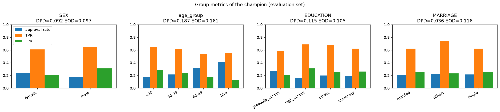
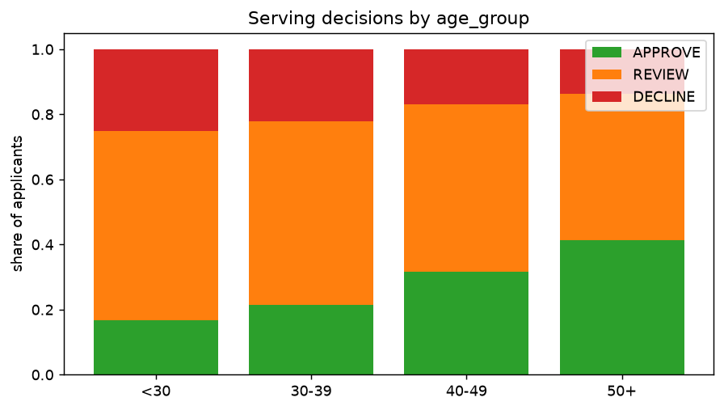
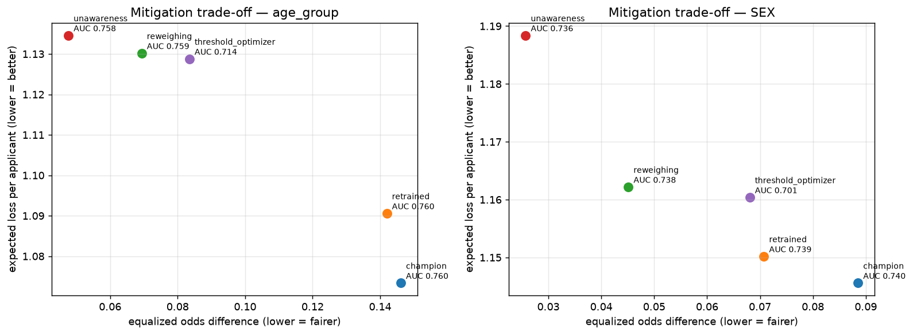
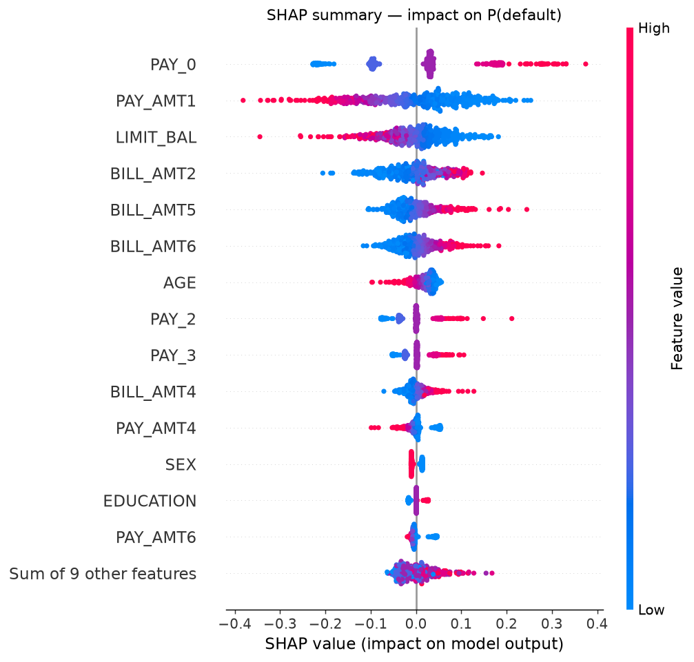
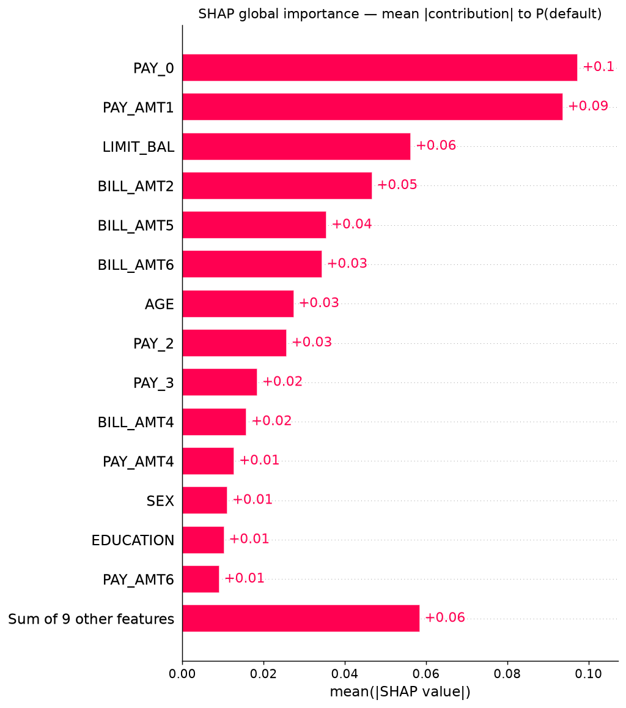

# 06 — Responsible AI: Fairness, Explainability, Privacy, Ethics

> Tài liệu này giải thích **vì sao** và **làm thế nào**; mọi con số nằm trong các khối
> `<!-- rai:… -->` được render lại từ `reports/fairness_report.json` và
> `reports/explainability_report.json` mỗi lần chạy `make responsible-ai`
> (test `tests/unit/test_rai_reporting.py::test_docs_match_generated_reports` fail nếu docs lệch report).
> Xem thêm: [Model card](model-card.md) · [Data card](data-card.md) ·
> [Báo cáo fairness](../reports/fairness_report.md) · [Báo cáo explainability](../reports/explainability_report.md) ·
> Notebook [`02_fairness_explainability.ipynb`](../notebooks/02_fairness_explainability.ipynb).

## 1. Tóm tắt

- **Bias có thật và đo được.** Champion (Logistic Regression) vi phạm ít nhất một ngưỡng fairness ở cả 4 thuộc tính
  nhạy cảm; nặng nhất là **nhóm tuổi**: người dưới 30 tuổi bị gắn cờ default và bị từ chối nhiều hơn rõ rệt so với
  nhóm 40+, trong khi chênh lệch default rate thực tế nhỏ hơn nhiều so với chênh lệch quyết định.
- **Nguyên nhân chính:** (1) model dùng trực tiếp `SEX`, `AGE`, `EDUCATION`, `MARRIAGE` làm feature (SHAP xác nhận
  `AGE` nằm trong nhóm feature quan trọng); (2) dữ liệu train chỉ có khách hàng **≥ 30 tuổi** (partition theo thiết kế
  drift của dự án) nên nhóm < 30 là out-of-distribution; (3) base rate khác nhau giữa các nhóm.
- **Mitigation khả thi với chi phí thấp.** Bỏ thuộc tính nhạy cảm (unawareness) hoặc reweighing giảm DPD/EOD nhiều lần
  mà ROC-AUC gần như không đổi; cái giá là expected loss tăng nhẹ (bắt ít defaulter hơn ở ngưỡng 0.5).
  ThresholdOptimizer đạt demographic parity tốt nhất nhưng mất ROC-AUC và **cần thuộc tính nhạy cảm lúc ra quyết định**
  (disparate treatment) → không khuyến nghị cho production.
- **Explainability hai phương pháp.** SHAP (global + local) và LIME đồng thuận cao về hướng tác động; SHAP được nối vào
  `POST /api/v1/explain` (thay `top_risk_factors` dạng rule bằng lý do sinh từ SHAP, cộng dồn chính xác).
- **Privacy:** không có định danh trực tiếp; log ứng dụng redact toàn bộ trường hồ sơ; pseudonymization bằng HMAC;
  inference log giữ tối đa 90 ngày (`make purge-logs`).
- **Ethics:** vùng REVIEW luôn qua người duyệt (human-in-the-loop), DECLINE phải kèm lý do và kênh khiếu nại; model
  chỉ là công cụ hỗ trợ quyết định, không dùng ngoài phạm vi ghi trong [model card](model-card.md#2-mục-đích-sử-dụng).

## 2. Tái lập

```bash
make setup             # cài dependencies (fairlearn, lime ở nhóm dev; shap ở runtime)
make responsible-ai    # audit + mitigation + SHAP/LIME + reports + figures + refresh khối số liệu trong docs (~1 phút)
make notebook-rai      # (tuỳ chọn) chạy lại notebook 02 với output
make purge-logs        # xoá inference log quá hạn (RETENTION_DAYS=90)
```

| Thành phần | File |
|---|---|
| Fairness (Fairlearn): metric theo nhóm, mitigation | `src/credit_risk/responsible_ai/fairness.py` |
| SHAP / LIME, risk factor từ SHAP, plots | `src/credit_risk/responsible_ai/explainability.py` |
| Privacy: PII inventory, HMAC pseudonym, generalization, retention | `src/credit_risk/responsible_ai/privacy.py` |
| Orchestration + report + đồng bộ docs | `src/credit_risk/responsible_ai/analysis.py`, `reporting.py`, `scripts/responsible_ai.py` |
| Cấu hình (thuộc tính, ngưỡng, seed, kích thước mẫu) | `configs/responsible_ai.yaml` |
| Output | `reports/fairness_report.{json,md}`, `reports/explainability_report.{json,md}`, `reports/figures/rai_*.png` |
| Test | `tests/unit/test_fairness.py`, `test_explainability.py`, `test_privacy.py`, `test_rai_reporting.py`, `tests/integration/test_api.py` (explain) |

Toàn bộ pipeline deterministic (`random_state: 42`, SHAP/LIME seed cố định): chạy lại cho cùng số liệu.

## 3. Fairness

### 3.1 Thuộc tính và metric

| Thuộc tính | Nhóm | Ghi chú |
|---|---|---|
| `SEX` | male / female | thuộc tính được bảo vệ trong hầu hết luật tín dụng |
| `age_group` (từ `AGE`) | `<30`, `30-39`, `40-49`, `50+` | nhóm `<30` không có trong dữ liệu train |
| `EDUCATION` | graduate_school / university / high_school / others | proxy của thu nhập, dễ gây bất công gián tiếp |
| `MARRIAGE` | married / single / others | thuộc tính được bảo vệ (ECOA/Reg B) |

- **Demographic parity difference (DPD):** chênh lệch lớn nhất về tỷ lệ bị gắn cờ default giữa các nhóm
  (= chênh lệch tỷ lệ *không* bị gắn cờ). 0 = mọi nhóm bị gắn cờ cùng tỷ lệ.
- **Equalized odds difference (EOD):** max(ΔTPR, ΔFPR) giữa các nhóm — model có sai *như nhau* với mọi nhóm không.
  Trong tín dụng, ΔFPR quan trọng nhất: FPR cao = khách hàng tốt bị từ chối oan.
- **Approval rate / Disparate impact (DI) ratio:** tỷ lệ APPROVE theo policy serving (APPROVE < 0.30 ≤ REVIEW < 0.60
  ≤ DECLINE); DI = approval nhóm thấp nhất / nhóm cao nhất, cảnh báo khi < 0.8 (*four-fifths rule*).
- **TPR / FPR / ROC-AUC / expected loss theo nhóm** (cost FN = 10, FP = 1 như lúc train).

**Tập đánh giá:** `stream_normal` (≥ 30 tuổi) + `stream_drifted` ghép nhãn trễ `ground_truth_feedback` (< 30 tuổi) —
không dòng nào dùng để train, và là cách duy nhất để có nhãn cho nhóm < 30.

### 3.2 Kết quả audit

<!-- rai:fairness-summary:start -->
| Thuộc tính | DPD | EOD | ΔTPR | ΔFPR | ΔApproval | DI ratio | Trạng thái |
|---|---|---|---|---|---|---|---|
| Giới tính (SEX) | 0.0916 | 0.0973 | 0.0379 | 0.0973 | 0.0697 | 0.7094 | **WARN** (disparate_impact_ratio) |
| Nhóm tuổi (AGE) | 0.1871 | 0.1614 | 0.1087 | 0.1614 | 0.2442 | 0.4076 | **WARN** (demographic_parity_difference, equalized_odds_difference, disparate_impact_ratio) |
| Học vấn | 0.1147 | 0.1052 | 0.0963 | 0.1052 | 0.1088 | 0.5879 | **WARN** (demographic_parity_difference, equalized_odds_difference, disparate_impact_ratio) |
| Hôn nhân | 0.0357 | 0.1159 | 0.1159 | 0.0202 | 0.0154 | 0.9320 | **WARN** (equalized_odds_difference) |

Ngưỡng cảnh báo: DPD > 0.1, EOD > 0.1, disparate impact ratio (approval) < 0.8 (four-fifths rule). DPD/EOD tính trên quyết định nhị phân tại threshold 0.5; approval theo policy serving (APPROVE khi P(default) < 0.3).

_Sinh tự động bởi `make responsible-ai` (2026-09-28T09:53:21+00:00) — không sửa tay._
<!-- rai:fairness-summary:end -->

Chi tiết theo nhóm tuổi (thuộc tính có disparity lớn nhất):

<!-- rai:fairness-age:start -->
| Nhóm | n | Default rate | APPROVE | REVIEW | DECLINE | TPR | FPR | ROC-AUC | Expected loss |
|---|---|---|---|---|---|---|---|---|---|
| <30 | 5,000 | 25.8% | 16.8% | 58.1% | 25.1% | 0.648 | 0.292 | 0.749 | 1.125 |
| 30-39 | 3,263 | 24.8% | 21.4% | 56.5% | 22.1% | 0.618 | 0.235 | 0.748 | 1.124 |
| 40-49 | 1,310 | 20.4% | 31.5% | 51.5% | 17.0% | 0.539 | 0.174 | 0.753 | 1.077 |
| 50+ | 427 | 15.7% | 41.2% | 45.0% | 13.8% | 0.552 | 0.131 | 0.742 | 0.813 |

_Sinh tự động bởi `make responsible-ai` (2026-09-28T09:53:21+00:00) — không sửa tay._
<!-- rai:fairness-age:end -->




### 3.3 Diễn giải

1. **Tuổi.** Default rate của nhóm `<30` chỉ cao hơn nhóm `30-39` một chút, nhưng FPR và tỷ lệ DECLINE cao hơn rõ;
   nhóm `50+` thì ngược lại. Model "phạt" tuổi trẻ nhiều hơn mức rủi ro thực tế giải thích được — một phần vì `AGE` là
   feature trực tiếp, một phần vì nhóm `<30` nằm ngoài phân phối train (xem [data card](data-card.md#4-partition-và-mục-đích)).
   ROC-AUC theo nhóm gần như bằng nhau → vấn đề nằm ở **calibration/ngưỡng theo nhóm**, không phải khả năng xếp hạng.
2. **Giới tính.** Nam có FPR cao hơn nữ (bị từ chối oan nhiều hơn) và DI ratio dưới 0.8 theo policy 3 mức, dù DPD/EOD
   nhị phân dưới ngưỡng 0.1. Đây là bias "nhẹ" nhưng thuộc tính được bảo vệ mạnh nhất về pháp lý.
3. **Học vấn** là proxy của thu nhập: nhóm high_school bị gắn cờ nhiều hơn graduate_school. Cần thận trọng vì loại bỏ
   `EDUCATION` không xoá được tương quan qua `LIMIT_BAL`.
4. **Hôn nhân:** DPD thấp; EOD vượt ngưỡng chủ yếu do nhóm `others` rất nhỏ (TPR không ổn định) — kết luận thận trọng.

## 4. Mitigation và trade-off

Ba chiến lược, đánh giá trên **cùng một test split** (50% tập đánh giá, stratified theo nhóm × nhãn) cho hai thuộc tính
ưu tiên (`age_group`, `SEX`):

| Chiến lược | Loại | Cách làm |
|---|---|---|
| Retrained (đối chứng) | — | fit lại cùng thuật toán + hyper-parameter champion trên train split + fit split (có nhóm `<30`) — tách hiệu ứng "thêm dữ liệu" khỏi hiệu ứng mitigation |
| Reweighing (Kamiran & Calders) | pre-processing | trọng số `w(a,y) = P(a)P(y)/P(a,y)` truyền qua `classifier__sample_weight` |
| Unawareness | pre-processing | thay `SEX/AGE/EDUCATION/MARRIAGE` bằng hằng số (median applicant) trước khi fit và score |
| ThresholdOptimizer (Fairlearn) | post-processing | ngưỡng ngẫu nhiên theo nhóm, ràng buộc `equalized_odds`, objective `balanced_accuracy_score`, fit trên fit split |

<!-- rai:mitigation:start -->
**Nhóm tuổi (AGE)** — test split 5,000 dòng (fit split 5,000 dòng)

| Biến thể | ROC-AUC | Expected loss | Recall | DPD | EOD | DI ratio (nhị phân) |
|---|---|---|---|---|---|---|
| Champion (không mitigation) | 0.7599 | 1.0734 | 0.635 | 0.1817 | 0.1461 | 0.772 |
| Retrained (đối chứng) | 0.7599 | 1.0906 | 0.624 | 0.1784 | 0.1420 | 0.778 |
| Reweighing | 0.7593 | 1.1302 | 0.600 | 0.0672 | 0.0694 | 0.911 |
| Unawareness | 0.7585 | 1.1346 | 0.597 | 0.0549 | 0.0477 | 0.926 |
| ThresholdOptimizer | 0.7137 | 1.1288 | 0.611 | 0.0253 | 0.0835 | 0.963 |

**Giới tính (SEX)** — test split 5,000 dòng (fit split 5,000 dòng)

| Biến thể | ROC-AUC | Expected loss | Recall | DPD | EOD | DI ratio (nhị phân) |
|---|---|---|---|---|---|---|
| Champion (không mitigation) | 0.7401 | 1.1456 | 0.606 | 0.0766 | 0.0885 | 0.890 |
| Retrained (đối chứng) | 0.7392 | 1.1502 | 0.601 | 0.0638 | 0.0707 | 0.909 |
| Reweighing | 0.7379 | 1.1622 | 0.596 | 0.0041 | 0.0451 | 0.994 |
| Unawareness | 0.7364 | 1.1884 | 0.577 | 0.0249 | 0.0257 | 0.965 |
| ThresholdOptimizer | 0.7010 | 1.1604 | 0.594 | 0.0122 | 0.0681 | 0.982 |

DI ratio ở bảng này tính trên quyết định nhị phân (không bị gắn cờ default tại threshold) để so sánh được với ThresholdOptimizer (chỉ cho ra nhãn nhị phân); bảng audit dùng tỷ lệ APPROVE của policy 3 mức.

_Sinh tự động bởi `make responsible-ai` (2026-09-28T09:53:21+00:00) — không sửa tay._
<!-- rai:mitigation:end -->



**Phân tích trade-off (fairness ↔ ROC-AUC ↔ expected loss):**

- **Thêm dữ liệu một mình không đủ.** `retrained` (có nhóm `<30` trong train) chỉ cải thiện fairness rất ít → bias
  không chỉ do thiếu dữ liệu mà do model học được quan hệ trực tiếp với thuộc tính nhạy cảm.
- **Reweighing / unawareness** giảm DPD và EOD nhiều lần, ROC-AUC gần như giữ nguyên (khả năng xếp hạng không mất).
  Expected loss tăng nhẹ vì ở ngưỡng cố định 0.5 model gắn cờ ít hơn → recall giảm; có thể bù bằng cách hạ ngưỡng
  (cost-optimal threshold) sau khi mitigation — nghĩa là phần lớn chi phí là *chi phí chọn ngưỡng*, không phải chi phí
  fairness nội tại.
- **ThresholdOptimizer** cho DPD thấp nhất nhưng ROC-AUC giảm rõ (quyết định ngẫu nhiên hoá quanh ngưỡng) và phải
  biết `SEX`/`AGE` của từng khách hàng *lúc quyết định* → đối xử khác biệt trực tiếp (disparate treatment), bị cấm ở
  nhiều khung pháp lý tín dụng (ECOA/Reg B ở Mỹ). Chỉ dùng như cận tham chiếu "fairness tối đa đạt được".
- **Unawareness ≠ công bằng tuyệt đối:** proxy (`LIMIT_BAL`, `PAY_*`) vẫn mang thông tin nhóm; DPD/EOD giảm nhưng
  không về 0 → vẫn phải audit định kỳ.

**Khuyến nghị (không tự động đổi champion — mọi thay đổi đi qua champion/challenger gate của `make train`/`make retrain`):**

1. Challenger tiếp theo: **unawareness + reweighing theo `age_group`**, train trên baseline + feedback (có nhóm `<30`),
   chọn ngưỡng cost-optimal; chỉ promote nếu vừa qua gate chất lượng vừa có EOD(age) ≤ 0.10.
2. Thêm fairness vào monitoring định kỳ (Airflow/Evidently): DPD/EOD theo `age_group` và `SEX` trên dữ liệu có nhãn trễ,
   cảnh báo khi vượt ngưỡng trong `configs/responsible_ai.yaml`.
3. Không dùng ThresholdOptimizer trong production.

## 5. Explainability

| Phương pháp | Phạm vi | Cách tính |
|---|---|---|
| SHAP `PermutationExplainer` | global (beeswarm, bar) + local (waterfall) | trên **23 trường gốc** API nhận, bọc cả pipeline `FeatureEngineer → preprocessor → classifier` thành `f(x) = P(default)`; background 100 hồ sơ train; đơn vị = xác suất |
| LIME `LimeTabularExplainer` | local, cùng 3 hồ sơ | 5,000 mẫu nhiễu, rời rạc hoá feature liên tục, `SEX/EDUCATION/MARRIAGE` là categorical |
| SHAP serving (`/api/v1/explain`) | local, mỗi request | background = 1 hồ sơ tham chiếu (median applicant trong `configs/serving.yaml`), 240 lượt đánh giá (~30 ms) |

Model-agnostic → áp dụng nguyên vẹn nếu champion đổi sang XGBoost/LightGBM/Random Forest.

<!-- rai:explainability:start -->
| # | Feature | mean \|SHAP\| (xác suất) | Tỷ trọng |
|---|---|---|---|
| 1 | `PAY_0` | 0.0973 | 17.6% |
| 2 | `PAY_AMT1` | 0.0937 | 16.9% |
| 3 | `LIMIT_BAL` | 0.0563 | 10.2% |
| 4 | `BILL_AMT2` | 0.0467 | 8.4% |
| 5 | `BILL_AMT5` | 0.0355 | 6.4% |
| 6 | `BILL_AMT6` | 0.0344 | 6.2% |
| 7 | `AGE` | 0.0275 | 5.0% |
| 8 | `PAY_2` | 0.0257 | 4.6% |

| Hồ sơ | P(default) | SHAP top-3 | LIME top-3 | Overlap@5 / cùng dấu |
|---|---|---|---|---|
| APPROVE | 0.245 | `PAY_0` -0.097, `LIMIT_BAL` +0.089, `BILL_AMT5` -0.061 | `LIMIT_BAL` +0.197, `PAY_0` -0.176, `PAY_AMT1` +0.106 | 60% / 100% |
| REVIEW | 0.418 | `AGE` +0.042, `PAY_0` +0.030, `LIMIT_BAL` +0.019 | `BILL_AMT6` -0.045, `BILL_AMT5` -0.040, `AGE` +0.034 | 40% / 100% |
| DECLINE | 0.784 | `PAY_0` +0.291, `LIMIT_BAL` -0.157, `BILL_AMT6` +0.141 | `PAY_AMT1` -0.278, `PAY_0` +0.214, `LIMIT_BAL` -0.172 | 100% / 100% |

_Sinh tự động bởi `make responsible-ai` (2026-09-28T09:53:21+00:00) — không sửa tay._
<!-- rai:explainability:end -->




Waterfall + LIME cho từng hồ sơ: `reports/figures/rai_shap_waterfall_{approve,review,decline}.png`,
`reports/figures/rai_lime_{approve,review,decline}.png`.

**Diễn giải:** lịch sử trả nợ gần nhất (`PAY_0`, `PAY_2`), số tiền trả tháng gần nhất (`PAY_AMT1`) và hạn mức
(`LIMIT_BAL`) chi phối điểm — đúng trực giác nghiệp vụ. `AGE` xuất hiện trong nhóm feature quan trọng và là yếu tố hàng
đầu đẩy rủi ro của hồ sơ REVIEW mẫu (26 tuổi) — bằng chứng trực tiếp cho bias tuổi ở mục 3. SHAP và LIME luôn cùng dấu
trên các feature chung; khác biệt thứ hạng đến từ việc LIME rời rạc hoá (trọng số của điều kiện "`PAY_AMT1 <= …`",
không phải của giá trị cụ thể) và là xấp xỉ tuyến tính cục bộ.

### 5.1 Tích hợp API (thay `top_risk_factors` dạng rule)

`POST /api/v1/explain` (cấu hình `configs/serving.yaml → explain`):

- `method = "shap_permutation"`; `contributions[]` là SHAP value (top-k theo độ lớn), `reference_probability` = base value
  → `reference_probability + Σ contributions = default_probability` (test `test_explain_shap_is_additive_and_drives_risk_factors`).
- `top_risk_factors` được sinh từ SHAP, yếu tố làm **tăng** rủi ro đứng trước, ví dụ
  `"PAY_0 = 2 (repayment status last month) increases default risk by +14.0 pp"`.
- Deterministic (seed cố định), warm-up SHAP khi khởi động app để request đầu không chịu chi phí JIT.
- Nếu SHAP lỗi → tự hạ cấp `method = "reference_substitution"` (thay từng feature bằng giá trị trung vị tập train), endpoint không bao giờ 500 vì explainer.
- `POST /api/v1/predict` giữ `top_risk_factors` dạng rule để bảo toàn ngân sách latency p95 < 100 ms; lý do chi tiết cho
  người duyệt/khách hàng lấy từ `/explain`.

**Giới hạn:** SHAP interventional giả định các feature độc lập khi "che" (BILL_AMT1..6 tương quan mạnh → attribution có
thể chia giữa các tháng); SHAP serving so với *một* hồ sơ tham chiếu nên trả lời câu hỏi "vì sao khác khách hàng điển
hình", không phải "vì sao khác trung bình toàn bộ"; LIME không ổn định giữa các seed (cố định seed để tái lập).

## 6. Privacy

### 6.1 PII inventory

| Trường | Loại | Độ nhạy | Xử lý |
|---|---|---|---|
| `SEX`, `MARRIAGE` | thuộc tính được bảo vệ | đặc biệt | chỉ dùng cho audit fairness; bỏ khi export |
| `AGE`, `EDUCATION` | thuộc tính được bảo vệ | cao | `AGE` → dải tuổi 10 năm; `EDUCATION` bỏ khi export |
| `LIMIT_BAL` | tài chính | cao | → dải hạn mức khi export |
| `PAY_0..6`, `BILL_AMT1..6`, `PAY_AMT1..6` | hành vi tài chính | cao | input model; không bao giờ vào log ứng dụng |
| `request_id` | định danh giả | trung bình | HMAC-SHA256 khi rời hệ thống (`pseudonymize`) |

Dataset **không có định danh trực tiếp** (tên, CMND/CCCD, số tài khoản). Tuy vậy mỗi dòng vẫn là dữ liệu cá nhân về tài
chính; theo khung pháp lý Việt Nam (Nghị định 13/2023/NĐ-CP, nay là Luật Bảo vệ dữ liệu cá nhân) thông tin khách hàng
của tổ chức tín dụng thuộc nhóm dữ liệu cá nhân nhạy cảm; GDPR áp nguyên tắc tương tự (minimization, storage limitation).

### 6.2 Biện pháp

| Nguyên tắc | Hiện thực | Kiểm chứng |
|---|---|---|
| Không log dữ liệu nhạy cảm thô | `JsonFormatter` redact mọi trường hồ sơ và `features/payload/applicant(s)` ở mọi độ sâu (`credit_risk.config.logging.PII_FIELDS`) | `test_privacy.py::test_structured_logs_never_contain_raw_applicant_fields`, `test_log_redaction_covers_every_model_feature` |
| Pseudonymization | `privacy.pseudonymize()` — HMAC-SHA256 với khoá `PSEUDONYMIZATION_KEY` (từ `.env`, không commit); cùng input → cùng pseudonym (join được) nhưng không đảo ngược/brute-force được nếu không có khoá | `test_pseudonymize_is_keyed_and_deterministic` |
| Data minimization khi chia sẻ | `privacy.generalize_record()` bỏ `SEX/EDUCATION/MARRIAGE`, `AGE` → dải tuổi, `LIMIT_BAL` → dải hạn mức | `test_generalize_record_drops_protected_and_bands_quasi_identifiers` |
| Storage limitation | inference log (cần feature thô cho drift + retrain) giữ **90 ngày**; `make purge-logs` / `privacy.purge_inference_logs()` xoá bản ghi cũ, có `--dry-run`; nên lập lịch hằng ngày trong Airflow | `test_purge_inference_logs_deletes_only_expired_rows` |
| Báo cáo chỉ chứa số liệu tổng hợp | fairness report chỉ có aggregate theo nhóm (nhóm nhỏ nhất > 100 dòng); explainability report chứa giá trị feature của 3 hồ sơ mẫu từ dataset công khai, không định danh | review report |
| Kiểm soát truy cập | `/api/v1/*` yêu cầu API key (fail closed); `/explain` không ghi inference log | `tests/integration/test_api.py::test_protected_routes_require_api_key`, `test_auth_fails_closed_when_no_key_configured` |

**Chính sách retention:** inference log 90 ngày; log ứng dụng (stdout JSON, đã redact) theo retention của log shipper,
khuyến nghị ≤ 30 ngày; report/figures lưu cùng repo (chỉ aggregate); MLflow artifacts không chứa dữ liệu thô của khách hàng.

## 7. Ethics

### 7.1 Rủi ro phân biệt đối xử trong tín dụng

| Rủi ro | Biểu hiện trong dự án | Giảm thiểu |
|---|---|---|
| **Disparate treatment** (dùng trực tiếp thuộc tính bảo vệ) | model nhận `SEX/AGE/MARRIAGE/EDUCATION` làm input; SHAP cho thấy `AGE` ảnh hưởng điểm | challenger unawareness (mục 4); nếu giữ `AGE` phải có căn cứ pháp lý và kiểm định |
| **Disparate impact** (tác động không cân xứng qua proxy) | DI ratio theo tuổi/học vấn < 0.8 | reweighing, audit định kỳ, ngưỡng cảnh báo trong config |
| **Historical/label bias** | nhãn "default" phản ánh chính sách tín dụng quá khứ (Đài Loan 2005) | không coi nhãn là chân lý; review định kỳ với dữ liệu mới |
| **Selection bias / feedback loop** | khách bị DECLINE không bao giờ có nhãn → model chỉ học từ người được duyệt, nhóm bị từ chối nhiều càng ít dữ liệu | human review vùng REVIEW tạo nhãn; theo dõi approval rate theo nhóm; cân nhắc reject inference |
| **Out-of-distribution** | nhóm `<30` không có trong train | drift monitor (Evidently + PSI) + retrain có feedback; guardrail tuổi tối thiểu 18 |
| **Automation bias** | người duyệt tin điểm model tuyệt đối | hiển thị SHAP + LIME cho người duyệt, yêu cầu ghi lý do khi đồng ý/bác bỏ |

### 7.2 Human-in-the-loop cho vùng REVIEW

- `0.30 ≤ P(default) < 0.60` → **REVIEW**: model *không* ra quyết định; hồ sơ vào hàng đợi người duyệt với
  `/api/v1/explain` (top risk factors từ SHAP, guardrails). Hạn mức đề xuất bị giới hạn (≤ 50% hạn mức, tối đa 100k NTD).
- Người duyệt phải ghi quyết định cuối và lý do; tỷ lệ override theo nhóm được theo dõi (override lệch nhóm = dấu hiệu
  bias của model hoặc của người).
- Hơn một nửa hồ sơ rơi vào REVIEW (xem cột REVIEW ở mục 3.2) → chi phí vận hành đáng kể; điều chỉnh
  `REVIEW_THRESHOLD`/`DECLINE_THRESHOLD` là quyết định nghiệp vụ, phải đánh giá lại fairness sau mỗi lần đổi
  (`make responsible-ai` đọc ngưỡng từ cấu hình serving).
- **DECLINE** tự động phải kèm *adverse action notice* (các lý do chính từ SHAP, không phải thuộc tính bảo vệ) và kênh
  khiếu nại để người thật xem lại.

### 7.3 Giới hạn sử dụng

- Chỉ dùng để **hỗ trợ** quyết định cấp/giữ hạn mức thẻ tín dụng cho khách hàng cá nhân tương tự dữ liệu train.
- **Không** dùng cho: tuyển dụng, bảo hiểm, định giá nhà ở, marketing nhắm mục tiêu, thu hồi nợ, hay bất kỳ quyết định
  nào ngoài tín dụng tiêu dùng; không dùng cho thị trường/giai đoạn khác mà chưa validate lại (dữ liệu Đài Loan 2005).
- Không dùng làm căn cứ duy nhất để từ chối; theo EU AI Act, chấm điểm tín dụng là hệ thống **high-risk** (yêu cầu quản
  trị dữ liệu, minh bạch, giám sát của con người, logging) — dự án đáp ứng một phần qua tài liệu này, model card và audit log.

## 8. Hạn chế

- Fairness đo trên 10k hồ sơ; nhóm nhỏ (`MARRIAGE=others`, `EDUCATION=others`) có khoảng tin cậy rộng — chưa có bootstrap CI.
- Chỉ xét fairness theo từng thuộc tính riêng lẻ, chưa xét giao thoa (vd. nữ < 30 tuổi).
- Mitigation mới ở mức thực nghiệm; champion đang phục vụ chưa được thay (cần chạy qua gate).

## 9. Hướng phát triển

- Lập lịch `make purge-logs` hằng ngày bằng một DAG Airflow để retention 90 ngày được thực thi tự động.
- Xuất fairness metric theo nhóm (approval rate, DI) lên Prometheus/Grafana và thêm alert khi DI < 0.8.
- Chuyển `PSEUDONYMIZATION_KEY` từ `.env` sang secret store khi triển khai thật.
- Bổ sung bootstrap confidence interval và fairness theo giao thoa thuộc tính.
