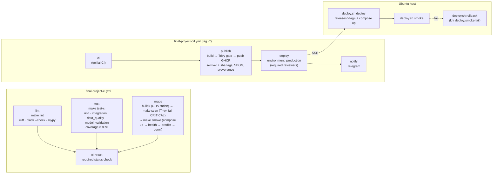

# 07 — Testing & CI/CD

Pipeline GitHub Actions cho Final Project nằm ở root repo:

| Workflow | Trigger | Vai trò |
|---|---|---|
| [`final-project-ci.yml`](../../.github/workflows/final-project-ci.yml) | push lên mọi branch / pull request có thay đổi trong `FinalProject/**`; `workflow_dispatch`; `workflow_call` (CD gọi lại) | Quality gate: lint, type check, 4 loại test + coverage ≥ 80%, build image, Trivy, compose smoke test |
| [`final-project-cd.yml`](../../.github/workflows/final-project-cd.yml) | push tag `v*` (vd. `v1.2.0`); `workflow_dispatch` trên một tag | Chạy lại CI, publish image lên GHCR, deploy Ubuntu qua SSH (có phê duyệt), smoke test sau deploy, rollback tự động, báo Telegram |

Mọi bước CI đều gọi **target `make`** trong `FinalProject/Makefile`, nên `make ci` chạy lại đúng pipeline trên máy local.

## 1. Sơ đồ job



## 2. Quality gates

| Gate | Công cụ / lệnh | Điều kiện fail |
|---|---|---|
| Lint + format | `ruff check .`, `black --check .` | Bất kỳ vi phạm nào |
| Type check | `mypy` (cấu hình trong `pyproject.toml`) | Bất kỳ lỗi type nào |
| Test | `make test-ci` chạy lần lượt `tests/unit`, `tests/integration`, `tests/data_quality`, `tests/model_validation` với `--cov-append` | Test fail, hoặc **coverage tổng < 80%** (`coverage report --fail-under=80`) |
| Container build | `docker/build-push-action`, Dockerfile multi-stage `deploy/docker/Dockerfile.api` | Build lỗi |
| Security | `make scan`: Trivy image scan (`aquasec/trivy:0.74.0` pin theo digest) | Có lỗ hổng **CRITICAL** (bảng CRITICAL/HIGH chỉ để báo cáo) |
| Smoke (E2E tối thiểu) | `make smoke`: compose `api` và các phụ thuộc (`postgres`, `minio`, `mlflow`, `model-bootstrap`) từ đúng image vừa scan (`--no-build`), rồi `deploy/scripts/smoke_test.sh` | `/health/live` ≠ 200, `/health/ready` ≠ 200 (`ready` hoặc `degraded`), request thiếu API key ≠ 401, `/api/v1/predict` ≠ 200 hoặc response sai schema |
| Post-deploy | `deploy.sh smoke` trên server | Như trên → kích hoạt `deploy.sh rollback` |

Artifact được upload mỗi lần chạy: `final-project-coverage` (`coverage.xml`, HTML, JUnit từng suite) và `final-project-security` (`trivy-report.json`). Job summary hiển thị bảng coverage (markdown) và kích thước image.

## 3. Hiệu năng, độ an toàn của pipeline

- **Cache:** `astral-sh/setup-uv` cache thư mục uv theo `FinalProject/uv.lock`; Docker layer cache `type=gha` (scope `final-project-api`, `mode=max`) dùng chung giữa CI và CD; Trivy DB cache qua `actions/cache`; pip trong Dockerfile dùng BuildKit cache mount.
- **Concurrency:** CI hủy run cũ trên cùng ref (trừ tag); CD dùng group `final-project-cd-production` với `cancel-in-progress: false` — không bao giờ hủy một lần deploy đang chạy, các release xếp hàng tuần tự.
- **Path filter:** CI chỉ chạy khi `FinalProject/**` hoặc chính workflow thay đổi (Lab1–Lab4 có workflow riêng). Tag `lab3-v*` không khớp `v*`.
- **Supply chain:** mọi action pin theo **commit SHA** (tag ghi ở comment) — bài học từ vụ `aquasecurity/trivy-action` bị force-push tag tháng 3/2026; Trivy chạy bằng image pin digest thay vì action. Không dùng action SSH của bên thứ ba.
- **Least privilege:** `permissions: contents: read` mặc định; chỉ job `publish` có `packages: write`, job `deploy` có `packages: read`. `persist-credentials: false` khi checkout.
- **Deploy bất biến:** server chạy image theo **digest** (`ghcr.io/<owner>/credit-risk-api@sha256:…`), không theo tag mutable. Image publish kèm SBOM + provenance attestation.
- **SSH:** chỉ key-based, `StrictHostKeyChecking yes` với host key pin sẵn trong secret (không TOFU), key bị xóa khỏi runner ở step cuối.

## 4. Secrets và variables cần cấu hình

Không commit giá trị thật. Tất cả cấu hình trong **Settings → Environments → `production`** (secret của environment chỉ được đọc sau khi reviewer phê duyệt).

| Tên | Loại | Bắt buộc | Mô tả |
|---|---|---|---|
| `DEPLOY_SSH_HOST` | Environment secret | ✔ | Hostname/IP server Ubuntu |
| `DEPLOY_SSH_USER` | Environment secret | ✔ | User deploy trên server (thuộc group `docker`) |
| `DEPLOY_SSH_KEY` | Environment secret | ✔ | Private key OpenSSH (ed25519) của user deploy |
| `DEPLOY_SSH_KNOWN_HOSTS` | Environment secret | ✔ | Output `ssh-keyscan -t ed25519 <host>` (đã đối chiếu fingerprint) |
| `GHCR_PULL_TOKEN` | Environment secret | — | PAT (fine-grained, `read:packages`) nếu muốn server pull image ngoài phạm vi job; mặc định dùng `GITHUB_TOKEN` của run |
| `TELEGRAM_BOT_TOKEN` | Repository/environment secret | — | Bot token (BotFather) để báo kết quả release; bỏ trống → bỏ qua bước notify |
| `TELEGRAM_CHAT_ID` | Repository/environment secret | — | Chat/group nhận thông báo |
| `DEPLOY_SSH_PORT` | Environment variable | — | Cổng SSH, mặc định `22` |
| `DEPLOY_ROOT` | Environment variable | — | Thư mục release trên server, mặc định `/opt/credit-risk` |
| `PRODUCTION_URL` | Environment variable | — | URL public hiển thị trên trang Deployments |

**GHCR:** không cần secret — job `publish` đăng nhập bằng `GITHUB_TOKEN` (`packages: write`). Package `credit-risk-api` được link về repo qua label `org.opencontainers.image.source`.

Secret runtime của ứng dụng (`API_KEYS`, `POSTGRES_PASSWORD`, `MINIO_ROOT_PASSWORD`, `PSEUDONYMIZATION_KEY`, `TELEGRAM_BOT_TOKEN` cho Alertmanager, …) **không** đi qua GitHub: chúng nằm trong `DEPLOY_ROOT/shared/.env` trên server (quyền `600`), tạo từ `.env.example`.

## 5. Cấu hình một lần

### GitHub

1. **Settings → Environments → New environment** `production`:
   - *Required reviewers*: thêm ít nhất 1 thành viên nhóm (job `deploy` sẽ chờ phê duyệt).
   - *Deployment branches and tags*: chọn *Selected branches and tags*, thêm rule tag `v*`.
   - Thêm các secret/variable ở mục 4.
2. **Settings → Branches**: bật branch protection cho `main`, required status check **`CI result`**.
3. Sau lần publish đầu tiên: **Packages → credit-risk-api → Package settings** chỉnh visibility (private mặc định; server pull bằng token).

### Server Ubuntu 24.04

Yêu cầu: Docker Engine + compose plugin ≥ 2.24.4 (cài từ apt repo `download.docker.com`, không dùng `docker.io` của Ubuntu), `curl`, `python3` (có sẵn trên Ubuntu Server; `deploy.sh` kiểm tra cả ba trước khi deploy).

```bash
sudo adduser --disabled-password --gecos "" deploy
sudo usermod -aG docker deploy
sudo install -d -o deploy -g deploy /opt/credit-risk/shared
sudo -u deploy cp .env.example /opt/credit-risk/shared/.env   # rồi điền secret thật
sudo chmod 600 /opt/credit-risk/shared/.env
# public key tương ứng DEPLOY_SSH_KEY:
sudo -u deploy sh -c 'mkdir -p ~/.ssh && cat >> ~/.ssh/authorized_keys' < deploy_key.pub
```

Trong `shared/.env`: đặt `COMPOSE_PROFILES` (vd. `core,monitoring,orchestration`) để chọn nhóm service chạy trên server; thay mọi giá trị `*-change-me`. `deploy.sh` luôn xếp lớp `docker-compose.yml` → `docker-compose.prod.yml` (port chỉ bind `127.0.0.1`, không mount source — chỉ `model-bootstrap` mount read-only `data/reference` từ bundle, `restart: always`) → `docker-compose.image.yml` (API/MLflow/model-bootstrap chạy image GHCR theo digest). Service có `build:` khác (drift monitor, Airflow) được build trên server từ bundle của release ở lần deploy đầu.

Giá trị cho `DEPLOY_SSH_KNOWN_HOSTS`: chạy `ssh-keyscan -t ed25519 <host>` từ máy tin cậy và đối chiếu với `ssh-keygen -lf /etc/ssh/ssh_host_ed25519_key.pub` trên server. Hướng dẫn cài đặt đầy đủ (Docker, UFW, Nginx/TLS, systemd, backup, upgrade/rollback) nằm trong [`guides/ubuntu-deployment.md`](guides/ubuntu-deployment.md); script tự động hoá ở [`deploy/ubuntu/`](../deploy/ubuntu/README.md).

## 6. Release và rollback

```bash
git tag -a v1.2.0 -m "Release 1.2.0" && git push origin v1.2.0   # người phụ trách release thực hiện
```

1. CD chạy lại toàn bộ CI trên tag → build + Trivy → push `ghcr.io/<owner>/credit-risk-api:{1.2.0,1.2,sha-<short>,latest}`.
2. Job `deploy` chờ reviewer phê duyệt trên environment `production`.
3. Runner đóng gói `git archive $GITHUB_SHA FinalProject` → `DEPLOY_ROOT/releases/v1.2.0/`, chạy `deploy.sh deploy v1.2.0 ghcr.io/…@sha256:…`: ghi `previous_release`, `docker compose up -d` (project `credit-risk-mlops`, volume giữ nguyên), trỏ `current` → release mới, giữ 5 release gần nhất.
4. `deploy.sh smoke` kiểm tra API qua `127.0.0.1:${API_PORT}`. Fail ở bước 3 hoặc 4 → `deploy.sh rollback` đưa stack về release trước (image digest cũ) và smoke test lại; job vẫn báo **failed**.
5. Job `notify` gửi kết quả lên Telegram (nếu có secret).

Rollback thủ công trên server: `DEPLOY_ROOT=/opt/credit-risk bash /opt/credit-risk/current/deploy/ubuntu/deploy.sh rollback`; xem trạng thái: `… deploy.sh status`. Rollback **model** (alias MLflow) là thao tác riêng: `make rollback`.

## 7. Kiểm chứng local

```bash
cd FinalProject
make actionlint                          # actionlint 1.7.12 (kèm shellcheck) cho 2 workflow
make setup                               # hoặc: uv sync --frozen --dev
make lint                                # ruff + black --check + mypy
make test-ci                             # 4 suite + coverage gate 80%
make docker-build API_IMAGE=credit-risk-api:ci
make scan API_IMAGE=credit-risk-api:ci   # Trivy, fail khi CRITICAL
make smoke API_IMAGE=credit-risk-api:ci ENV_FILE=.env.example
make ci API_IMAGE=credit-risk-api:ci     # tất cả các bước trên theo thứ tự
```

`make smoke` dùng project Compose riêng `credit-risk-smoke` (volume riêng, `down -v` sau khi chạy) nhưng publish cùng host port với stack dev — dừng stack dev (`make down`) trước, hoặc truyền `ENV_FILE` có các biến `*_PORT` khác.

## 8. Xử lý sự cố

| Triệu chứng | Nguyên nhân thường gặp | Cách xử lý |
|---|---|---|
| `coverage report` fail dưới 80% | Code mới chưa có test | Xem `reports/coverage/html/index.html` hoặc artifact `final-project-coverage` |
| Trivy fail CRITICAL | CVE mới trong base image/thư viện | Đọc `trivy-report.json`; bump digest base image hoặc version thư viện (`make lock`) |
| Smoke: `/health/ready` 503 | Không load được model (thiếu `models/credit_model_v1.joblib`) | Kiểm tra log `api` (được in khi smoke fail) |
| `deploy` báo `secret DEPLOY_SSH_… is not configured` | Thiếu secret trên environment `production` | Bổ sung theo mục 4 |
| `Host key verification failed` | `DEPLOY_SSH_KNOWN_HOSTS` sai/cũ | Chạy lại `ssh-keyscan`, đối chiếu fingerprint |
| `missing …/shared/.env` | Chưa chuẩn bị server | Làm theo mục 5 |
| `no previous release recorded` khi rollback | Lần deploy đầu tiên thất bại, hoặc vừa rollback xong (chỉ giữ 1 mức lịch sử) | Sửa lỗi rồi tag release mới; kiểm tra bằng `deploy.sh status` |
| `deploy.sh`: `python3 is not installed` | Server thiếu công cụ smoke test cần | `sudo apt-get install -y curl python3` rồi chạy lại job |
