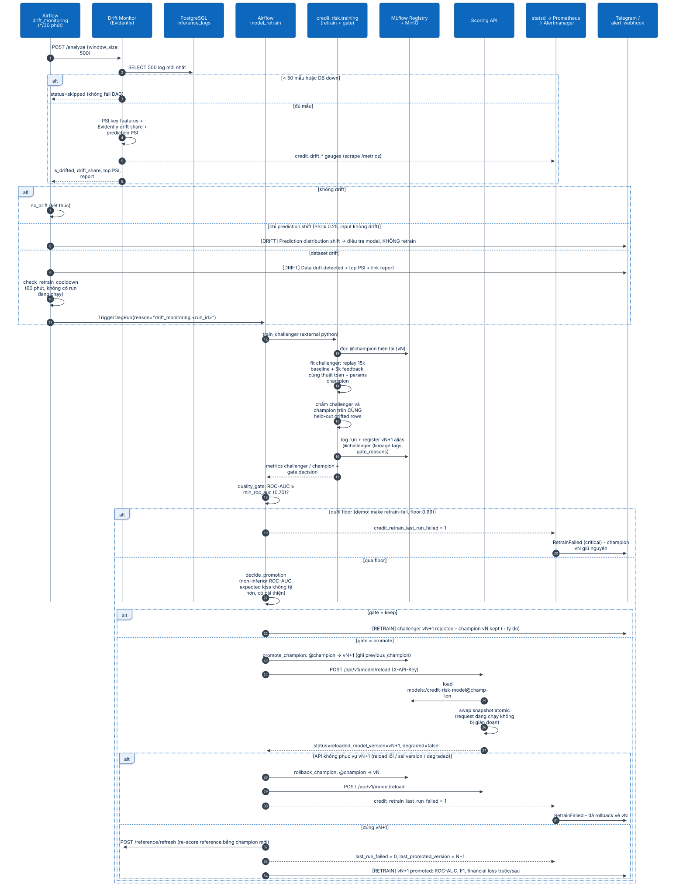

# Diagrams kiến trúc

Nguồn Mermaid nằm trong [`src/`](src/); ảnh SVG (nhúng tài liệu, zoom không vỡ) và PNG @2x (slide, Word/PDF) được render từ nguồn bằng cùng một theme [`mermaid.config.json`](mermaid.config.json). **Không sửa ảnh bằng tay** — sửa `.mmd` rồi render lại:

```bash
bash scripts/render_diagrams.sh                 # tất cả (cần Node.js; tự dùng Chrome hệ thống nếu có)
bash scripts/render_diagrams.sh 05-data-flow    # một diagram
```

| # | Diagram | Rubric | Nguồn | Ảnh |
|---|---|---|---|---|
| 1 | Sơ đồ ngữ cảnh hệ thống | 3.1.2 System design | [`01-system-context.mmd`](src/01-system-context.mmd) | [SVG](01-system-context.svg) · [PNG](01-system-context.png) |
| 2 | Sơ đồ container | 3.1.2 System design | [`02-container.mmd`](src/02-container.mmd) | [SVG](02-container.svg) · [PNG](02-container.png) |
| 3 | Sơ đồ component — Scoring API | 3.1.2 System design (component) | [`03-component-api.mmd`](src/03-component-api.mmd) | [SVG](03-component-api.svg) · [PNG](03-component-api.png) |
| 4 | Sơ đồ component — ML pipeline | 3.1.2 System design (component), 3.1.3 ML Pipeline | [`04-component-ml-pipeline.mmd`](src/04-component-ml-pipeline.mmd) | [SVG](04-component-ml-pipeline.svg) · [PNG](04-component-ml-pipeline.png) |
| 5 | Data flow end-to-end + edge cases | 3.1.2 System design (data flow) | [`05-data-flow.mmd`](src/05-data-flow.mmd) | [SVG](05-data-flow.svg) · [PNG](05-data-flow.png) |
| 6 | Sequence: drift → retrain → gate → promote / rollback | 3.1.3 ML Pipeline, 3.1.3 Monitoring, orchestration | [`06-retrain-sequence.mmd`](src/06-retrain-sequence.mmd) | [SVG](06-retrain-sequence.svg) · [PNG](06-retrain-sequence.png) |
| 7 | Deployment trên Ubuntu 24.04 | 3.1.3 Deployment | [`07-deployment-ubuntu.mmd`](src/07-deployment-ubuntu.mmd) | [SVG](07-deployment-ubuntu.svg) · [PNG](07-deployment-ubuntu.png) |

## Quy ước ký hiệu

| Ký hiệu | Ý nghĩa |
|---|---|
| Xanh navy | Person (người dùng / vận hành) |
| Xanh dương đậm | Software system / container thuộc profile `core` |
| Xanh lá | Container thuộc profile `monitoring` |
| Tím | Container thuộc profile `orchestration` |
| Xanh dương nhạt | Component (sơ đồ component) |
| Xám | Hệ thống bên ngoài |
| Hình trụ | Kho dữ liệu (database, object store, volume, file) |
| Khung nét đứt | Ranh giới hệ thống / container, hoặc job one-shot |
| Xanh lá nhạt / cam / đỏ (data flow) | Happy path / degraded nhưng vẫn phục vụ / lỗi dừng xử lý |
| Mũi tên nét đứt | Luồng tùy chọn, fallback hoặc bất đồng bộ |

## 1. Sơ đồ ngữ cảnh hệ thống

Ai dùng hệ thống và hệ thống phụ thuộc bên ngoài nào. Hệ thống quản lý hạn mức cho chủ thẻ đang lưu hành, có hai đường gọi API với `X-API-Key`: Card Management System / mobile app backend (trong demo là persona simulator) gọi `/predict` realtime khi chủ thẻ gửi yêu cầu tăng hạn mức trên app; batch limit-review job gọi `/predict/batch` sau mỗi kỳ sao kê để rà soát hạn mức toàn danh mục. Credit Risk Analyst không gọi API trực tiếp mà xem quyết định và reason codes qua Card Management System.



## 2. Sơ đồ container

Project Compose `credit-risk-mlops` có 15 service (12 long-running + 3 job one-shot `minio-init`, `model-bootstrap`, `airflow-init`; diagram chỉ vẽ job có ý nghĩa kiến trúc), tô màu theo profile để thấy ngay có thể bật tách `core` / `monitoring` / `orchestration`. PostgreSQL dùng chung cho MLflow metadata, `inference_logs` và Airflow metadata (database riêng `airflow`).



## 3. Sơ đồ component — Scoring API

Middleware → auth → router mỏng → domain service. `ModelManager` giữ snapshot model bất biến và swap atomic nên hot reload không làm rơi request đang chạy; reload lỗi không bao giờ gỡ model đang phục vụ.


## 4. Sơ đồ component — ML pipeline

Cùng một quality gate (`evaluation.model_validation`) được dùng bởi `make train`, `make retrain` và Airflow `model_retrain`.


## 5. Data flow end-to-end + edge cases

Bốn lane: offline training, model loading, online scoring, monitoring feedback loop. Mọi nhánh lỗi đều có kết quả xác định (dừng có report, degraded vẫn phục vụ, hoặc HTTP 4xx/5xx có mã lỗi) — không có nhánh "im lặng".

| Edge case | Hành vi | Tín hiệu quan sát |
|---|---|---|
| Dữ liệu sai schema / ngoài domain | `make validate` dừng, exit ≠ 0 | `reports/data_validation.json` |
| Manifest hash lệch | Dừng train cho tới khi review + `make manifest` | log + exit code |
| Request sai schema / thiếu field | `422 VALIDATION_ERROR` với `details` theo field | `credit_api_requests_total{status="422"}` |
| Thiếu / sai API key | `401 MISSING_API_KEY` / `403 INVALID_API_KEY` | `credit_api_auth_failures_total` |
| Batch > 500 | `413 BATCH_TOO_LARGE` | response body |
| MLflow down lúc startup | Serve `models/credit_model_v1.joblib`, readiness `degraded` | alert `ModelServedFromFallback` |
| MLflow down lúc reload khi đang chạy model registry | Giữ model registry hiện tại (không downgrade) | `credit_model_reloads_total{result="failure"}` |
| Không load được model nào | `503 MODEL_UNAVAILABLE`, readiness `not_ready` | alert `ModelNotLoaded` |
| PostgreSQL down | Vẫn trả kết quả, không ghi log, readiness `degraded` | `/health/ready` reasons |
| Drift monitor thiếu mẫu / DB down | `status=skipped`, DAG không fail | alert `DriftAnalysisStale` nếu kéo dài |
| Không có Telegram token | Alertmanager chỉ gửi `alert-webhook` | `make alerts` |
| MLflow down lúc train | Log vào `mlruns/` local, vẫn lưu `models/*.joblib` | log cảnh báo |


## 6. Sequence — drift → retrain → quality gate → promote / rollback

Hai DAG Airflow: `drift_monitoring` (lịch `*/30 * * * *`) quyết định *có* retrain hay không; `model_retrain` quyết định *có promote* hay không và tự rollback khi API không phục vụ đúng version mới.



## 7. Deployment trên Ubuntu 24.04

Một host Ubuntu (VPS hoặc VM Multipass/UTM): UFW chỉ mở 22/80/443, Nginx terminate TLS (Let's Encrypt), mọi port container chỉ bind `127.0.0.1` (overlay `docker-compose.prod.yml`), systemd khởi động stack khi boot, backup hằng ngày ra off-site. CD dùng `deploy/ubuntu/deploy.sh` theo mô hình release thư mục + symlink `current` để rollback tức thì.

> Mọi thành phần trong diagram đã có trong repo: Nginx vhost, systemd unit, `install.sh`, `backup.sh`, `deploy.sh` (`deploy/ubuntu/`), overlay prod và workflow CD. Hướng dẫn từng bước: [Ubuntu deployment](../../guides/ubuntu-deployment.md).


