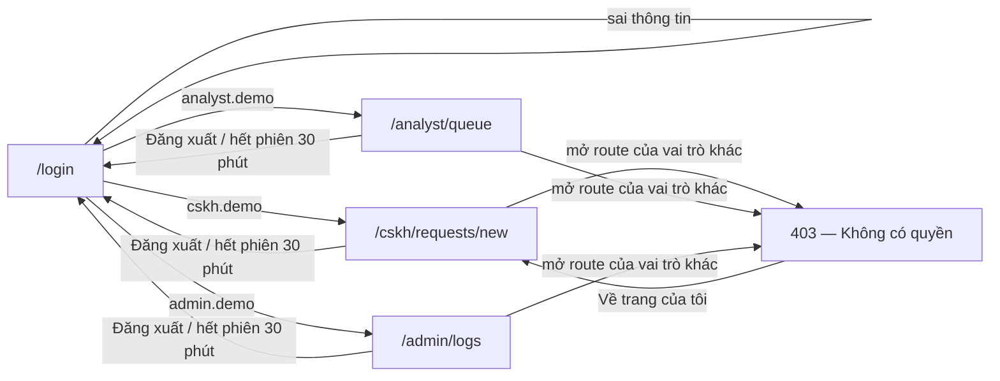
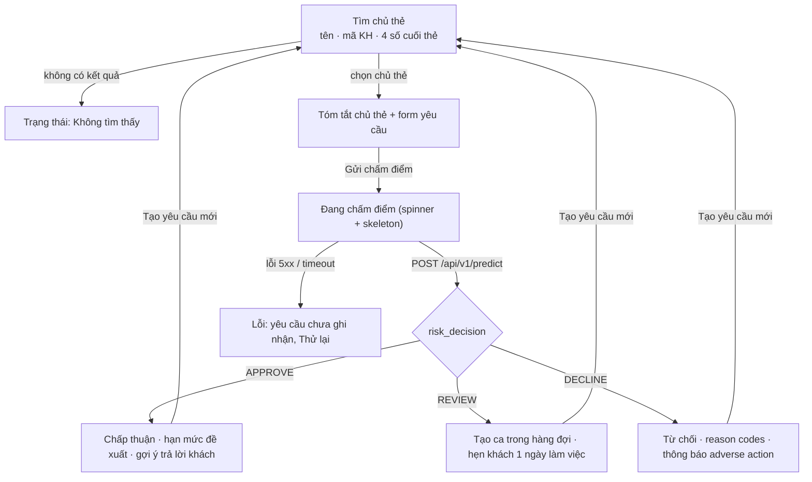
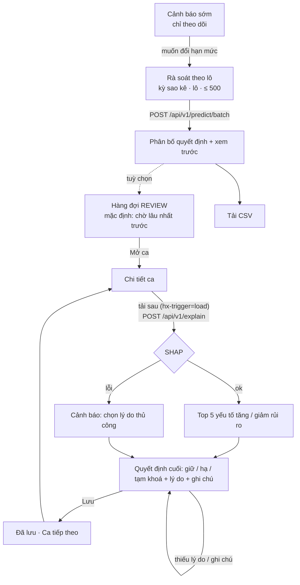
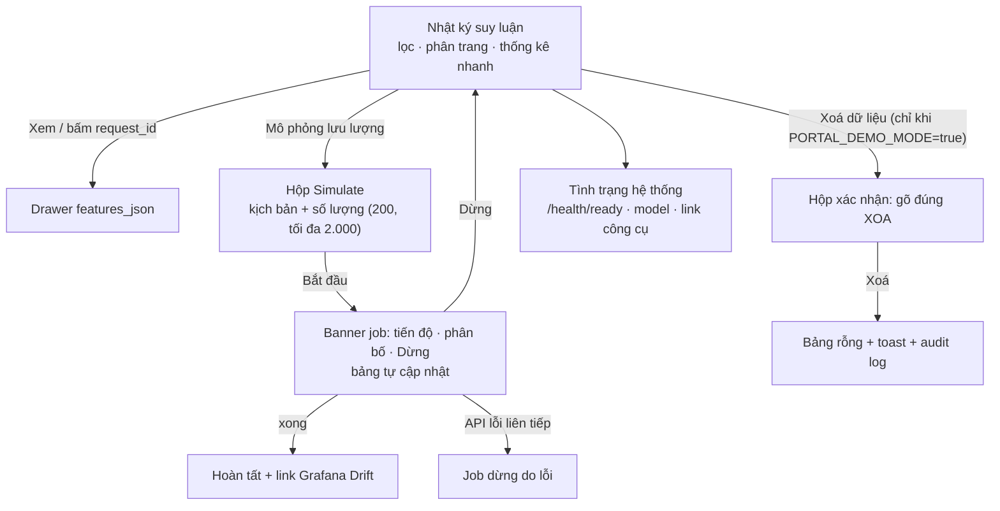

# Thiết kế giao diện Staff Portal

Cổng nghiệp vụ cho nhân viên ngân hàng dùng hệ thống quản lý hạn mức thẻ hằng ngày, kèm màn hình System admin.
Tài liệu này là đầu vào để dựng service `staff-portal` (FastAPI + Jinja2 + HTMX, render phía server, không CDN,
chạy offline). Thuật ngữ theo [01 — Problem statement](../../01-problem-statement.md); API theo
[04 — API reference](../../04-api-reference.md).

## Nội dung thư mục

| File | Dùng để |
|---|---|
| [`tokens.css`](tokens.css) | Design token (màu, chữ, khoảng cách, bo góc, bóng, motion) + base style. **CSS gốc của portal, nạp đầu tiên.** |
| [`components.css`](components.css) | Thư viện component dùng chung (app shell, nút, form, badge, bảng, dialog, trạng thái…). Nạp sau `tokens.css`. |
| [`icons.svg`](icons.svg) | Sprite icon SVG (stroke 24×24). Nhúng một lần trong template gốc, gọi bằng `<svg class="icon"><use href="#i-check"/></svg>`. |
| [`mockups/`](mockups/index.html) | Mockup HTML tĩnh, mở thẳng bằng trình duyệt. Bắt đầu từ [`mockups/index.html`](mockups/index.html). |
| [`mockups/assets/`](mockups/assets/) | Chỉ dùng cho mockup: thanh chọn trạng thái (`mockup.css`, `mockup.js`). **Không** đưa vào portal. |
| [`screenshots/`](screenshots/) | Ảnh PNG chụp từ mockup ở 1280 px và 768 px. |

Mỗi mockup có thanh chọn trạng thái ở cuối trang. Mở thẳng một trạng thái bằng `?state=<id>`, thêm `&clean=1` để ẩn
thanh chọn. Ví dụ: `mockups/02-cskh-request.html?state=decline`.

## 1. Vai trò và màn hình

| Vai trò | Tài khoản demo | Trang mặc định sau đăng nhập | Màn hình |
|---|---|---|---|
| Nhân viên tiếp nhận yêu cầu (CSKH / Card Ops) | `cskh.demo` | Tạo yêu cầu | Tìm chủ thẻ → tạo yêu cầu (tăng hạn mức / rút tiền mặt / chuyển trả góp) → kết quả realtime |
| Chuyên viên rủi ro tín dụng | `analyst.demo` | Hàng đợi REVIEW | Hàng đợi REVIEW → chi tiết ca + SHAP + quyết định cuối; rà soát theo lô; cảnh báo sớm |
| System admin | `admin.demo` | Nhật ký suy luận | Bảng `inference_logs` + Simulate + Xoá dữ liệu; tình trạng hệ thống + link công cụ |

Mật khẩu demo nằm trong `.env.example` — giao diện chỉ hiện tên đăng nhập.

## 2. Luồng màn hình

### 2.1 Chung: đăng nhập, phân quyền, 403

### 2.2 CSKH / Card Ops

### 2.3 Chuyên viên rủi ro tín dụng

### 2.4 System admin

## 3. Mapping màn hình → route dự kiến

Route là đề xuất cho người dựng portal; tên có thể đổi miễn giữ phân quyền. Mọi route kiểm tra quyền ở phía server,
không chỉ ẩn nút. Mọi form `POST` có CSRF token. API key chỉ nằm ở server của portal.

| Màn hình (mockup) | Route | Vai trò | Ghi chú HTMX / API |
|---|---|---|---|
| Đăng nhập ([01](mockups/01-login.html)) | `GET/POST /login` | công khai | `?expired=1` hiện thông báo hết phiên |
| Đăng xuất (header) | `POST /logout` | mọi vai trò | form `POST`, không dùng link `GET` |
| Trang gốc | `GET /` | mọi vai trò | redirect theo vai trò |
| Tạo yêu cầu ([02](mockups/02-cskh-request.html)) | `GET /cskh/requests/new` | CSKH | |
| ↳ tìm chủ thẻ | `GET /cskh/cardholders?q=` | CSKH | partial; `hx-trigger="input changed delay:300ms"` |
| ↳ chọn chủ thẻ | `GET /cskh/cardholders/{customer_id}` | CSKH | partial: tóm tắt + form |
| ↳ gửi chấm điểm | `POST /cskh/requests` | CSKH | gọi `/api/v1/predict`; DECLINE gọi thêm `/api/v1/explain` để dựng reason codes; REVIEW tạo ca; trả partial kết quả |
| Hàng đợi REVIEW ([03](mockups/03-analyst-queue.html)) | `GET /analyst/queue` | Chuyên viên | `?source=&request_type=&sort=&page=` |
| Chi tiết ca ([04](mockups/04-analyst-case.html)) | `GET /analyst/cases/{case_id}` | Chuyên viên | |
| ↳ giải thích SHAP | `GET /analyst/cases/{case_id}/explain` | Chuyên viên | partial `hx-trigger="load"`, gọi `/api/v1/explain` |
| ↳ lưu quyết định | `POST /analyst/cases/{case_id}/decision` | Chuyên viên | ghi bảng `analyst_decisions` |
| Rà soát theo lô ([05](mockups/05-analyst-batch.html)) | `GET/POST /analyst/batch` | Chuyên viên | `POST` gọi `/api/v1/predict/batch` (≤ 500), trả partial kết quả |
| ↳ tải CSV | `GET /analyst/batch/{batch_id}.csv` | Chuyên viên | |
| ↳ đưa ca REVIEW vào hàng đợi (tuỳ chọn) | `POST /analyst/batch/{batch_id}/enqueue` | Chuyên viên | có thể cắt nếu trễ |
| Cảnh báo sớm ([06](mockups/06-analyst-watchlist.html)) | `GET /analyst/watchlist` (+ `.csv`) | Chuyên viên | chỉ đọc |
| Nhật ký suy luận ([07](mockups/07-admin-logs.html)) | `GET /admin/logs` | Admin | `?decision=&model_version=&from=&to=&page=` |
| ↳ bảng (tự cập nhật) | `GET /admin/logs/table` | Admin | partial; `hx-trigger="every 5s"` khi bật tự cập nhật hoặc có job |
| ↳ thống kê nhanh | `GET /admin/logs/stats` | Admin | partial, cùng bộ lọc với bảng |
| ↳ xem `features_json` | `GET /admin/logs/{id}/features` | Admin | partial vào `<dialog class="drawer">` |
| ↳ bắt đầu Simulate | `POST /admin/simulate` | Admin | `409` nếu đã có job; `422` nếu số lượng ngoài 1–2.000 |
| ↳ tiến độ job | `GET /admin/simulate/status` | Admin | partial banner; `hx-trigger="every 1s"` khi đang chạy |
| ↳ dừng job | `POST /admin/simulate/stop` | Admin | |
| ↳ xoá dữ liệu | `POST /admin/logs/purge` | Admin | yêu cầu `PORTAL_DEMO_MODE=true` **và** `confirm == "XOA"` kiểm tra ở server; ghi audit log |
| Tình trạng hệ thống ([08](mockups/08-admin-system.html)) | `GET /admin/system` | Admin | đọc `/health/live`, `/health/ready`, `/api/v1/model/info` |
| 403 ([09](mockups/09-forbidden.html)) | template lỗi | mọi vai trò | trả HTTP `403`, ghi log truy cập bị từ chối |

## 4. Nguyên tắc UX

1. **Kết quả trước, chi tiết sau** (*Inverted Pyramid*, *Visual hierarchy*). Khối kết quả mở đầu bằng mã quyết định,
   một tiêu đề hành động ("Chấp thuận tăng hạn mức") và một câu tóm tắt; số liệu và giải thích nằm dưới. Sau khi có kết
   quả, form thu gọn thành một dòng tóm tắt để quyết định nằm trong màn hình đầu tiên ở 1280 px.
2. **Không chỉ dựa vào màu** (*WCAG 1.4.1*, *Color-independence*). APPROVE / REVIEW / DECLINE luôn có chữ + icon
   (✓ / ! / ✕) + màu. Thanh xác suất có vạch ngưỡng 30 % / 60 % và nhãn chữ.
3. **Phản hồi trong ngưỡng Doherty** (< 400 ms cho phản hồi đầu, 100 ms cho nút). Nút đổi sang trạng thái "Đang chấm
   điểm…" ngay khi bấm, skeleton giữ chỗ cho kết quả. Mục tiêu cả luồng CSKH < 1 giây (API p95 ≤ 100 ms).
4. **Hệ thống gánh độ phức tạp** (*Tesler's Law*). CSKH không nhập 23 feature; portal lấy từ sao kê của chủ thẻ demo.
   Số tiền khách đề nghị chỉ dùng để so với `recommended_limit_ntd`, không gửi sang API (không đổi API contract).
5. **Nhận diện thay vì nhớ** (*Recognition over Recall*). Danh sách chủ thẻ gần đây, danh sách tài khoản demo bấm để
   điền, lý do adverse action chọn sẵn từ SHAP (chuyên viên bỏ chọn nếu không phù hợp).
6. **Ít lựa chọn cho mỗi vai trò** (*Hick's Law*). Mỗi vai trò chỉ thấy 1–3 mục điều hướng của mình.
7. **Trạng thái hệ thống luôn thấy được** (*Nielsen #1*). Chấm trạng thái API ở chân sidebar, banner job khi Simulate
   chạy, bảng log tự cập nhật, trang health có thời điểm kiểm tra.
8. **Ngăn lỗi trước khi báo lỗi** (*Nielsen #5*, *Postel's Law*). Số lượng Simulate 1–2.000, lô ≤ 500 kiểm tra ngay
   trên form; nút Simulate tắt khi đã có job; nút Xoá tắt khi bảng rỗng hoặc job đang chạy. Server vẫn kiểm tra lại.
9. **Thao tác phá huỷ phải có ma sát** (*Forgiveness*, *Shneiderman: cho phép đảo ngược*). Xoá dữ liệu: hộp xác nhận
   nêu rõ số dòng và hậu quả, phải gõ đúng `XOA`, nút xác nhận màu đỏ ghi rõ "Xoá 7.412 dòng". Khi chế độ demo tắt, nút
   bị vô hiệu **và có chú thích hiển thị** (không chỉ tooltip, vì nút disabled không nhận focus bàn phím).
10. **Gần đích thì cho thấy** (*Goal-Gradient*). Sau khi lưu quyết định: "Còn 11 ca" + nút "Ca tiếp theo".
11. **Công bằng và minh bạch trong adverse action** (*Ethics*). Tuổi, giới tính, tình trạng hôn nhân, học vấn không bao
    giờ là lý do gửi chủ thẻ. Chuyên viên vẫn thấy chúng trong SHAP (gắn nhãn "nhạy cảm") để minh bạch. Câu gợi ý cho
    CSKH ở vùng REVIEW **không hứa trước kết quả**. Cảnh báo sớm ghi rõ "không tự động chuyển thu hồi nợ".
12. **Tối thiểu hoá dữ liệu** (*Data minimization*). CSKH chỉ thấy thông tin để nhận diện và xử lý (tên giả, mã KH,
    số thẻ che, hạn mức, dư nợ, tình trạng thanh toán) — không thấy tuổi, giới tính. `features_json` không có định danh.
    CSV rà soát dùng mã KH + số thẻ che, không có tên.

## 5. Design token

Toàn bộ giá trị nằm trong [`tokens.css`](tokens.css). Component chỉ dùng token, không dùng giá trị thô.

### 5.1 Màu quyết định (cố định theo chính sách)

| Quyết định | Chữ trên nền nhạt | Nền nhạt | Khối đậm (chữ trên khối) | Tương phản |
|---|---|---|---|---|
| APPROVE | `--approve-fg` `#116329` | `--approve-bg` `#E6F4EA` | `--approve-solid` `#1A7F37` + chữ trắng | 6,51 : 1 · trắng/đậm 5,08 : 1 |
| REVIEW | `--review-fg` `#7A4B00` | `--review-bg` `#FFF4D1` | `--review-solid` `#F5B800` + chữ `#2B1D00` | 6,74 : 1 · tối/vàng 9,18 : 1 |
| DECLINE | `--decline-fg` `#B42318` | `--decline-bg` `#FDECEA` | `--decline-solid` `#B42318` + chữ trắng | 5,75 : 1 · trắng/đậm 6,57 : 1 |

Không bao giờ đặt chữ trắng trên `--review-solid`. Mọi cặp chữ/nền khác đều ≥ 4,5 : 1:

| Cặp | Tương phản |
|---|---|
| Chữ chính `--gray-900` trên trắng / nền trang | 16,35 / 15,24 |
| Chữ phụ `--gray-600` trên trắng | 6,89 |
| Chữ mờ `--gray-500` trên trắng / nền trang | 4,96 / 4,62 |
| Nút chính: trắng trên `--brand-700` | 7,59 |
| Link / focus `--brand-600` trên trắng | 6,55 |
| Header: trắng / `--brand-200` trên `--brand-950` | 15,39 / 8,97 |
| Viền ô nhập `--gray-400` trên trắng (WCAG 1.4.11, ≥ 3 : 1) | 3,55 |

### 5.2 Chữ, khoảng cách, bo góc

- **Font hệ thống**, không web font: `-apple-system, "Segoe UI", Roboto, "Helvetica Neue", Arial, "Noto Sans", …` —
  đều hiển thị đủ dấu tiếng Việt. Số dùng `font-variant-numeric: tabular-nums` (class `.num`) để cột số thẳng hàng.
- **Thang chữ**: 12 / 13 / 14 (thân) / 16 / 18 / 22 (tiêu đề trang) / 28 / 36 px.
- **Khoảng cách**: lưới 4 px (`--space-1` 4 px … `--space-16` 64 px). Card padding 20 px, khoảng cách giữa khối 24 px.
- **Bo góc**: 4 / 6 (nút, ô nhập) / 10 (card) / 14 (dialog) / pill.
- **Motion**: 120 ms (hover/press), 200 ms (panel), 320 ms (tiến độ); tắt khi `prefers-reduced-motion`.
- **Breakpoint**: ≥ 1024 px có sidebar; < 1100 px các lưới 2 cột xếp dọc và cột bảng `.col-optional` ẩn; < 768 px form
  1 cột. Bảng rộng nằm trong `.table-wrap` để cuộn ngang thay vì vỡ layout.

## 6. Quy ước nội dung

| Mục | Quy ước | Ví dụ |
|---|---|---|
| Tiền | `NT$` + phân tách nghìn bằng dấu chấm | `NT$ 187.500` |
| Xác suất | phần trăm, 1 chữ số thập phân, dấu phẩy | `46,3 %` (admin: `0,4634` theo cột DB) |
| Thời gian | `dd/mm/yyyy HH:MM:SS`, giờ địa phương | `03/10/2026 08:41:12` |
| Số thẻ | chỉ 4 số cuối | `**** 4821` |
| Mã quyết định | giữ nguyên tiếng Anh, viết hoa | `APPROVE`, `REVIEW`, `DECLINE` |
| Tên cột admin | giữ tên cột DB | `request_id`, `latency_ms`, `features_json` |

| Thuật ngữ trên giao diện | Nghĩa |
|---|---|
| Chủ thẻ | khách hàng đang có thẻ tín dụng lưu hành |
| Hạn mức hiện tại | `LIMIT_BAL` |
| Hạn mức đề xuất | `recommended_limit_ntd` khi APPROVE / DECLINE |
| Hạn mức tham chiếu | `recommended_limit_ntd` khi REVIEW — gợi ý cho chuyên viên, chưa áp dụng |
| Xác suất vỡ nợ | `default_probability` |
| Rà soát (theo lô) | chấm điểm định kỳ sau kỳ sao kê qua `/predict/batch` |
| Tạm khoá hạn mức khả dụng | không cho chi tiêu thêm, dư nợ hiện tại vẫn phải trả |
| Adverse action | từ chối tăng, hạ hoặc tạm khoá hạn mức — phải gửi thông báo kèm lý do |
| Ca | một tài khoản cần chuyên viên quyết định (từ yêu cầu realtime hoặc rà soát lô) |

### 6.1 Nhãn feature và reason code

Nhãn hiển thị cho SHAP (chuyên viên) và reason code gửi chủ thẻ. Kỳ `k` của `PAY_*`, `BILL_AMT*`, `PAY_AMT*` hiển thị
bằng tháng của kỳ sao kê (kỳ 1 = kỳ gần nhất).

| Feature | Nhãn hiển thị | Reason code khi tăng rủi ro |
|---|---|---|
| `PAY_0`, `PAY_2`…`PAY_6` | Tình trạng thanh toán kỳ MM/YYYY | **R01** Có khoản thanh toán trễ hạn *n* tháng ở kỳ sao kê gần nhất / các kỳ gần đây |
| `BILL_AMT1` ÷ `LIMIT_BAL` | Đã dùng hạn mức | **R02** Dư nợ đang sử dụng *x* % hạn mức |
| `PAY_AMT1`…`PAY_AMT6` | Số tiền thanh toán kỳ MM/YYYY | **R03** Số tiền thanh toán các kỳ gần đây thấp so với dư nợ sao kê |
| `BILL_AMT1`…`BILL_AMT6` | Dư nợ sao kê kỳ MM/YYYY | **R04** Dư nợ sao kê tăng liên tục trong các kỳ gần đây |
| `LIMIT_BAL` | Hạn mức hiện tại | **R05** Hạn mức hiện tại thấp so với mức sử dụng |
| `AGE`, `SEX`, `MARRIAGE`, `EDUCATION` | Tuổi, Giới tính, Tình trạng hôn nhân, Trình độ học vấn (+ nhãn "nhạy cảm") | **Không bao giờ** dùng làm lý do. Chuỗi `top_risk_factors` bắt đầu bằng `Demographic Cohort` cũng bị lọc. |

Lấy tối đa 3 lý do, theo thứ tự đóng góp SHAP giảm dần, gộp các feature cùng mã (ví dụ nhiều `PAY_AMT*` → một R03).
Khi `/explain` lỗi, dùng `top_risk_factors` (rule-based) sau khi lọc nhân khẩu học.

### 6.2 Cột CSV rà soát theo lô

`index, request_id, customer_id, masked_card, limit_bal, default_probability, credit_score, risk_decision,
recommended_limit_ntd, policy_action, model_version` — không có tên chủ thẻ.

## 7. Ma trận trạng thái

| Màn hình | Rỗng | Đang tải | Lỗi | Trạng thái khác |
|---|---|---|---|---|
| Đăng nhập | — | Đang đăng nhập | Sai thông tin | Hết phiên |
| CSKH tạo yêu cầu | Chưa chọn chủ thẻ; Không tìm thấy | Đang chấm điểm | API 503 | APPROVE / REVIEW / DECLINE |
| Hàng đợi REVIEW | Hết ca | Skeleton | DB lỗi | — |
| Chi tiết ca | — | Đang tính SHAP | SHAP lỗi | Thiếu lý do / ghi chú; Đã lưu |
| Rà soát theo lô | Chưa chạy | Đang chấm | API 503 | Lô > 500; Có kết quả |
| Cảnh báo sớm | Không có chủ thẻ | Skeleton | DB lỗi | — |
| Nhật ký suy luận | Bảng rỗng; Lọc không ra | Skeleton | DB lỗi | features_json; Simulate (hợp lệ / sai số lượng); job chạy / xong / lỗi; Xoá (chưa gõ / đã gõ XOA / đã xoá); chế độ demo tắt |
| Tình trạng hệ thống | — | Đang kiểm tra | not_ready | ready / degraded |

## 8. Ghi chú cho người dựng portal

- Nạp `tokens.css` → `components.css`. Đặt tại `services/staff_portal/static/css/`. Nhúng `icons.svg` trong template
  gốc. HTMX phải được vendor vào `static/` (không dùng CDN).
- Template gốc tương ứng phần `app-header` + `demo-banner` + `app-nav` lặp lại trong các mockup. Banner demo chỉ hiện
  khi `PORTAL_DEMO_MODE=true`.
- Dialog và drawer dùng phần tử `<dialog>` gốc (`showModal()` cho focus trap và phím Esc). Hộp xoá: nút xác nhận chỉ bật
  khi ô nhập đúng `XOA` (vài dòng JS); server luôn kiểm tra lại.
- Kết quả chấm điểm, banner job và toast nằm trong vùng `aria-live="polite"`; lỗi dùng `role="alert"`.
- Class trong `mockups/assets/` (`mock-switcher`, thuộc tính `data-show` / `data-hide` / `data-states`) chỉ để chuyển
  trạng thái mockup, không đưa vào portal.

## 9. Điểm còn mở

- Ca REVIEW từ yêu cầu tăng hạn mức: thiết kế theo đúng 3 lựa chọn giữ / hạ / tạm khoá. "Giữ" khi khách xin tăng cũng là
  adverse action nên vẫn bắt buộc lý do. Nếu cần lựa chọn "Chấp thuận tăng" cho chuyên viên, thêm một `choice` nữa.
- Nội dung thông báo adverse action (nút "Xem thông báo") và trang "Yêu cầu hôm nay" của CSKH chưa thiết kế.
- "Đưa ca REVIEW vào hàng đợi" từ rà soát lô là tuỳ chọn; có thể cắt mà không ảnh hưởng các luồng khác.
