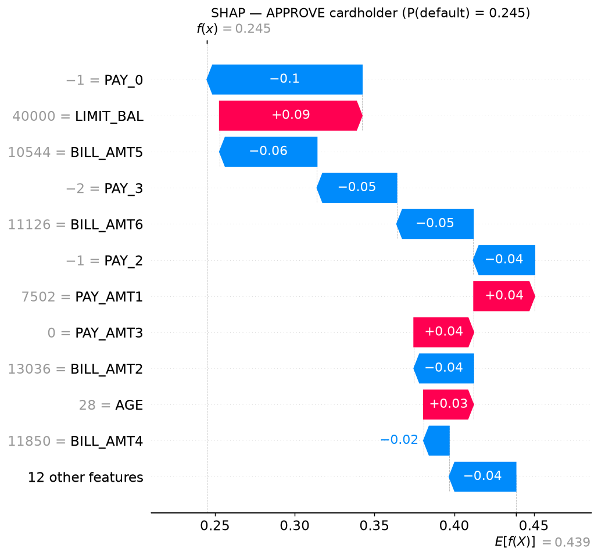
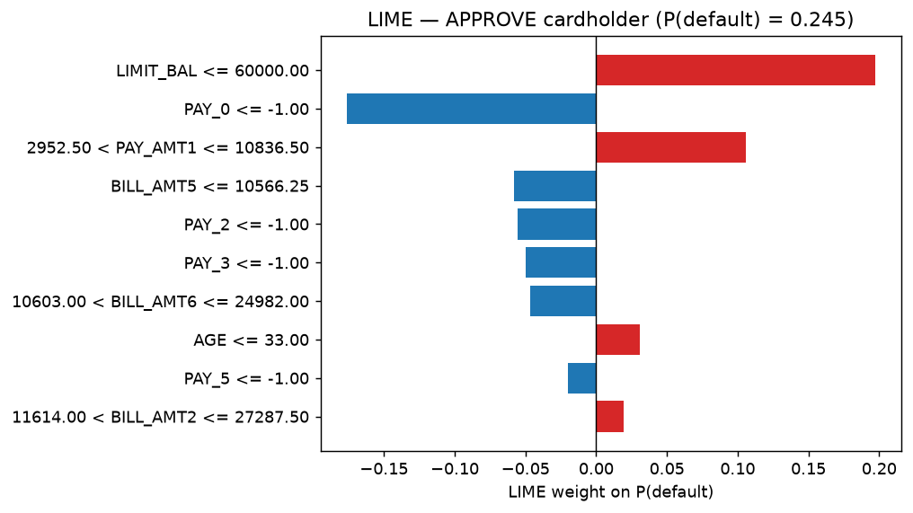
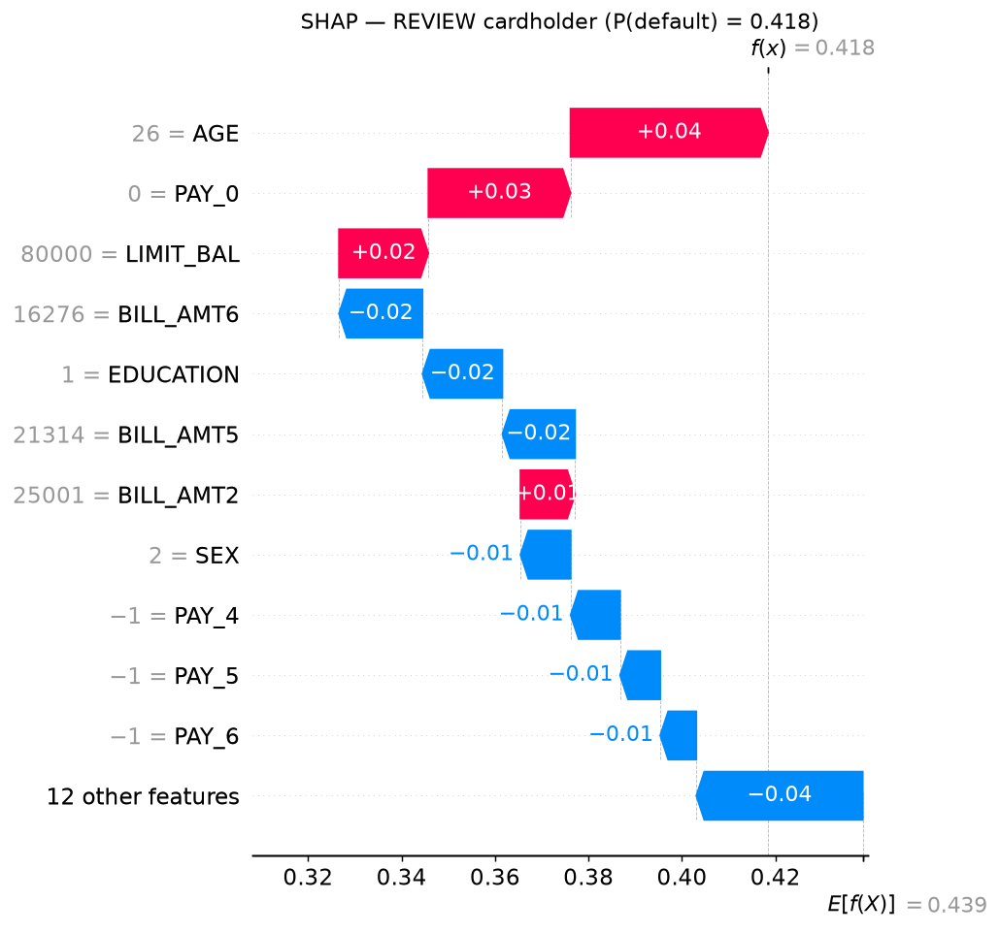
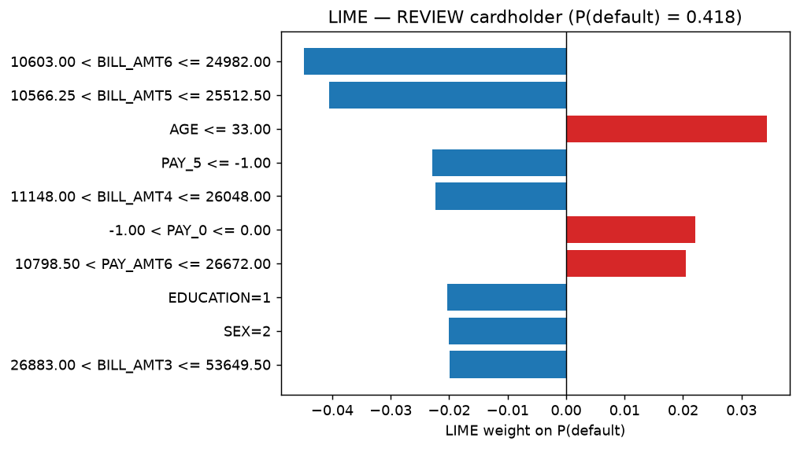
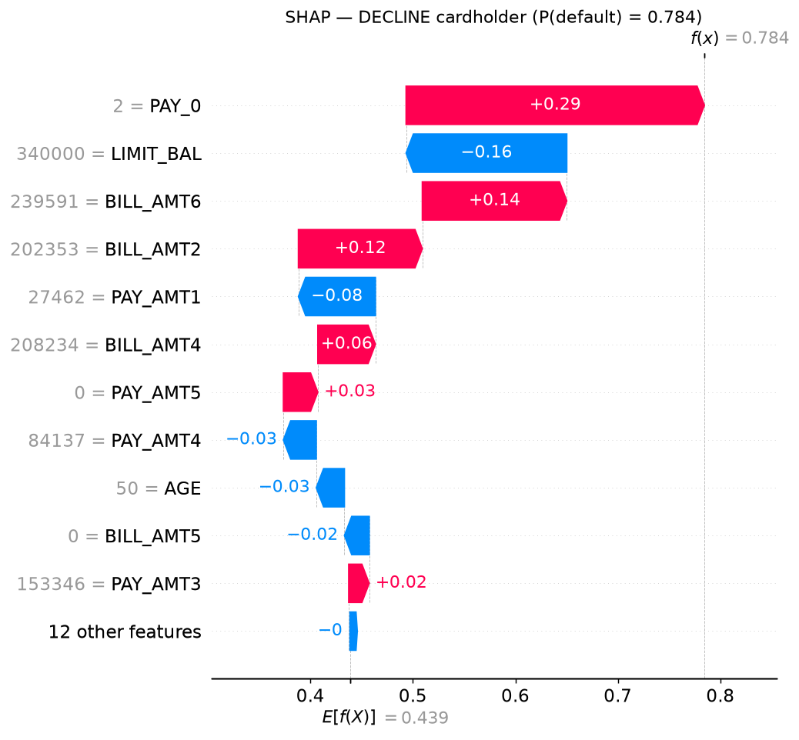
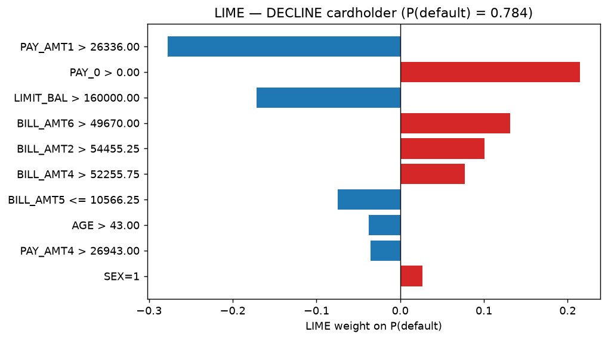

# Báo cáo Explainability (SHAP + LIME)

> Sinh tự động bởi `make responsible-ai` (2026-09-29T11:54:02+00:00). Không sửa tay.

## Phương pháp

- SHAP: PermutationExplainer on P(default) of the full pipeline, 100 background training cardholders, max_evals=500 — 500 chủ thẻ trong tập đánh giá.
- LIME: LimeTabularExplainer, 5000 samples, discretized continuous features.
- Serving (`POST /api/v1/explain`): PermutationExplainer against the reference cardholder, max_evals=240.

## Global — SHAP

| # | Feature | mean \|SHAP\| (xác suất) | Tỷ trọng |
|---|---|---|---|
| 1 | `PAY_0` | 0.0973 | 17.6% |
| 2 | `PAY_AMT1` | 0.0937 | 16.9% |
| 3 | `LIMIT_BAL` | 0.0563 | 10.2% |
| 4 | `BILL_AMT2` | 0.0467 | 8.4% |
| 5 | `BILL_AMT5` | 0.0355 | 6.4% |
| 6 | `BILL_AMT6` | 0.0344 | 6.2% |
| 7 | `AGE` | 0.0275 | 5.0% |
| 8 | `PAY_2` | 0.0257 | 4.6% |
| 9 | `PAY_3` | 0.0185 | 3.3% |
| 10 | `BILL_AMT4` | 0.0158 | 2.9% |

## Local — 3 chủ thẻ đại diện (SHAP vs LIME)

| Chủ thẻ | P(default) | SHAP top-3 | LIME top-3 | Overlap@5 / cùng dấu |
|---|---|---|---|---|
| APPROVE | 0.245 | `PAY_0` -0.097, `LIMIT_BAL` +0.089, `BILL_AMT5` -0.061 | `LIMIT_BAL` +0.197, `PAY_0` -0.176, `PAY_AMT1` +0.106 | 60% / 100% |
| REVIEW | 0.418 | `AGE` +0.042, `PAY_0` +0.030, `LIMIT_BAL` +0.019 | `BILL_AMT6` -0.045, `BILL_AMT5` -0.040, `AGE` +0.034 | 40% / 100% |
| DECLINE | 0.784 | `PAY_0` +0.291, `LIMIT_BAL` -0.157, `BILL_AMT6` +0.141 | `PAY_AMT1` -0.278, `PAY_0` +0.214, `LIMIT_BAL` -0.172 | 100% / 100% |

Overlap@k trung bình SHAP↔LIME: 67%.

### APPROVE — P(default) = 0.245

Risk factors (SHAP, như API trả về):

- LIMIT_BAL = 40,000 NTD (credit limit) increases default risk by +8.9 pp
- PAY_AMT1 = 7,502 NTD (amount paid 1 month(s) ago) increases default risk by +3.8 pp
- PAY_AMT3 = 0 NTD (amount paid 3 month(s) ago) increases default risk by +3.8 pp

Sai số additivity của SHAP serving: 0.00e+00.

### REVIEW — P(default) = 0.418

Risk factors (SHAP, như API trả về):

- AGE = 26 (age) increases default risk by +4.2 pp
- PAY_0 = 0 (repayment status last month) increases default risk by +3.0 pp
- LIMIT_BAL = 80,000 NTD (credit limit) increases default risk by +1.9 pp

Sai số additivity của SHAP serving: 0.00e+00.

### DECLINE — P(default) = 0.784

Risk factors (SHAP, như API trả về):

- PAY_0 = 2 (repayment status last month) increases default risk by +29.1 pp
- BILL_AMT6 = 239,591 NTD (bill amount 6 month(s) ago) increases default risk by +14.1 pp
- BILL_AMT2 = 202,353 NTD (bill amount 2 month(s) ago) increases default risk by +12.1 pp

Sai số additivity của SHAP serving: 0.00e+00.

