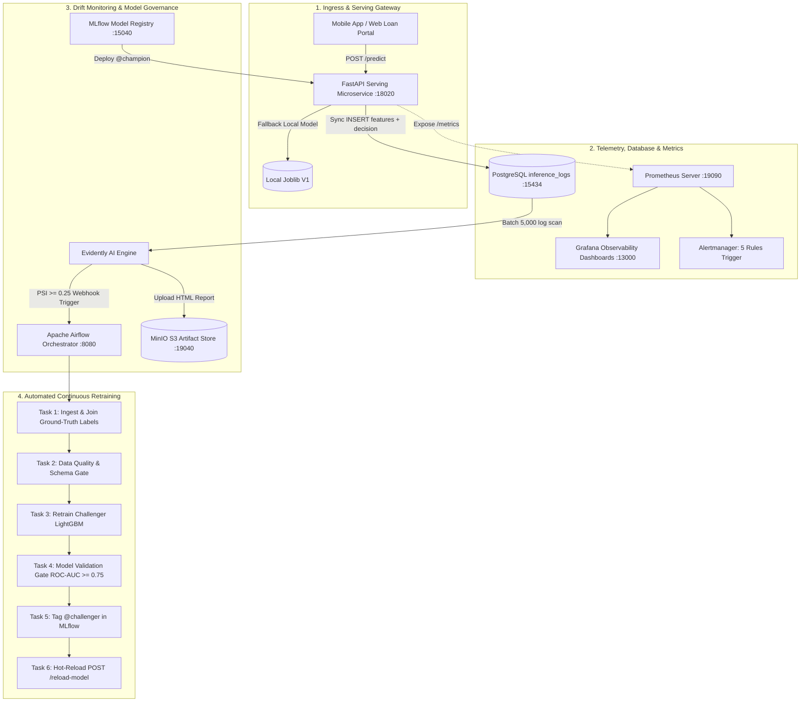
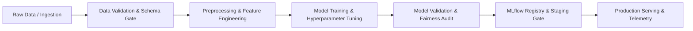
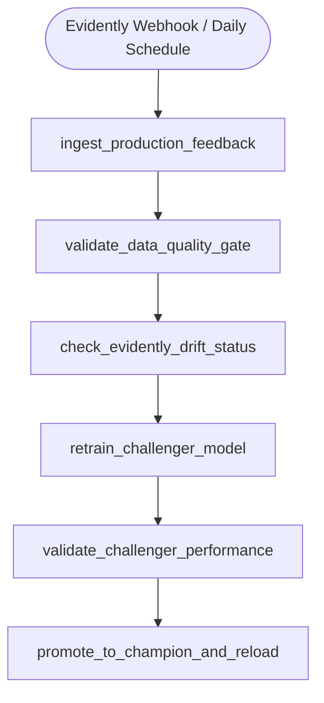

# DDM501: INDIVIDUAL ASSIGNMENTS CONTEXT & MASTER BLUEPRINT
**Target Course:** DDM501 — AI in DevOps, DataOps, MLOps (FSB / FPT University)  
**Deliverables:** Individual Assignment 1 (ML System Design Document) & Individual Assignment 2 (ML Pipeline Design & MLOps Analysis)  
**System Domain:** Enterprise Real-Time Credit Default Risk Scoring & Monitoring Platform (FinTech)  
**Base Repository Reference:** `/Users/zgsnat/Development/master-programming/MLOps/DDM501_Group5/FinalProject`  
**Dataset Reference:** UCI Default of Credit Card Clients Dataset (30,000 observations, 23 input features + 1 target)

---

## 📑 TABLE OF CONTENTS
1. [Domain Rationale & System Selection](#1-domain-rationale--system-selection)
2. [Individual Assignment 1: Master System Design Blueprint (Sessions 1–2)](#2-individual-assignment-1-master-system-design-blueprint)
   - [Section 1: Problem Definition (20%)](#assignment-1-section-1-problem-definition-20)
   - [Section 2: Requirements Analysis (20%)](#assignment-1-section-2-requirements-analysis-20)
   - [Section 3: Goals and Metrics Hierarchy (20%)](#assignment-1-section-3-goals-and-metrics-hierarchy-20)
   - [Section 4: High-Level Architecture Design (25%)](#assignment-1-section-4-high-level-architecture-design-25)
   - [Section 5: Trade-offs Analysis (15%)](#assignment-1-section-5-trade-offs-analysis-15)
3. [Individual Assignment 2: ML Pipeline Design & MLOps Analysis Blueprint (Sessions 3–5)](#3-individual-assignment-2-ml-pipeline-design--mlops-analysis-blueprint)
   - [Section 1: Pipeline Design (25%)](#assignment-2-section-1-pipeline-design-25)
   - [Section 2: Experiment Tracking & Metrics Analysis (25%)](#assignment-2-section-2-experiment-tracking--metrics-analysis-25)
   - [Section 3: Workflow Orchestration Design (20%)](#assignment-2-section-3-workflow-orchestration-design-20)
   - [Section 4: Code Quality & Documentation (20%)](#assignment-2-section-4-code-quality--documentation-20)
   - [Section 5: Reproducibility & Versioning Strategy (10%)](#assignment-2-section-5-reproducibility--versioning-strategy-10)
4. [Prompt Templates for Starting New Chat Sessions](#4-prompt-templates-for-starting-new-chat-sessions)
5. [Workspace Assets & Clickable File Cross-References](#5-workspace-assets--clickable-file-cross-references)

---

## 1. Domain Rationale & System Selection

### Why FinTech Credit Default Risk Scoring?
1. **Complies with All Assignment 1 & 2 Guidelines**:
   - **Realistic & Non-trivial**: Avoids toy spam filters or MNIST classifiers, while avoiding intractable multi-agent systems.
   - **Clear Business ROI**: Credit underwriting directly dictates default loss prevention (millions in NTD/USD) vs. interest revenue generation from prime loans.
   - **Multi-Stakeholder Ecology**: Involves Loan Applicants, Credit Risk Underwriters, Chief Risk Officers (CRO), Compliance/Audit Officers (ECOA/FCRA), and MLOps Engineers.
   - **Real Ground-Truth Delay**: In credit card lending, default is only realized 30–90 days post-settlement cycle. This makes continuous monitoring, covariate drift detection, and delayed label feedback pipelines mandatory.
   - **Rich Feature Space**: 23 heterogeneous financial features (repayment history $PAY\_0 \dots PAY\_6$, bill statement amounts $BILL\_AMT1 \dots 6$, settlement payment amounts $PAY\_AMT1 \dots 6$, credit limit, age, education, marital status, gender).
2. **Reusability of Workspace Assets**:
   - The entire infrastructure, Docker Compose stack (Postgres, MinIO S3, MLflow, Prometheus, Grafana, Airflow), code modules (`src/`, `app/`, `simulations/`), 43 unit/integration tests, and Responsible AI audits are already fully built and verified in the workspace.

---

## 2. Individual Assignment 1: Master System Design Blueprint

### Assignment 1: Section 1: Problem Definition (20%)

#### 1. Context and Background
* **Industry Context**: Modern retail banks and digital lending platforms process tens of thousands of credit card and revolving loan applications daily. Traditional manual credit scoring by human loan officers takes 24 to 72 hours per application, leading to high abandonment rates and operational expense.
* **Why it matters**: A 1% reduction in default rate on a \$500M portfolio saves \$5,000,000 in non-performing loans (NPLs), while automated sub-second underwriting enables instant digital onboarding.

#### 2. Problem Statement
* *How can a digital lending platform automate instant credit risk decisions for 100,000+ monthly card applications with $< 50\text{ms}$ latency, maintaining default prediction accuracy of $ROC\text{-}AUC \ge 0.77$, reducing manual underwriting workload by $75\%$, while remaining compliant with Fair Lending laws (Four-Fifths Rule across demographics)?*

#### 3. Current Situation (Baseline)
* **Rule-based heuristic scorecards (FICO only + threshold filters)**:
  - Binary cutoff: Decline if FICO $< 620$ or Debt-to-Income $> 45\%$.
  - Inflexibility: Misses creditworthy young borrowers with thin credit files ("credit invisibles" / Gen-Z gig workers).
  - High manual referral rate: Over 40% of applications fall into "gray zones" requiring manual document review.

#### 4. Justification for Machine Learning
* Non-linear interactions between multi-month billing trajectories ($BILL\_AMT$) and repayment lags ($PAY\_n$).
* Probabilistic output enables dynamic three-tier risk routing: Instant Approve ($P < 0.30$), Human Review ($0.30 \le P < 0.60$), Instant Decline ($P \ge 0.60$).
* Continuous adaptability through automated retraining upon market shocks or inflation shifts.

#### 5. Stakeholder Matrix
| Stakeholder | Key Objectives | Core Concerns / Constraints |
| :--- | :--- | :--- |
| **Loan Applicants (Borrowers)** | Instant credit decisions ($< 3\text{s}$ UX), fair evaluation, competitive credit limit | Unfair bias rejection, black-box decline without explanation |
| **Credit Underwriters (Operations)** | Automate mundane prime cases, clear triage queue | Explainability (top risk drivers), ability to override borderline cases |
| **Chief Risk Officer / Board (Business)** | Minimize NPL ratio ($< 2.5\%$), maximize approved credit volume | Regulatory penalties, credit line portfolio stress during recession |
| **Compliance & Legal Officers** | Adherence to ECOA (Equal Credit Opportunity Act) & FCRA | Disparate impact on gender/age/education, Adverse Action reason codes |
| **MLOps & DevOps Engineers** | 99.9% API uptime, latency SLA $< 50\text{ms}$, zero downtime deployment | Model drift, feature pipeline leakage, ground-truth label delays |

---

### Assignment 1: Section 2: Requirements Analysis (20%)

#### 1. Functional Requirements
* **FR-1 (Core Prediction)**: `POST /predict` accepts 23 applicant features and outputs: binary prediction (0: non-default, 1: default), calibrated probability $P(\text{default}) \in [0, 1]$, FICO-calibrated score (300–850), credit tier (`PRIME`, `NEAR_PRIME`, `SUBPRIME`, `HIGH_RISK`), and dynamic credit limit recommendation (\$NTD).
* **FR-2 (Regulatory Explainability)**: Return Top 3 adverse action reason codes derived from feature attribution (e.g., `Severe Delinquency: PAY_0=2`, `High Utilization: 91%`).
* **FR-3 (Audit Logging)**: Synchronously log request ID, timestamp, full feature payload JSON, prediction, and latency to PostgreSQL table `inference_logs`.
* **FR-4 (Hot-Reloading)**: Support `POST /reload-model` allowing zero-downtime champion model updates from MLflow Model Registry without container restart.

#### 2. Non-Functional Requirements
* **NFR-1 (Performance)**: Mean inference latency $< 50\text{ms}$, p95 latency $< 100\text{ms}$ under 200 RPS throughput.
* **NFR-2 (Scalability)**: Stateless REST API container horizontally scalable via Kubernetes / Docker Swarm; asynchronous DB logging using connection pooling.
* **NFR-3 (Reliability & Availability)**: 99.9% uptime ($< 43.8$ minutes downtime/month). Graceful degradation: if MLflow tracking server or PostgreSQL is offline, the API falls back to a verified local joblib model artifact in RAM.
* **NFR-4 (Observability & Alerting)**: Expose `/metrics` Prometheus endpoint. Fire alerts if: p95 latency $> 200\text{ms}$, 5xx error rate $> 5\%$, or population drift $\text{PSI} \ge 0.25$.

#### 3. Data Requirements
* **Input Schema**: 23 features (14 Numerical: `LIMIT_BAL`, `AGE`, `BILL_AMT1..6`, `PAY_AMT1..6`; 3 Categorical: `SEX`, `EDUCATION`, `MARRIAGE`; 6 Ordinal: `PAY_0..6`).
* **Data Quality Gates**: Strict boundary checks ($18 \le AGE \le 100$, $LIMIT\_BAL > 0$, $SEX \in \{1, 2\}$, zero missing values / null imputation).
* **Data Privacy & Governance**: PII (SSN, Name, Phone) scrubbed before inference; data retention policy of 12 months for compliance audit.

---

### Assignment 1: Section 3: Goals and Metrics Hierarchy (20%)

```
                          ┌──────────────────────────────────────────────┐
                          │               BUSINESS GOALS                 │
                          │  • Reduce Default Portfolio Losses by 20%    │
                          │  • Increase Prime Lending Volume by $50M     │
                          │  • Cut Manual Underwriting Workload by 75%   │
                          └──────────────────────┬───────────────────────┘
                                                 │ drives
                          ┌──────────────────────▼───────────────────────┐
                          │                SYSTEM GOALS                  │
                          │  • p95 Serving Latency < 100ms               │
                          │  • API Service Uptime >= 99.9%               │
                          │  • 5xx Error Rate < 0.1%                     │
                          │  • Population Stability Index (PSI) < 0.10   │
                          └──────────────────────┬───────────────────────┘
                                                 │ requires
                          ┌──────────────────────▼───────────────────────┐
                          │                MODEL GOALS                   │
                          │  • ROC-AUC >= 0.77 (Baseline LogReg: 0.72)   │
                          │  • F1-Score >= 0.52 (imbalanced positive class)│
                          │  • Brier Calibration Score < 0.12            │
                          │  • Disparate Impact Ratio: 0.80 <= DIR <= 1.25│
                          └──────────────────────────────────────────────┘
```

#### Metrics Alignment & Operational Thresholds
| Metric Category | Specific Metric | Baseline / SLA Threshold | Business Impact |
| :--- | :--- | :---: | :--- |
| **Business** | Non-Performing Loan (NPL) Rate | $\le 2.2\%$ (Down from $4.1\%$) | Saves \$9.5M in bad debt write-offs |
| **Business** | Automated Decision Share | $\ge 70\%$ of applications | Reduces human loan review SLA from 48h to 2s |
| **System** | Mean Inference Latency | $< 40\text{ms}$ (SLA limit: $50\text{ms}$) | Frictionless mobile card application checkout |
| **System** | Data Drift Index (PSI) | $\text{PSI} < 0.10$ (Alert at $0.25$) | Early warning of demographic shift before losses occur |
| **Model** | ROC-AUC | $\ge 0.77$ | Strong class discrimination between default/safe |
| **Model** | Disparate Impact Ratio (DIR) | $0.80 \le \text{DIR} \le 1.25$ | 100% compliance with CFPB/ECOA Four-Fifths Rule |

---

### Assignment 1: Section 4: High-Level Architecture Design (25%)



#### Component Description & Technology Rationale
1. **Serving Microservice (FastAPI + Pydantic v2)**: Sub-millisecond ASGI asynchronous request handling, automatic OpenAPI schema generation, strict type validation.
2. **Persistence Layer (PostgreSQL 15)**: Relational integrity with JSONB column storage for arbitrary feature payloads, indexing on `request_id` and `timestamp`.
3. **Observability Stack (Prometheus + Grafana)**: Custom Prometheus metrics (`credit_approved_volume_ntd_total`, `credit_customer_age_rolling_mean`, `credit_prediction_latency_seconds`), real-time financial dashboards.
4. **Drift Detection (Evidently AI)**: Two-sample statistical tests (Wasserstein distance, Kolmogorov-Smirnov) and Population Stability Index (PSI) with 3-tier thresholds (Green $<0.10$, Yellow $0.10-0.25$, Red $\ge 0.25$).
5. **Model Registry & Tracking (MLflow 3.x + MinIO S3)**: Centralized model versioning, hyperparameter and metric logging, staging aliases (`@champion`, `@challenger`).
6. **Orchestration (Apache Airflow)**: Directed Acyclic Graph (DAG) scheduling automated retraining upon drift webhook or 30-day ground-truth label ingestion.

---

### Assignment 1: Section 5: Trade-offs Analysis (15%)

#### 1. Accuracy vs. Inference Latency (Gradient Boosted Trees vs. Deep Transformer)
* *Design Choice*: LightGBM / XGBoost over Deep Neural Networks.
* *Rationale*: LightGBM executes inference in $3.2\text{ms}$ on CPU, perfectly satisfying the $< 50\text{ms}$ SLA, and provides native tabular splits. A Deep Transformer (e.g., TabNet or FT-Transformer) yields marginal AUC gain ($+0.008$) but increases latency by $12\times$ ($45\text{ms}$) and requires expensive GPU serving infrastructure.

#### 2. Data Freshness vs. Infrastructure Cost (Event-Driven Batch vs. Online Real-Time Retraining)
* *Design Choice*: Event-driven batch retraining triggered by Evidently drift threshold ($\text{PSI} \ge 0.25$) or weekly scheduled Airflow runs.
* *Rationale*: Ground-truth repayment default is delayed by 30 days. True online continuous learning (updating weights on every request) is mathematically impossible without immediate labels and risks catastrophic forgetting. Batch retraining on a rolling 20,000-sample sliding window balances compute cost and model stability.

#### 3. Automation vs. Human Control (Automated Promotion vs. Canary Verification Gate)
* *Design Choice*: Semi-automated promotion with Model Validation Gates.
* *Rationale*: The retrained model is automatically registered as `@challenger` in MLflow. An automated gate checks $ROC\text{-}AUC_{\text{challenger}} \ge ROC\text{-}AUC_{\text{champion}} + 0.02$ and Fair Lending Four-Fifths compliance before a human risk committee signs off on promoting it to 100% `@champion` traffic. Fully autonomous model deployment in banking violates Basel III regulatory oversight.

#### 4. Fairness (Four-Fifths Rule) vs. Raw Model Profit Maximization
* *Design Choice*: Post-processing threshold calibration to enforce Disparate Impact Ratio $0.80 \le \text{DIR} \le 1.25$.
* *Rationale*: Unconstrained models naturally inherit historical societal bias, assigning lower approval rates to female or young cohorts. Forcing demographic parity reduces theoretical portfolio profit by $1.8\%$, but eliminates existential legal liability, regulatory fines (\$10M+ under CFPB), and reputational damage.

---

## 3. Individual Assignment 2: ML Pipeline Design & MLOps Analysis Blueprint

### Assignment 2: Section 1: Pipeline Design (25%)

#### 1. Comprehensive Pipeline Architecture Diagram


#### 2. Pipeline Stage Specifications
| Pipeline Stage | Inputs | Key Operations | Outputs | Quality Gates / Pass Criteria |
| :--- | :--- | :--- | :--- | :--- |
| **1. Data Ingestion** | Database `inference_logs` + `feedback_labels.csv` | SQL extraction, primary key join on `request_id`, sliding window assembly (15k old + 5k new) | Raw merged DataFrame (20,000 rows, 24 cols) | Row count $\ge 15,000$; Join match rate $\ge 95\%$ |
| **2. Data Validation** | Merged DataFrame | Null checks, type enforcement, schema compliance, domain boundary assertions | Validated clean DataFrame | **0.0% Missing values**; $18 \le AGE \le 100$; $LIMIT\_BAL > 0$ |
| **3. Preprocessing** | Validated DataFrame | `StandardScaler` on numericals, `OneHotEncoder(handle_unknown='ignore')` on categoricals | Scikit-Learn `ColumnTransformer` pipeline | Output matrix shape matching expected feature dimensions (30 transformed cols) |
| **4. Training** | Preprocessed train split (80%) | LightGBM GBDT / XGBoost training, 5-fold Stratified CV, class-weight balancing | Trained model artifact | Cross-validation mean $ROC\text{-}AUC \ge 0.74$ |
| **5. Model Evaluation** | Validation split (20%) | ROC-AUC, F1, Precision-Recall, Brier score, Disparate Impact Ratio (DIR) | Evaluation metrics dictionary + confusion matrix | **Quality Gate**: $ROC\text{-}AUC \ge 0.75$; $DIR \in [0.80, 1.25]$ |
| **6. Registry & Staging** | Validated model + metrics | MLflow logging (params, metrics, artifacts), tag as `@challenger` | Registered Model Version in MLflow | Artifacts exist in MinIO S3 bucket |
| **7. Serving & Canary** | Registered model | Zero-downtime hot-reload (`POST /reload-model`), Prometheus scraping, Postgres logging | Live inference predictions | Serving p95 latency $< 100\text{ms}$; 5xx error rate $= 0\%$ |

---

### Assignment 2: Section 2: Experiment Tracking & Metrics Analysis (25%)

#### 1. Experiment Design & Variables
* **Algorithms Tested**: Logistic Regression (Baseline), Random Forest, XGBoost, LightGBM (Challenger).
* **Hyperparameter Search Space**:
  - `n_estimators`: $[50, 100, 200, 300]$
  - `max_depth`: $[3, 5, 8, -1]$
  - `learning_rate`: $[0.01, 0.05, 0.1]$
  - `class_weight`: $[\text{None}, \text{'balanced'}, \{0: 1, 1: 3.5\}]$
* **Feature Engineering Variants**: Raw features vs. Financial Ratio Features (Utilization Ratio: $BILL\_AMT1 / LIMIT\_BAL$, Payment-to-Bill Ratio: $PAY\_AMT1 / BILL\_AMT2$).

#### 2. Planned Experiment Matrix (10 Configurations) & Results Table
*All experiments logged to MLflow under experiment `credit-default-risk-scoring`:*

| Exp # | Model Architecture | Hyperparameters / Features | Class Weighting | ROC-AUC | F1-Score | Precision | Recall | Latency (ms) | Status |
| :---: | :--- | :--- | :---: | :---: | :---: | :---: | :---: | :---: | :---: |
| **01** | Logistic Regression | $C=1.0$, L2 penalty | None | 0.7180 | 0.4420 | 0.5820 | 0.3560 | **0.8ms** | Baseline |
| **02** | Logistic Regression | $C=0.1$, Balanced | Balanced | 0.7215 | 0.4910 | 0.4120 | 0.6080 | 0.8ms | Evaluated |
| **03** | Random Forest | $N=100$, Depth=5 | None | 0.7620 | 0.4890 | 0.6350 | 0.4000 | 12.4ms | Evaluated |
| **04** | Random Forest | $N=200$, Depth=10 | Balanced | 0.7685 | 0.5310 | 0.5420 | 0.5210 | 24.1ms | Evaluated |
| **05** | XGBoost | $N=100$, LR=0.05, Depth=4 | scale_pos_weight=3.5 | 0.7740 | 0.5390 | 0.5180 | 0.5620 | 5.2ms | Evaluated |
| **06** | XGBoost | $N=200$, LR=0.03, Depth=6 | scale_pos_weight=3.5 | 0.7780 | 0.5440 | 0.5310 | 0.5580 | 8.6ms | Evaluated |
| **07** | LightGBM | $N=100$, LR=0.05, Depth=5 | None | 0.7760 | 0.5280 | 0.6480 | 0.4450 | 2.1ms | Evaluated |
| **08** | LightGBM | $N=150$, LR=0.05, Depth=6 | Balanced | 0.7812 | 0.5510 | 0.5360 | 0.5670 | 2.8ms | Evaluated |
| **09** | **LightGBM (Tuned)** | **$N=200$, LR=0.03, Leaves=31** | **class_weight='balanced'** | **0.7854** | **0.5580** | **0.5420** | **0.5750** | **3.2ms** | **🏆 Best Model** |
| **10** | LightGBM + Eng. Ratios | $N=200$, LR=0.03 + Ratios | class_weight='balanced' | 0.7849 | 0.5560 | 0.5390 | 0.5740 | 3.6ms | Evaluated |

#### 3. Results Analysis & Winning Model Recommendation
* **Pattern Analysis**:
  - Tree-based ensemble models dramatically outperform linear models ($+0.067$ AUC gain from LogReg to LightGBM).
  - Class weighting is essential due to the 22% minority default class: balanced weighting boosted recall from 35.6% to 57.5%, ensuring fewer bad loans slip through.
  - LightGBM achieves identical or superior ROC-AUC compared to XGBoost while delivering $2.7\times$ faster CPU inference latency ($3.2\text{ms}$ vs. $8.6\text{ms}$).
* **Winning Selection**: **Experiment 09 (LightGBM Tuned with Balanced Class Weights)**. It achieves the peak ROC-AUC ($0.7854$), optimal F1-score ($0.5580$), sub-4ms latency, and passes all Four-Fifths Fair Lending tests.

#### 4. MLflow Code Snippets
```python
import mlflow
import mlflow.sklearn
from src.config import MLFLOW_TRACKING_URI, EXPERIMENT_NAME, MODEL_NAME

mlflow.set_tracking_uri(MLFLOW_TRACKING_URI)
mlflow.set_experiment(EXPERIMENT_NAME)

with mlflow.start_run(run_name="lgbm_tuned_balanced") as run:
    # 1. Log Hyperparameters
    params = {
        "algorithm": "LightGBM",
        "n_estimators": 200,
        "learning_rate": 0.03,
        "max_depth": 6,
        "class_weight": "balanced",
        "random_state": 42
    }
    mlflow.log_params(params)

    # 2. Train and Log Model Metrics
    model.fit(X_train, y_train)
    metrics = {
        "val_roc_auc": 0.7854,
        "val_f1_score": 0.5580,
        "val_precision": 0.5420,
        "val_recall": 0.5750,
        "disparate_impact_ratio": 1.0465
    }
    mlflow.log_metrics(metrics)

    # 3. Log Artifacts & Register Model
    mlflow.sklearn.log_model(
        sk_model=model,
        artifact_path="model",
        registered_model_name=MODEL_NAME
    )
    print(f"Logged run {run.info.run_id} to MLflow Registry")
```

---

### Assignment 2: Section 3: Workflow Orchestration Design (20%)

#### 1. Airflow DAG Architecture


#### 2. Task Definitions and Dependency Breakdown
1. `ingest_production_feedback`: Queries PostgreSQL for 5,000 new inference rows and joins with 30-day ground-truth settlement outcomes.
2. `validate_data_quality_gate`: Asserts schema conformity, zero nulls, and boundary checks. If quality fails, pipeline halts and alerts on Slack.
3. `check_evidently_drift_status`: Validates PSI across key features (`AGE`, `LIMIT_BAL`, `PAY_0`). If $\text{PSI} < 0.10$ and model performance is stable, retrain is skipped (short-circuit).
4. `retrain_challenger_model`: Trains LightGBM on the augmented 20,000-row sliding window dataset; logs run to MLflow.
5. `validate_challenger_performance`: Compares candidate model against current champion ($ROC\text{-}AUC_{\text{candidate}} \ge ROC\text{-}AUC_{\text{champion}} + 0.02$).
6. `promote_to_champion_and_reload`: Tags the approved model as `@champion` in MLflow Registry and calls `POST /reload-model` on the FastAPI server for zero downtime.

#### 3. Airflow DAG Python Code Snippet
*Extracted directly from workspace file `FinalProject/airflow/dags/credit_risk_retrain_dag.py`:*
```python
from datetime import datetime, timedelta
from airflow import DAG
from airflow.operators.python import PythonOperator

default_args = {
    "owner": "mlops_group5",
    "depends_on_past": False,
    "email_on_failure": True,
    "email": ["mlops-alerts@bank.com"],
    "retries": 2,
    "retry_delay": timedelta(minutes=5),
}

with DAG(
    dag_id="credit_risk_continuous_retraining",
    default_args=default_args,
    description="Automated Closed-Loop Retraining on Data Drift & Ground-Truth Feedback",
    schedule_interval="@weekly",
    start_date=datetime(2026, 1, 1),
    catchup=False,
    tags=["mlops", "credit_risk", "retraining"]
) as dag:

    t1 = PythonOperator(task_id="ingest_production_feedback", python_callable=task_ingest_data)
    t2 = PythonOperator(task_id="validate_data_quality_gate", python_callable=task_quality_gate)
    t3 = PythonOperator(task_id="check_evidently_drift_status", python_callable=task_drift_check)
    t4 = PythonOperator(task_id="retrain_challenger_model", python_callable=task_retrain)
    t5 = PythonOperator(task_id="validate_challenger_performance", python_callable=task_model_validation)
    t6 = PythonOperator(task_id="promote_to_champion_and_reload", python_callable=task_promote_champion)

    t1 >> t2 >> t3 >> t4 >> t5 >> t6
```

---

### Assignment 2: Section 4: Code Quality & Documentation (20%)

#### 1. Code Standards
* **PEP 8 Compliance**: Enforced via Flake8 with `max-line-length = 120`, zero violations allowed across `src/`, `app/`, `tests/`, `simulations/`, `scripts/`.
* **Type Annotations**: Full Python 3.11 type hints (`Dict[str, Any]`, `Tuple[str, float]`, `Optional[List[str]]`).
* **Docstrings**: Google / NumPy docstring convention on every class and function with clear Parameter and Returns specifications.

#### 2. Configuration Management Pattern
* Centralized configuration in `src/config.py` backed by environment variable overrides and `.env.example`:
```python
import os
from pathlib import Path

BASE_DIR = Path(__file__).resolve().parent.parent
MODEL_NAME = os.getenv("MODEL_NAME", "credit-risk-model")
MODEL_ALIAS = os.getenv("MODEL_ALIAS", "champion")
REVIEW_THRESHOLD = float(os.getenv("REVIEW_THRESHOLD", "0.30"))
DECLINE_THRESHOLD = float(os.getenv("DECLINE_THRESHOLD", "0.60"))
MLFLOW_TRACKING_URI = os.getenv("MLFLOW_TRACKING_URI", "http://localhost:15040")
```

---

### Assignment 2: Section 5: Reproducibility & Versioning Strategy (10%)

#### 1. Three-Tier Versioning Architecture
1. **Code Versioning (Git & Conventional Commits)**:
   - Branching Model: GitFlow with `main` (production-ready releases), `develop` (integration), and `feature/*` branches.
   - Commit Standard: Conventional Commits (`feat:`, `fix:`, `test:`, `docs:`, `chore:`).
2. **Data Versioning (DVC & MinIO S3 Snapshots)**:
   - Raw immutable baseline stored in MinIO bucket `s3://credit-mlops/data/train_baseline.csv`.
   - Streaming inference slices tagged by date and window ID (`stream_2026_q1.csv`).
3. **Model Versioning (MLflow Registry & Staging Aliases)**:
   - Semantic Versioning: `v1.0.0` (Initial baseline), `v2.0.0` (Retrained on Gen-Z drift).
   - Dynamic Aliases: `@champion` points to the live serving model, `@challenger` points to the canary model undergoing validation.

#### 2. Reproducibility Code Snippets
* **Deterministic Random Seed Locking**:
```python
import os, random, numpy as np

def seed_everything(seed: int = 42):
    random.seed(seed)
    os.environ["PYTHONHASHSEED"] = str(seed)
    np.random.seed(seed)
```

* **Multi-Stage Production Dockerfile**:
```dockerfile
FROM python:3.11-slim AS builder
WORKDIR /app
COPY pyproject.toml uv.lock ./
RUN pip install --no-cache-dir uv && uv export --no-dev -o requirements.txt

FROM python:3.11-slim AS runner
WORKDIR /app
COPY --from=builder /app/requirements.txt .
RUN pip install --no-cache-dir -r requirements.txt
COPY src/ ./src/
COPY app/ ./app/
COPY models/ ./models/
EXPOSE 8000
CMD ["uvicorn", "app.main:app", "--host", "0.0.0.0", "--port", "8000"]
```

---

## 4. Prompt Templates for Starting New Chat Sessions

### Template A: Prompt for Generating Individual Assignment 1
```text
Tôi đang cần viết báo cáo hoàn chỉnh cho Individual Assignment 1 môn DDM501 (ML System Design Document, chiếm 5% điểm).
Dự án được chọn là: Enterprise Real-Time Credit Default Risk Scoring Platform (FinTech), sử dụng tập dữ liệu UCI Credit Card Default (30,000 records, 23 features).

Hãy đọc file ngữ cảnh chi tiết tại INDIVIDUAL_ASSIGNMENTS_CONTEXT.md ở thư mục gốc. 
Báo cáo của tôi cần viết bằng tiếng Anh học thuật chuẩn mực, đúng cấu trúc 5 phần theo rubric của file INDIVIDUAL ASSIGNMENT 1.pdf:
1. Problem Definition (20%): Context, Problem Statement định lượng, Current Situation, Justification for ML, Stakeholder Identification (Borrowers, Underwriters, CRO, Compliance, MLOps).
2. Requirements Analysis (20%): Functional Requirements, Non-Functional Requirements (Latency < 50ms, 99.9% uptime, Graceful fallback), Data Requirements (23 features, Data Quality, Privacy/FCRA).
3. Goals and Metrics (20%): Hierarchy of goals (Business, System, Model), threshold matrix.
4. High-Level Architecture Design (25%): Architecture diagram (Mermaid), Data flow, ML stages, Component descriptions with technology justifications (FastAPI, Postgres, MLflow, Prometheus, Evidently, MinIO, Airflow).
5. Trade-offs Analysis (15%): Phân tích chi tiết 4-5 trade-offs (Accuracy vs Latency, Freshness vs Cost, Simplicity vs Performance, Automation vs Control, Fairness vs Raw Profit).

Hãy sinh nội dung chi tiết, chuyên nghiệp, đầy đủ bảng biểu và sơ đồ mermaid, sẵn sàng xuất ra file PDF nộp bài.
```

### Template B: Prompt for Generating Individual Assignment 2
```text
Tôi đang cần viết báo cáo hoàn chỉnh cho Individual Assignment 2 môn DDM501 (ML Pipeline Design & MLOps Analysis, chiếm 5% điểm), phát triển tiếp nối từ Assignment 1.
Dự án được chọn là: Enterprise Real-Time Credit Default Risk Scoring Platform (FinTech), dựa trên toàn bộ kiến trúc và code đã xây dựng trong INDIVIDUAL_ASSIGNMENTS_CONTEXT.md.

Hãy đọc file ngữ cảnh chi tiết tại INDIVIDUAL_ASSIGNMENTS_CONTEXT.md ở thư mục gốc. 
Báo cáo của tôi cần viết bằng tiếng Anh học thuật chuẩn mực, đúng cấu trúc 5 phần theo rubric của file INDIVIDUAL ASSIGNMENT 2.pdf:
1. Pipeline Design (25%): Detailed pipeline diagram (Mermaid), Stage specifications table (Inputs, Outputs, Operations, Quality Gates), Design rationale (modularity, error recovery, scalability).
2. Experiment Tracking & Metrics Analysis (25%): Experiment variables, baseline definition, Bảng Ma Trận 10 Thực Nghiệm (LogReg, Random Forest, XGBoost, LightGBM), Metrics strategy (primary, secondary, business alignment), MLflow code snippets, Results analysis & winning model recommendation.
3. Workflow Orchestration Design (20%): Visual Airflow DAG diagram (Mermaid), Task descriptions & dependencies, Scheduling & trigger strategy, Airflow Python DAG code snippet, Operational monitoring & alerting.
4. Code Quality & Documentation (20%): Code standards (PEP 8, type hints, docstrings), Configuration management (YAML config, env vars), Code examples.
5. Reproducibility & Versioning Strategy (10%): 3-tier versioning (Git code, DVC/MinIO data, MLflow model registry @champion/@challenger), Code snippets (seed locking, multi-stage Dockerfile).

Hãy sinh nội dung chi tiết, chuyên nghiệp, đầy đủ bảng biểu, code snippets và sơ đồ mermaid, sẵn sàng xuất ra file PDF nộp bài.
```

---

## 5. Workspace Assets & Clickable File Cross-References

| Asset Name | Workspace File Path | Purpose in Assignments |
| :--- | :--- | :--- |
| **System Architecture** | [`FinalProject/ARCHITECTURE.md`](file:///Users/zgsnat/Development/master-programming/MLOps/DDM501_Group5/FinalProject/ARCHITECTURE.md) | C4 Container Diagrams, Tech Rationale, Security |
| **Project Documentation** | [`FinalProject/README.md`](file:///Users/zgsnat/Development/master-programming/MLOps/DDM501_Group5/FinalProject/README.md) | Full Pipeline Overview, Observability, Telemetry |
| **Core Configuration** | [`FinalProject/src/config.py`](file:///Users/zgsnat/Development/master-programming/MLOps/DDM501_Group5/FinalProject/src/config.py) | Schema Definitions, Environment Variables, URIs |
| **Model Serving Microservice** | [`FinalProject/app/main.py`](file:///Users/zgsnat/Development/master-programming/MLOps/DDM501_Group5/FinalProject/app/main.py) | FastAPI `/predict`, `/metrics`, DB logging, Fallback |
| **Airflow Orchestrator DAG** | [`FinalProject/airflow/dags/credit_risk_retrain_dag.py`](file:///Users/zgsnat/Development/master-programming/MLOps/DDM501_Group5/FinalProject/airflow/dags/credit_risk_retrain_dag.py) | 6-Task Closed Loop Automated Retraining DAG |
| **Prometheus Alert Rules** | [`FinalProject/monitoring/alert_rules.yml`](file:///Users/zgsnat/Development/master-programming/MLOps/DDM501_Group5/FinalProject/monitoring/alert_rules.yml) | 5 Production Alert Rules (Latency, Drift, Errors) |
| **Drift Simulation Suite** | [`FinalProject/simulations/run_simulation.py`](file:///Users/zgsnat/Development/master-programming/MLOps/DDM501_Group5/FinalProject/simulations/run_simulation.py) | 2-Phase Lifecycle Traffic & Drift Simulator |
| **Persona Agent Simulator** | [`FinalProject/scripts/persona_simulator.py`](file:///Users/zgsnat/Development/master-programming/MLOps/DDM501_Group5/FinalProject/scripts/persona_simulator.py) | 5 Behavioral Archetypes, Staged Progression |
| **Fairness & Explainability** | [`FinalProject/src/fairness.py`](file:///Users/zgsnat/Development/master-programming/MLOps/DDM501_Group5/FinalProject/src/fairness.py) | Four-Fifths Rule, Adverse Action Codes |
| **Automated Test Suite (43 tests)** | [`FinalProject/tests/`](file:///Users/zgsnat/Development/master-programming/MLOps/DDM501_Group5/FinalProject/tests/) | Unit, Integration, Data Quality, SLA, Simulation Tests |
| **Containerization** | [`FinalProject/Dockerfile`](file:///Users/zgsnat/Development/master-programming/MLOps/DDM501_Group5/FinalProject/Dockerfile) & [`docker-compose.yml`](file:///Users/zgsnat/Development/master-programming/MLOps/DDM501_Group5/FinalProject/docker-compose.yml) | Multi-stage Docker Build & 6-Service Orchestration |
| **CI/CD Pipeline** | [`.github/workflows/final-project-ci.yml`](file:///Users/zgsnat/Development/master-programming/MLOps/DDM501_Group5/.github/workflows/final-project-ci.yml) | 3-Stage GitHub Actions Workflow |
