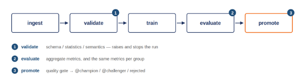

**LAB 2**

**ML Pipeline & Experiment Tracking**

*From one script to a pipeline you can reproduce, compare and promote*

|**Field**|**Value**|
| :- | :- |
|Course|DDM501 — AI in DevOps, DataOps, MLOps|
|Session|5 (Lab 2)|
|Weight|15% of the final grade (T2)|
|Tools|MLflow 2.19, Apache Airflow 2.8.4, scikit-learn 1.6, Docker Compose|

# **1. Overview**
## **1.1 Where Lab 1 left off**
Lab 1 ended with a working service: a model, an API, a container. It also ended with a script called train\_model.py that produced exactly one model, and a .joblib file that nobody could account for.

Three questions about that artifact:\
\- Which rows was it trained on? 

Which hyperparameters won, and what did they beat? 

If you retrain, how do you know the new model is better?

None of those are answerable, and none of them are model quality problems.
## **1.2 What you build**
Data pipeline:

*Figure 1 — the pipeline*

Then two things on top of it: a hyperparameter sweep whose runs are comparable in MLflow, and an Airflow DAG that runs the whole thing on a schedule and decides, without a human, whether the result deserves to be promoted.
# **2. Background**
## **2.1 What experiment tracking is actually for**
The usual pitch for MLflow is that it stores metrics so you can compare models. That is true and it undersells it. Metrics are the easy part; a spreadsheet stores metrics.

What a spreadsheet does not store is the *run*: the exact parameters, the data summary, the fitted artifact, the library versions, the validation report, and the list of feature columns the model expects. Three months from now the question will not be "how good was it" — that is the number everyone remembers. It will be "why does the model in production expect a column that no longer exists", and only the artifacts can answer that.

So the rule for this lab: log the things you would need to rebuild the run, not just the things you would put on a slide.
## **2.2 Aliases replaced stages**
MLflow's model registry used to have four fixed stages — None, Staging, Production, Archived.

Two aliases are used here. @champion is what a serving layer loads; @challenger is a candidate that cleared the quality gate but did not beat the champion.
# **3. Setup**
unzip ddm501-lab2-starter.zip && cd ddm501-lab2-starter

python -m venv .venv

source .venv/bin/activate          # Windows: .venv\Scripts\activate

pip install -r requirements.txt

\# The pipeline defaults to a local MLflow file store at ./mlruns —

\# no server needed. Start here.

python -m pipeline.run\_pipeline --no-register

When that runs end to end, bring up the tracking server:

docker compose up -d mlflow

export MLFLOW\_TRACKING\_URI=http://localhost:5000

python scripts/setup\_mlflow.py         # confirms it is reachable

mlflow ui                              # or just open http://localhost:5000

docker compose up -d --build brings up Postgres, the Airflow webserver and the scheduler at http://localhost:8080 (airflow / airflow). 
# **4. Tasks**

|**Task**|**File**|**TODOs**|**What you are building**|
| :- | :- | :- | :- |
|1|`pipeline/validation.py`|4|Schema, statistics and semantics checks; the report the run carries|
|2|`pipeline/preprocessing.py`|2|Six derived features and the ColumnTransformer|
|3|`pipeline/training.py`|1|MLflow tracking wrapped around the fit|
|4|`pipeline/evaluation.py`|3|Metrics, per-group metrics, fairness gap|
|5|`pipeline/registry.py`|5|Best run, register, alias, quality gate, promotion|
|6|`experiments/`, sweep|—|Run it and read the leaderboard|
|7|`dags/credit\_training\_dag.py`|6|Five task bodies and the dependency graph|
|8|`docker/`, `docker-compose.yml`|4|The Airflow image and the MLflow service|

Read these first — they are the worked examples: pipeline/config.py, pipeline/data\_ingestion.py, pipeline/run\_pipeline.py, the ingest and cleanup tasks in the DAG, beats\_champion and the helpers in registry.py.
## **Task 1 — The data quality gate (pipeline/validation.py)**
Three levels, each a function returning a list of error strings, plus an orchestrator that collects them and raises.

|**Level**|**Asks**|
| :- | :- |
|Schema|Are the expected columns present, with usable types?|
|Statistics|Enough rows? Too many missing values? Is the target rate plausible?|
|Semantics|Do the values mean what the business says? A SEX of 7, an AGE of 400, a negative payment.|

Return errors rather than raising inside each level, so the orchestrator can report all three together. A validator that stops at the first problem makes you fix issues one run at a time.
## **Task 2 — Features (pipeline/preprocessing.py)**
Six derived features, then the transformer. The features encode what a credit analyst would compute by hand — utilisation, payment ratio, worst delay, months delayed, and two averages.

Two requirements that are easy to miss and hard to debug:

- Return a copy. Mutating the caller's frame makes the stage depend on how many times it has been called, which only surfaces once the pipeline is on a schedule.
- Divide by LIMIT\_BAL.replace(0, np.nan), not by LIMIT\_BAL. A zero denominator gives inf, which poisons the scaler downstream without raising. NaN is an honest "not applicable" and the imputer handles it.

And the one that matters most: build\_preprocessor returns an **unfitted** transformer, because build\_pipeline puts it inside the sklearn Pipeline.
## **Task 3 — Tracking (pipeline/training.py)**
Wrap the fit in an MLflow run and log parameters, the data summary, the validation report, the feature list and the fitted pipeline.

Log the feature list and the validation report as artifacts, not just the metrics. The metrics answer "how good was it". The artifacts answer "why does production expect a column that no longer exists", which is the question you will actually be asked.
## **Task 4 — Metrics and slices (pipeline/evaluation.py)**

|**Function**|**Produces**|
| :- | :- |
|compute\_metrics|ROC AUC, PR AUC, precision, recall, F1, Brier, confusion counts|
|compute\_group\_metrics|The same numbers, once per value of the sensitive attribute|
|fairness\_gap|The largest difference in selection rate between any two groups|

Three traps in compute\_metrics. ROC AUC and PR AUC take the probability; precision, recall and F1 take the hard prediction — mixing them up does not raise, it just gives wrong numbers. Pass labels=[0, 1] to confusion\_matrix, or a single-class slice returns a 1×1 matrix and ravel() explodes. Use zero\_division=0 for the same reason.
## **Task 5 — Registry and promotion (pipeline/registry.py)**
Find the best run, register it, and give it the alias it earned. Three outcomes, and only one of them changes what production serves:

|**Outcome**|**When**|
| :- | :- |
|champion|Passed the gate and beats the current champion by the margin|
|challenger|Passed the gate but does not beat the champion|
|rejected|Failed the gate — registered anyway, tagged, not aliased|

Register the rejected model too. A version with a quality\_gate: failed tag is the audit trail, and it is how you demonstrate that a bad model was caught rather than never produced.

Two details in the gate that decide tests. Read the metrics with .get(key, default) and pick the default so that a missing metric fails — if a bug stopped computing the fairness gap, a gate that read the absence as a pass would keep reporting green while checking nothing. And note the 0.002 margin in beats\_champion: shipping a model 0.0003 AUC better is all deployment risk and no reward.
## **Task 6 — Run the sweep**
python -m experiments.run\_experiments

python -m experiments.run\_experiments --leaderboard-only --top 5

Seven configurations across three model families. Then look at the leaderboard, because the interesting result is not which model wins.

Logistic regression usually posts the best ROC AUC and the widest fairness gap. The gradient boosting configurations post slightly lower AUC and a noticeably narrower gap. Your report has to say which one you would promote and why. There is no answer key for that; there is a quality gate, and you chose its thresholds.
## **Task 7 — Orchestration (dags/credit\_training\_dag.py)**
Five task bodies and the dependency graph. The tasks call functions from the pipeline package — the DAG orchestrates and never reimplements. The moment a DAG carries its own copy of the training logic, the scheduled model and the one you tested stop being the same model.

Three things to get right:

- XCom carries metadata, never data. XCom values are serialised into Airflow's metadata database and there is a size limit. Push paths and scalar metrics; put frames and models on the shared volume.
- A BranchPythonOperator callable returns the task\_id to run next. Return a string that is not a real downstream task and the failure message will not obviously say so.
- cleanup already has trigger\_rule="none\_failed\_min\_one\_success". The default rule is all\_success, and a branch always skips one side — with the default, cleanup skips too and leaves the run directory behind on every single run.
## **Task 8 — The stack (docker/, docker-compose.yml)**
Three TODOs in the Airflow Dockerfile — switch to the airflow user before installing, install with Airflow's constraints file, set PYTHONPATH — and the MLflow service in Compose.

One detail in the MLflow command: sqlite:////mlflow/mlflow.db has **four** slashes. Three is a relative path, four is absolute. With three, the database lands wherever the process happened to start and vanishes on the next restart, taking your entire experiment history with it.
# **5. Deliverables**
## **5.1 What to submit**
A GitHub repository link:

- Completed pipeline: all five stages, running end to end from the CLI
- MLflow evidence
- The sweep leaderboard, and your written justification of which model you would promote
- Working Airflow DAG with a successful run, and a screenshot of the graph showing the branch
## **5.2 The report**

|**Section**|**What it has to contain**|
| :- | :- |
|Pipeline design|The five stages, what each one owns, and why validation sits before training rather than after ingestion|
|Experiment analysis|The leaderboard, and what the sweep actually told you. "Model X won" is not an analysis|
|The promotion decision|Which model you would promote and why — including what you do about the accuracy-versus-fairness trade-off the leaderboard shows|
|Orchestration|Your DAG, what travels through XCom and what does not, and why|
|Reproducibility|How someone else would reproduce your best run from what you logged|

# **8. Reading**
- Kästner, Le Goues & Hilton (2024), Machine Learning in Production — pipeline quality and automating the pipeline.
- Huyen (2022), Designing Machine Learning Systems, chapter 5 — feature engineering; chapter 6 — model development and offline evaluation.
- MLflow docs, "Migrating from Stages to Aliases" — the reasoning behind the deprecation you are working around.
- Sculley et al. (2015), Hidden Technical Debt in Machine Learning Systems — re-read the pipeline jungle and configuration debt sections against the code you just wrote.

DDM501 · AI in DevOps, DataOps, MLOps · FSB — FPT University
